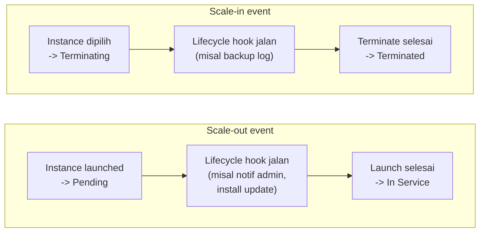

## Lifecycle Hooks

Lifecycle hook itu kesempatan buat ngejalanin action custom sebelum scale-in atau scale-out event selesai.

Pas scale-out, instance baru masuk state **Pending**, lifecycle hook bisa dipake buat misal kirim notifikasi email dulu sebelum instance beneran masuk **In Service**. Pas scale-in, instance masuk state **Terminating**, hook bisa dipake buat backup log dulu sebelum beneran **Terminated**.

## Launch Template

Launch template itu 2 hal yang saling melengkapi: **apa yang mau dilaunch** (AMI, instance type, key pair, security group) dan **gimana cara scaling group-nya** (ukuran min/max, scaling policy).

Parameter yang bisa diatur di launch template: AMI, instance type, key pair, security group, storage, IAM role, user data, tagging. AWS strongly recommend pake launch template dibanding launch configuration (yang lama).

Setelah launch template siap, kita bikin Auto Scaling group-nya, wajib punya VPC dan subnet (disaranin pake subnet di beberapa AZ biar HA), plus opsional: register ke load balancer, health check, monitoring CloudWatch, dan scaling policy.

## Best Practice

| Area | Best Practice |
|---|---|
| CloudWatch | Pake frekuensi 1 menit, bukan default 5 menit, biar respons ke perubahan load lebih cepet |
| Auto Scaling group metrics | Aktifin, kalau nggak, data kapasitas nggak muncul di grafik forecast |
| Instance type | Hindari burstable performance (T2/T3) buat scaling group, karena bisa kehabisan CPU credit |

### Steady-State Group

Pola dimana min, max, desired semuanya di-set sama (misal semua 1), jadi kalau instance-nya mati/unhealthy, langsung dibikinin instance baru otomatis. Contoh pemakaian: jaga NAT server tetep hidup di tiap AZ.

### Avoid Thrashing

**Thrashing** itu kondisi instance nambah-kurang gantian terlalu cepet, mirip virtual memory yang kebanyakan swap. 3 cara ngehindarinnya:

- **Alarm sustain period**: alarm baru trigger kalau kondisinya bertahan sekian lama (misal CPU 90% selama 10 menit), biar lonjakan sesaat nggak langsung trigger scaling.
- **Cooldown period**: abis scaling, ada jeda dulu sebelum scaling berikutnya boleh jalan, kasih waktu instance baru buat nyerep beban.
- **Instance warmup period**: instance baru dikasih waktu buat "pemanasan" sebelum dihitung ke kapasitas group, jadi nggak ada over-provisioning gara-gara beberapa alarm nyala barengan.

## Yang Perlu Diinget

- Auto Scaling terdiri dari 3 bagian: launch template, Auto Scaling group, scaling policy.
- Lifecycle hook ngasih kesempatan jalanin action custom sebelum instance beneran in-service atau terminated.
- Thrashing dicegah pake alarm sustain, cooldown, dan warmup period.

## Referensi Resmi

- [Amazon EC2 Auto Scaling User Guide](https://docs.aws.amazon.com/autoscaling/ec2/userguide/what-is-amazon-ec2-auto-scaling.html)
- [Amazon EC2 Auto Scaling Lifecycle Hooks](https://docs.aws.amazon.com/autoscaling/ec2/userguide/lifecycle-hooks-overview.html)
- [Create a Launch Template for an Auto Scaling Group](https://docs.aws.amazon.com/autoscaling/ec2/userguide/create-launch-template.html)
- [Getting Started with Amazon EC2 Auto Scaling](https://aws.amazon.com/ec2/autoscaling/getting-started/)
