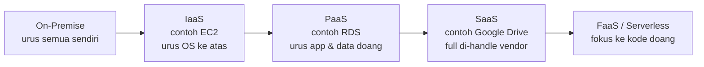

Hari pertama AWS re/Start batch 15 resmi dimulai hari ini. Kelasnya ternyata dikompres, harusnya 12 minggu tapi dipadetin jadi 7 minggu doang, jadi beberapa materi kayak linux, mysql, dan python di-skip karena emang nggak keluar di ujian CCP. Fokusnya full ke kuis dan lab, total ada 66 lab yang semuanya gratis pake sandbox account, jadi nggak perlu bikin akun AWS sendiri.

Satu hal yang langsung aku catet gede-gede: tiap lab itu wajib di-submit dulu sebelum end lab. Kalau cuma di-end tanpa submit, dianggap nggak ngerjain sama sekali alias nggak kepoin. Ini jenis kesalahan yang sayang banget kalau sampe kejadian pas udah capek-capek ngerjain labnya.

Materi hari ini masih orientasi, kenalan konsep dasar cloud computing. Intinya cloud computing itu kita nyewa infrastruktur IT (compute, storage, database) ke vendor kayak AWS, bayarnya pay-as-you-go, mirip ngontrak dibanding beli rumah sendiri. Bedanya cuma di seberapa banyak yang masih kita urus sendiri:

Makin ke kanan, makin dikit yang kita urus, tapi makin dikit juga kontrolnya. Ada juga konsep scaling vertikal (naikin spek server yang sama, ada batas maksimal) dan horizontal (nambah jumlah server, gak ada batas tapi nambah kompleksitas). Detail lebih dalam soal service model, deployment model, sampe trade-off scaling ini ada di [halaman khusus cloud computing fundamentals](/blog/cloud-computing-service-model-scaling).

7 minggu, 66 lab. Let's go.

## Catatan Sampingan

- Instrukturnya cerita pernah gagal ujian AI Practitioner sekali, tanggal 3 Januari, skornya 73.5 padahal minimal lulus 75, cuma kurang satu soal doang. Rugi sekitar 6 juta buat ujian ulang.
- Insight soal pricing: region AWS yang baru dibuka itu biasanya lebih mahal dari region yang udah lama beroperasi, jadi kalau ada opsi region lama vs baru dengan lokasi yang mirip-mirip, region lama lebih worth it dari sisi harga.
- Ada cerita soal data center KPK yang pernah kebakaran, padahal itu salah satu data center dengan prosedur akses paling ketat (KTP, verifikasi tujuan kunjungan, dst).
