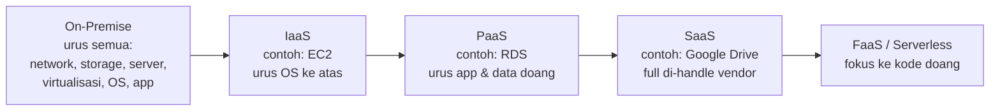
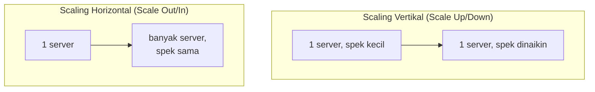
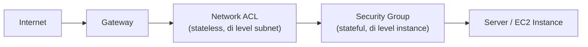

Hari pertama AWS re/Start isinya kenalan konsep dasar cloud computing, dan ternyata banyak analogi sehari-hari yang bikin konsepnya lebih gampang nempel.

## Kenapa Cloud, Bukan Beli Server Sendiri

Cloud computing intinya **on-demand delivery** dari IT resource (compute, storage, database), yang dibayar pake model **pay-as-you-go**, kepake baru bayar, kayak nyewa dibanding beli rumah.

Bandingin sama bikin data center sendiri: butuh beli server fisik (harganya ratusan juta buat spek gede), rak server, AC pendingin, UPS, kabel, switch, sampe biaya tenaga kerja (network engineer, sysadmin, satpam yang jagain data center). Semua itu masuk kategori **at-front cost**, duit besar yang harus keluar di depan sebelum server-nya kepake sama sekali. Belum lagi kalau ternyata kebutuhannya berubah, speknya kurang, harus beli lagi, atau malah kelebihan beli dan sisa resource-nya nganggur (idle).

Dengan cloud, biaya itu diubah dari **fixed expense** (harus keluar di depan, jumlahnya pasti, dan biasanya naik terus tiap tahun kalau kita ngontrak) jadi **variable expense** (bayar sesuai pemakaian aktual, bisa naik-turun sesuai kebutuhan bisnis).

## Model Layanan: IaaS, PaaS, SaaS, FaaS

Bedanya keempat model ini ada di seberapa banyak yang masih kita urus sendiri vs yang di-handle penyedia cloud:

- **IaaS (Infrastructure as a Service)**: vendor nyediain infrastruktur mentah (server, network, storage), kita yang urus OS, konfigurasi, sampe aplikasinya. Contohnya EC2.
- **PaaS (Platform as a Service)**: vendor udah handle infrastruktur dan platform-nya, kita fokus ke aplikasi dan data doang. Contohnya RDS, kita nggak perlu install database engine-nya manual.
- **SaaS (Software as a Service)**: semuanya udah jadi, tinggal pake. Contoh paling gampang: Google Drive, Google Colab.
- **FaaS (Function as a Service)** / serverless: kita cuma nulis kode fungsinya, server-nya "nggak keliatan" karena manajemennya diambil alih total sama vendor. "Serverless" di sini cuma istilah, servernya tetep ada, cuma kemampuan kita buat konfigurasi dan manage-nya berkurang drastis, seakan-akan kita nggak punya server.

Makin ke kanan (dari IaaS ke FaaS), makin sedikit yang kita urus, tapi makin sedikit juga kontrol yang kita punya.

## Model Deployment: Cloud, Hybrid, Private

Ada 3 pilihan gimana infrastruktur di-deploy:

- **Full cloud**: semua infra di AWS.
- **Hybrid**: sebagian di cloud, sebagian di on-premise. Biasanya alasannya soal compliance atau kredensial data yang sensitif, misal web server di cloud tapi database tetep di lokal.
- **Full private / on-premise**: semua infra di data center sendiri.

Ada beberapa kasus di mana on-premise/hybrid tetep jadi pilihan wajib, bukan soal harga:

- **Institusi pemerintah**: walaupun AWS punya data center di Jakarta, secara compliance kebanyakan instansi negara tetep diwajibin pake infrastruktur lokal, alasannya soal siapa yang "pegang kendali" data sensitif negara.
- **Beban AI/LLM yang traffic-nya sangat tinggi**: kadang biaya token API di cloud, kalau dihitung-hitung untuk traffic besar dan konsisten, bisa lebih mahal dibanding investasi server on-premise buat jalanin model sendiri.

## Economies of Scale

Konsepnya sama kayak beli barang grosir, makin banyak beli, makin murah per unitnya. AWS bisa nawarin harga makin murah karena penggunaan agregat dari semua customer-nya di seluruh dunia bikin mereka dapet skala ekonomi yang nggak bisa ditandingin perusahaan individual.

## Kenapa Harga Beda-Beda per Region

Region yang lebih baru dibuka AWS itu cenderung **lebih mahal** dibanding region yang udah lama beroperasi. Ada 4 faktor yang nentuin pemilihan region:

1. **Latency**: makin deket lokasi server ke user, makin cepet responnya.
2. **Compliance**: beberapa data wajib disimpen di region tertentu karena regulasi.
3. **Harga**: region lama biasanya lebih murah dari region baru.
4. **Ketersediaan servis**: nggak semua servis (apalagi servis AI) tersedia merata di semua region, region yang lebih matang biasanya punya servis paling lengkap.

Satu hal penting: aplikasi yang di-deploy di satu region nggak otomatis bisa "pindah harga" ke region lain, kalau mau ambil harga region Amerika misalnya, konsekuensinya ya beneran deploy di sana, dengan risiko latency naik karena jaraknya jauh.

## Scaling: Vertikal vs Horizontal

Dua pendekatan buat nambah kapasitas server:

- **Vertikal (scale up/down)**: naikin spek server yang sama (misal dari 1 core jadi 4 core). Jumlah server tetep satu.
- **Horizontal (scale out/in)**: nambah jumlah server, spek tiap server tetep sama.

Trade-off masing-masing:

| Aspek | Vertikal | Horizontal |
|---|---|---|
| Downtime | Ada, biasanya butuh restart/stop dulu | Nggak ada, tinggal nambah server baru |
| Batas maksimal | Ada (mentok di spek terkuat yang tersedia di pasaran) | Nggak ada batas praktis |
| Availability/failover | Lebih rentan, kalau server itu down ya semuanya down | Lebih tahan, kalau satu server down yang lain masih jalan |
| Biaya per spek yang sama | Cenderung lebih murah untuk kebutuhan compute murni | Lebih mahal, karena ada biaya traffic tambahan buat sinkronisasi antar-server |

Kesimpulannya nggak ada yang mutlak lebih baik, semua balik ke kebutuhan **SLA (Service Level Agreement)**: kalau perusahaan nggak bisa toleransi downtime sama sekali (misal sistem perbankan), horizontal scaling jadi pilihan yang lebih masuk akal meski lebih mahal dari sisi traffic. Kalau downtime singkat masih bisa ditoleransi dan yang penting hemat compute, vertikal lebih pas.

## Web Service: Konsep Request-Response

Web service itu potongan software yang bisa diakses lewat internet, komunikasinya pake format standar (XML atau JSON) lewat API. Alurnya sederhana: **client** kirim **request**, **server** balikin **response**.

Analoginya kayak pesan kopi di coffee shop: kita bilang "cappuccino satu" (request) ke kasir (server), kasir jawab "oke, cappuccino satu" (response). Kalau stoknya habis, kasir tetep harus kasih respons ("maaf, robusta habis"), bukan diem aja. Prinsip yang sama berlaku di web service, tiap request harus dapet response, entah itu berhasil atau gagal.

## Lapisan Keamanan Dasar

Traffic yang masuk ke server itu ngelewatin beberapa lapis pertahanan sebelum nyampe:

Ini lapisan dasarnya. Kalau butuh proteksi lebih ketat, bisa ditambah lapisan lain di depan, misal WAF (Web Application Firewall) atau Shield buat proteksi dari DDoS, tapi itu semua ada biaya tambahan, karena di cloud, keamanan ekstra itu servis berbayar terpisah, bukan otomatis aktif semua.

## Yang Perlu Diinget

- Cloud computing itu nyewa infrastruktur IT, bayar sesuai pemakaian (pay-as-you-go), bukan beli di depan.
- Makin ke arah SaaS/FaaS, makin sedikit yang kita urus, tapi makin sedikit juga kontrolnya.
- Region baru cenderung lebih mahal dari region lama, dan harga di satu region nggak bisa "diimpor" ke region lain tanpa beneran pindah deploy ke sana.
- Scaling vertikal ada downtime dan ada batas maksimal, scaling horizontal nggak ada downtime tapi lebih mahal dari sisi traffic.
- Keamanan tambahan (WAF, Shield, dst) itu servis berbayar terpisah, bukan bawaan gratis.

## Referensi Resmi

- [What Is Cloud Computing?](https://aws.amazon.com/what-is-cloud-computing/)
