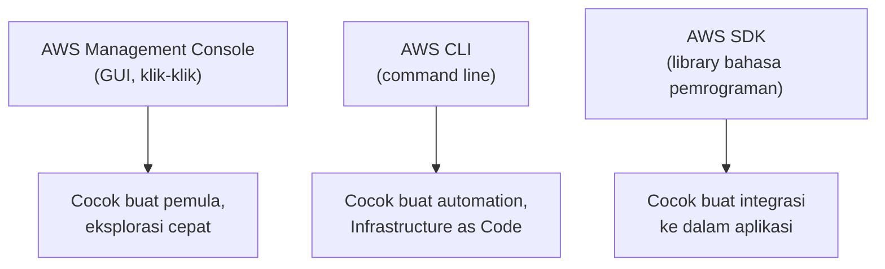

Sebelum mulai praktek EC2, ada overview dulu soal apa aja sebenarnya yang ditawarin AWS, dan cara ngaksesnya gimana.

## 3 Cara Akses AWS

- **Management Console**: antarmuka grafis, gampang dipahami visual, tapi susah buat automation (karena harus klik manual satu-satu).
- **CLI (Command Line Interface)**: berbasis command, bisa dipakai buat scripting dan automation. Ini kuncinya **Infrastructure as Code (IaC)**: satu infrastruktur bisa dibangun dari satu script, jadi konsisten, gampang diulang, dan minim human error dibanding klak-klik di console.
- **SDK (Software Development Kit)**: library buat akses AWS lewat bahasa pemrograman (Python, Java, Node.js, dst), dipakai kalau mau integrasi AWS langsung ke dalam kode aplikasi.

Best practice-nya: belajar console dulu buat paham konsepnya, baru pindah ke CLI kalau udah lebih nyaman, karena CLI butuh hafal syntax dan kurang visual.

## Kategori Servis AWS

### Compute

- **EC2**: virtual machine, kontrol penuh dari OS ke atas.
- **Lambda**: serverless, cuma nulis kode fungsi, infrastrukturnya nggak keliatan.
- **Elastic Beanstalk**: versi "light" dari deploy aplikasi, fokus ke build web app tanpa perlu pusing infrastruktur.
- **ECS/EKS**: orkestrator container (Docker), EKS pakai Kubernetes.
- **Fargate**: jalanin container tapi serverless, nggak perlu mikirin cluster/scaling manual.
- **Outposts**: buat yang mau nyewa hardware AWS tapi ditaruh di data center sendiri.

### Storage

Ada 3 jenis penyimpanan dengan karakteristik beda:

| Jenis | Contoh Servis | Karakteristik |
|---|---|---|
| **Object storage** | S3 | Data disimpan sebagai objek, nggak bisa diedit langsung kayak file biasa, cocok buat aset web, harganya paling murah dari ketiganya |
| **Block storage** | EBS | Mirip SSD/HDD, bisa dipasang ke instance, bisa diedit datanya, harga medium |
| **File storage** | EFS | Mirip file server/NAS, bisa diakses banyak server sekaligus, paling mahal karena butuh banyak konfigurasi |

Ada juga **Glacier**, varian storage buat arsip jangka panjang yang jarang diakses (bisa 5-10 tahun sekali), harganya jauh lebih murah tapi proses ambil datanya bisa makan waktu sampai berhari-hari (analoginya kayak pita kaset LTO, murah tapi lambat).

### Database

- **RDS**: relational database terkelola (MySQL, PostgreSQL, dst).
- **Aurora**: versi AWS dari MySQL/PostgreSQL yang udah di-tuning, katanya 5x lebih cepat dari MySQL biasa dan 3x dari PostgreSQL, dan bisa serverless.
- **DynamoDB**: NoSQL, serverless, cocok buat data yang strukturnya nggak kaku.

### Networking

- **VPC**: jaringan privat sendiri di dalam AWS.
- **Elastic Load Balancing (ELB)**: bagi-bagi traffic ke banyak server biar nggak numpuk di satu tempat.
- **CloudFront**: CDN, distribusi konten biar lebih cepat diakses dari lokasi manapun.
- **Transit Gateway**: penghubung banyak VPC/jaringan sekaligus.
- **Direct Connect**: koneksi fisik dedicated dari data center sendiri ke AWS, mahal banget (bisa miliaran rupiah kalau jaraknya jauh), jarang dipakai kecuali beneran butuh.

### IAM dan Organizations

- **IAM**: kontrol akses di level user dalam satu akun.
- **Organizations**: kontrol banyak akun sekaligus, salah satu manfaat utamanya **consolidated billing** (gabungin tagihan banyak akun jadi satu, biar dapet potongan economies of scale yang lebih besar).

### Cost Management

- **Budgets**: bikin alert kalau pemakaian mendekati/lewat batas anggaran, cuma notifikasi doang, bukan otomatis mematikan servis.
- **Cost Explorer**: liat breakdown biaya per servis, buat tau servis mana yang paling nyedot anggaran.

## Yang Perlu Diinget

- Console buat belajar/eksplorasi cepat, CLI buat automation dan IaC, SDK buat integrasi ke kode aplikasi.
- Storage AWS ada 3 jenis: object (S3, termurah), block (EBS), file (EFS, termahal), plus Glacier buat arsip dingin.
- AWS Organizations beda dari IAM: IAM ngatur user dalam satu akun, Organizations ngatur banyak akun sekaligus dan bisa gabungin billing.
- Budgets cuma ngasih notifikasi, nggak otomatis mematikan servis yang kelebihan pemakaian.

## Referensi Resmi

- [What Is AWS?](https://aws.amazon.com/what-is-aws/)
- [AWS CLI User Guide](https://docs.aws.amazon.com/cli/latest/userguide/cli-chap-welcome.html)
