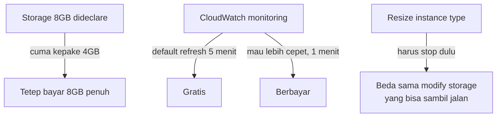

Sesi dibuka lanjutan dari kemarin, overview kategori servis AWS (compute, storage, database, networking) dan bedanya akses lewat Management Console, CLI, sama SDK. Detail lengkapnya ada di [halaman khusus AWS overview](/blog/aws-overview-service-categories-sdk-cli-console).

Abis itu full praktek, launch EC2 instance pertama kali. EC2 (Elastic Compute Cloud) itu intinya virtual machine di AWS, kita tinggal pilih spek (CPU, RAM), OS, sama storage-nya, terus AWS yang urus hardware fisiknya. Sempet dijelasin juga model layanan (IaaS, PaaS, SaaS) sebelumnya, dan EC2 ini contoh paling klasik dari IaaS.

Yang paling nempel di kepala justru bukan cara launch instance-nya, tapi jebakan-jebakan billing yang ternyata gampang banget kelewat:

Ada juga trap klasik pas testing: buka website pake http padahal browser defaultnya nembak https duluan, jadi harus ketik manual `http://` di depan karena port-nya beda (80 vs 443). Kelihatan sepele tapi bikin bingung beberapa menit sebelum nyadar. Detail lengkap semua jebakan billing ini (storage yang dibulatin, harga OS yang beda-beda, monitoring interval berbayar, dst) ada di [halaman khusus EC2 launch lab](/blog/ec2-billing-traps-launch-lab).

Networking dasar (OSI layer, NIC, switch, router, kabel) baru masuk lebih dalam besok.

## Catatan Sampingan

- Instruktur bandingin biaya bikin data center sendiri: satu server dengan RAM 1TB aja harganya bisa ratusan juta, kalau butuh 10 unit bisa nembus 2 miliar, dan itu belum termasuk rak server, AC, listrik, sama tenaga kerja buat ngurusnya.
- Insight soal cold storage: analoginya kayak pita kaset LTO, harga per giga-nya jauh lebih murah dari SSD/hardisk, tapi proses ambil datanya bisa nunggu sampai berhari-hari karena sifatnya memang didesain buat data yang jarang banget diakses.
- Cerita eksklusif: instrukturnya pernah kebagian proyek deploy AI agent di Bank Mandiri, dan ternyata biaya lisensi cloud buat AI itu kadang bisa lebih mahal dibanding infrastruktur on-premise kalau traffic-nya udah gede banget, jadi keputusan cloud vs on-premise itu nggak selalu "cloud pasti lebih murah".
