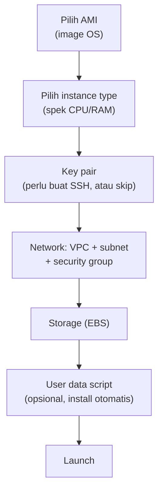
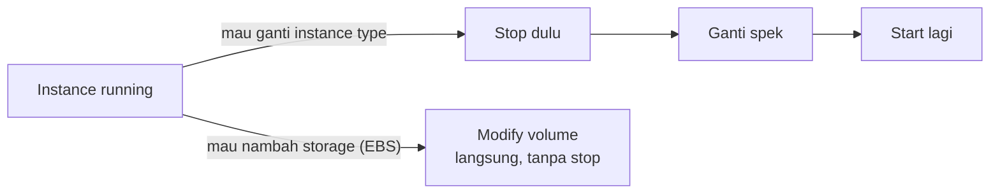

Lab pertama yang beneran hands-on: launch EC2 instance dari nol, sekalian belajar setting, resize, monitoring, sampe terminate. Tapi yang paling berharga dari lab ini justru bukan cara launch-nya, melainkan jebakan-jebakan billing yang instrukturnya sengaja tunjukin satu-satu.

## Alur Launch Instance

Analogi yang kepake buat tiap komponen: VPC itu kayak data center milik sendiri, subnet itu rak di dalam data center itu, dan availability zone itu gedung data center yang berbeda-beda.

## Jebakan 1: Spek Tinggi = Mahal, Beda Image = Beda Harga

Dua faktor yang langsung ngefek ke harga instance: **instance type** (makin tinggi spek CPU/RAM, makin mahal) dan **pilihan image/AMI**. Amazon Linux itu paling murah, sementara Windows jauh lebih mahal karena harganya udah termasuk biaya lisensi OS-nya. Ubuntu Pro dan Red Hat juga lebih mahal dari Amazon Linux karena alasan yang sama.

Contoh hitungan kasar: `t3.micro` Linux sekitar $0.0104/jam, sementara Windows dengan spek yang sama bisa $0.0196/jam. Kelihatan kecil, tapi kalau dikali 24 jam dan 30 hari, selisihnya jadi berasa.

## Jebakan 2: Key Pair Itu Keputusan Sekali Jalan

Key pair (buat akses SSH) itu keputusan yang harus diambil di awal, mau pake atau nggak. Analoginya kayak masang pintu di rumah, kalau di awal nggak dikasih kunci, ya nggak akan bisa masuk lewat situ. Nggak bisa diubah belakangan kecuali lewat proses tambahan yang lebih ribet (masuk ke materi security).

## Jebakan 3: Storage Dibulatin ke Atas, Bukan Sesuai Pemakaian

Ini yang paling gampang bikin kaget: kalau declare storage 8GB, tapi yang kepake cuma 4GB, tetep aja **bayar 8GB penuh**. Analoginya kayak beli gorengan 8 biji, walaupun yang dimakan cuma 4, bayarnya tetep 8. Jadi best practice-nya: jangan asal declare storage gede-gede di awal kalau belum tau kebutuhan aktualnya.

## Jebakan 4: Security Group, Port yang Dibuka = Pintu yang Dibuka

Security group itu firewall di level instance. Prinsipnya: makin banyak port yang dibuka (di-whitelist), makin banyak juga celah yang bisa dimasukin orang. Kalau port SSH (22) dihapus dari aturan inbound, artinya nggak ada satupun yang bisa remote ke situ lewat SSH, bahkan pemilik server sendiri.

Praktik yang lebih aman: ganti port SSH default (22) ke port custom di luar port umum, biar nggak jadi target sasaran otomatis dari bot-bot yang nyari port 22 terbuka di internet.

## Jebakan 5: Monitoring Interval yang Dipercepat Itu Berbayar

CloudWatch monitoring itu default-nya refresh **per 5 menit**, dan ini gratis. Kalau mau lebih cepat (per 1 menit), itu opsi "detailed monitoring" yang berbayar, biasanya ada label kecil "additional charges apply" yang gampang kelewat pas buru-buru klik-klik setting.

## Trap Klasik: HTTP vs HTTPS

Setelah web server jalan dan port 80 (HTTP) dibuka di security group, akses ke public IP-nya sering gagal karena browser secara default nembak `https://` duluan (port 443), padahal yang dibuka cuma port 80. Solusinya simpel: ketik manual `http://` di depan alamat IP-nya.

## Resize Instance: Vertikal Scaling Butuh Downtime

Ganti instance type (misal dari `t3.micro` ke `t3.small`) itu contoh nyata scaling vertikal, dan konsekuensinya harus **stop instance dulu**, ganti tipenya, baru start lagi. Beda sama nambah storage (EBS volume), yang bisa dilakuin sambil instance-nya tetep nyala, nggak perlu mount ulang manual, otomatis kedetect sistemnya.

## Termination Protection

Fitur gratis buat mencegah instance ke-delete nggak sengaja. Kalau aktif, instance nggak bisa langsung di-terminate, harus dimatiin dulu proteksinya lewat menu instance settings sebelum bisa beneran dihapus. Simpel tapi penting, apalagi buat server yang nyimpen data penting.

## Yang Perlu Diinget

- Storage EBS itu dibulatin ke atas, bukan bayar sesuai pemakaian aktual, jangan declare kegedean dari kebutuhan.
- Harga instance dipengaruhi 2 hal: instance type (spek) dan pilihan image (OS berlisensi kayak Windows selalu lebih mahal dari Amazon Linux/Linux OSS lainnya).
- Detailed monitoring (interval 1 menit) itu berbayar, default 5 menit gratis.
- Resize instance type wajib stop dulu (downtime), tapi resize storage EBS bisa sambil jalan.
- Key pair adalah keputusan di awal launch, nggak bisa gampang diubah belakangan.
- Termination protection itu gratis dan sangat worth diaktifin buat cegah salah klik.

## Referensi Resmi

- [Get Started with Amazon EC2](https://docs.aws.amazon.com/AWSEC2/latest/UserGuide/EC2_GetStarted.html)
