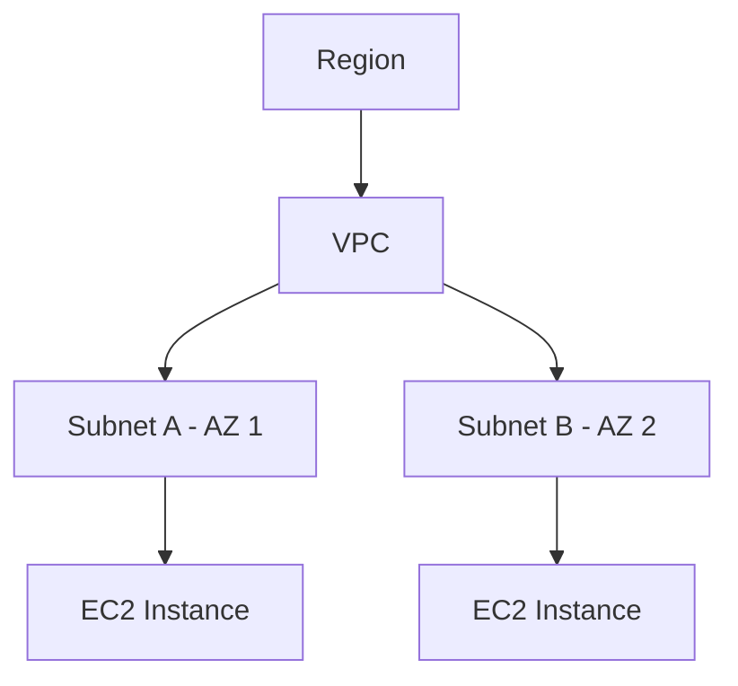

Sesi dibuka dengan fondasi jaringan komputer fisik dulu, client-server, NIC dan MAC address, jenis-jenis kabel (coax, UTP, fiber optic), sampe bedanya switch dan router. Detail lengkapnya ada di [halaman khusus jaringan komputer dasar](/blog/jaringan-komputer-dasar-nic-kabel-switch-router).

Dua lab hari ini sama-sama muter di soal IP. Lab pertama soal instance yang nggak punya public IPv4 dan gimana cara tetep bisa SSH ke situ (ternyata bisa numpang lewat instance lain yang punya public IP). Lab kedua lebih spesifik: kenapa IP public itu bisa berubah tiap instance mati-nyala, tapi kalau cuma reboot nggak berubah, dan kenapa IP private-nya malah tetep sama terus.

Singkatnya, IP private itu nempel ke network interface instance-nya yang tetep ada meski instance di-stop, sedangkan IP public auto-assign itu dari pool punya AWS, dilepas balik pas stop dan dapet yang baru pas nyala lagi. Makanya kalau butuh IP public yang permanen, solusinya pake Elastic IP. Detail lengkap investigasi labnya, plus struktur VPC-Subnet-AZ, ada di [halaman khusus VPC dan IP address](/blog/vpc-subnet-az-public-private-elastic-ip).

Selain itu mulai kenalan sama Availability Zone (AZ), yaitu data center fisik yang lokasinya kepisah-pisah di dalam satu region, tujuannya biar kalau satu AZ bermasalah, AZ lain masih bisa jalan. Terus lanjut ke VPC dan subnet:

VPC itu scope-nya per region, subnet itu potongan dari VPC yang nempel ke satu AZ tertentu. Banyak istilah baru hari ini, tapi pelan-pelan mulai kebentuk gambaran gede-nya gimana network di AWS itu disusun berlapis-lapis.

## Catatan Sampingan

- Instruktur cerita pengalaman pribadinya pasang fiber optic sendiri di rumah, termasuk cara ngecek redaman (Rx optical power) buat mastiin internet lemot itu masalah dari ISP atau dari sisi sendiri, dan tarif instalasi kalau kabelnya lebih dari 100 meter.
- Cerita dia dulu doyan banget gonta-ganti distro Ubuntu (16.04 ke 18.04 ke 20.04), sampai akhirnya kapok dan sekarang lebih milih install ulang total daripada upgrade in-place, karena upgrade in-place sering bikin masalah baru yang susah dilacak sumbernya.
- Ada joke soal belajar itu makin susah makin nambah umur, instrukturnya sendiri ngaku mau kepala 4 dan belajar sekarang emang lebih sering butuh diulang-ulang dibanding waktu masih muda.
