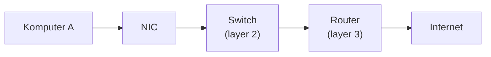

Sebelum masuk ke VPC dan networking di AWS, ada fondasi jaringan komputer fisik yang penting dipahami dulu, karena semua konsep cloud networking itu sebenarnya analogi dari perangkat fisik ini.

## Client dan Server

Analoginya kayak beli kopi di coffee shop: **client** adalah customer yang melakukan request (pesan kopi), **server** adalah pihak yang merespons request itu (kasir yang nyiapin pesanan). Di jaringan komputer, client adalah hardware/device yang dipake user buat akses data dan jaringan, server adalah komputer yang nyediain respons terhadap request dari client lewat jaringan.

## NIC dan MAC Address

**NIC (Network Interface Card)** adalah komponen yang menghubungkan komputer ke jaringan, sering disebut juga network adapter. Tiap NIC punya **MAC address**, alamat fisik unik yang "tertanam" dari pabrik dan nggak bisa diubah, formatnya heksadesimal (contoh: `00-0C-29-XX-XX-XX`). Dari MAC address ini bisa diketahui merek dan produsen hardware-nya. NIC bekerja di **layer 2** jaringan.

Kalau port NIC di komputer cuma ada satu tapi butuh lebih dari satu koneksi jaringan, solusinya nambah NIC tambahan (secara konsep sama kayak OCP, cuma OCP itu versi enterprise-nya yang lebih mahal dan jarang dipake di Indonesia).

## Jenis-Jenis Kabel Jaringan

| Jenis | Karakteristik |
|---|---|
| **Coax (koaksial)** | Dulu dipake ISP jaman internet Speedy, durability tinggi (tahan cuaca ekstrem), tapi bandwidth mentok di 10 Mbps |
| **UTP (kabel LAN, RJ45)** | Paling umum ditemuin, ada beberapa kategori (Cat5, Cat6, Cat7, Cat8), makin tinggi kategori makin bagus performanya |
| **Fiber Optic (FO)** | Bandwidth jauh lebih tinggi, tapi rapuh secara fisik, kabelnya nggak boleh ditekuk sama sekali, kalau ketekuk sedikit aja koneksi bisa langsung putus |

Indikator kualitas sinyal fiber optic disebut **redaman (Rx optical power)**, nilai idealnya sekitar -8 sampai -27. Kalau di luar rentang itu, koneksi dipastikan nggak stabil. Ini yang biasa dicek teknisi ISP sebelum nentuin masalahnya di sisi pelanggan atau di sisi jaringan ISP.

## Switch: Managed vs Unmanaged

**Switch** menghubungkan banyak node dalam jaringan secara bersamaan, kerja di **layer 2**. Ada dua jenis:

- **Unmanaged**: nggak ada fitur pengaturan, semua beban pemrosesan (filtering, rules) jatuh ke router.
- **Managed**: bisa diatur (block port tertentu, limit bandwidth, dst), harganya bisa hampir 2x lipat dari unmanaged untuk spek yang sama, tapi meringankan beban router karena switch-nya sendiri yang handle sebagian pengaturan.

## Router

**Router** menghubungkan banyak segmen jaringan yang berbeda, kerja di **layer 3**. Kalau dua jaringan yang berbeda mau saling komunikasi, itu butuh router. Router juga bisa dipake buat kontrol traffic (block/allow ke tujuan tertentu), bukan cuma sekadar meneruskan paket.

### Routing: Static vs Dynamic

- **Static routing**: rute dikonfigurasi manual, nggak berubah-ubah, lebih simpel tapi nggak fleksibel.
- **Dynamic routing**: rute ditentukan otomatis lewat protokol (RIP, OSPF, BGP), lebih fleksibel tapi lebih kompleks.

Tiap protokol routing punya nilai **Administrative Distance (AD)**, makin kecil angkanya, makin dipercaya/diprioritaskan rute itu (static routing biasanya AD-nya paling kecil/prioritas tertinggi).

## LAN vs WAN

- **LAN (Local Area Network)**: cakupan kecil, satu gedung, satu lantai, atau satu kampus. Contoh: WiFi di coffee shop.
- **WAN (Wide Area Network)**: cakupan luas, antar kota atau negara, butuh router tambahan di tengah buat menghubungkan antar-router.

## Subnetting Dasar

Subnetting itu cara membagi rentang IP jadi segmen-segmen lebih kecil. Contoh: `192.168.3.0/24` punya subnet mask `255.255.255.0`. Total host dihitung dari `2^(32 - prefix)`, dikurangi 2 (untuk IP network dan broadcast address) buat dapet jumlah host yang beneran bisa dipakai.

Di AWS, pengurangannya lebih banyak lagi (dikurangi 5, bukan 2), karena AWS reserve 3 IP tambahan: satu buat IP router VPC, satu buat DNS resolver internal, satu lagi cadangan.

## Yang Perlu Diinget

- NIC punya MAC address yang unik dan permanen dari pabrik, beda konsep dari IP address yang bisa berubah.
- Fiber optic punya bandwidth lebih tinggi dari kabel tembaga, tapi jauh lebih rapuh secara fisik.
- Switch kerja di layer 2 (dalam satu jaringan), router kerja di layer 3 (antar jaringan berbeda).
- Static routing lebih simpel tapi kaku, dynamic routing lebih fleksibel tapi lebih kompleks buat dikonfigurasi.
- Subnetting di AWS mengurangi 5 IP dari total rentang (bukan 2 seperti jaringan biasa), karena 3 IP tambahan dipakai internal oleh AWS.

## Referensi Resmi

- [What Is Amazon VPC?](https://docs.aws.amazon.com/vpc/latest/userguide/what-is-amazon-vpc.html)
