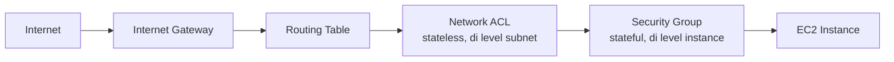

Ini kayaknya hari terpadat sejauh ini. Mulai dari TCP vs UDP, security fundamentals, sampe lab paling berat minggu ini: bikin VPC manual dari nol.

Analogi yang paling nempel buat TCP vs UDP itu tumbler vs galon. TCP kayak minum pake tumbler, ada koneksi jelas, lambat tapi terjamin nggak tumpah. UDP kayak nenggak langsung dari galon, cepet tapi ada yang muncrat kemana-mana. Sesimpel itu tapi langsung ngerti bedanya, TCP dipake buat yang butuh kepastian data sampe utuh (chat, transfer file), UDP buat yang butuh kecepatan real-time (streaming, video call).

Abis itu masuk ke security fundamentals: CIA triad (confidentiality, integrity, availability), bedanya threat/vulnerability/exploit/breach, sampe bahas kasus-kasus lokal kayak WA GB, phishing ngaku-ngaku bank, dan modus di ATM. Yang ditekenin bakal keluar di ujian CCP itu shared responsibility model: "security of the cloud" itu tanggung jawab AWS (infrastruktur fisik), "security in the cloud" itu tanggung jawab kita (data, IAM, konfigurasi). Detail lengkapnya, plus perbandingan TCP/UDP, ada di [halaman khusus TCP/UDP dan security fundamentals](/blog/tcp-udp-security-fundamentals).

Terus lab paling berat: bikin VPC manual dari nol, itung CIDR sendiri, bikin subnet public-private di AZ beda, attach internet gateway, setting routing table, network ACL, sampe security group.

Urutan ini yang bikin ngerti kenapa troubleshooting koneksi itu harus dicek dari luar ke dalam. Lab ini kepanjangan sampe lanjut ke besok. Detail teknis lengkapnya (rumus CIDR, IGW, routing table, NACL vs security group) ada di [halaman khusus VPC manual](/blog/vpc-manual-cidr-igw-nacl-security-group).

## Catatan Sampingan

- Instruktur ngebahas detail modus penipuan ATM: pelaku pura-pura jadi customer service resmi lewat telepon pas korban lagi di ATM, ngaku ATM-nya "kejepit", ngobrol basa-basi dulu buat bangun kepercayaan, baru minta PIN buat "bantuin", padahal itu murni social engineering, bukan hacking teknis.
- Insight soal karier: freelance IT security/pentester buat bank itu bisa dibayar ratusan juta buat kerja cuma 3 hari, karena mereka udah punya reputasi/nama besar di industri, jauh beda sama security engineer yang di-hire tetap dengan gaji bulanan biasa.
- Ada joke soal Kominfo yang pernah bikin campaign "hacker jangan menyerang" alih-alih benerin sistem keamanannya sendiri, dibandingin sama nyuruh maling jangan maling.
