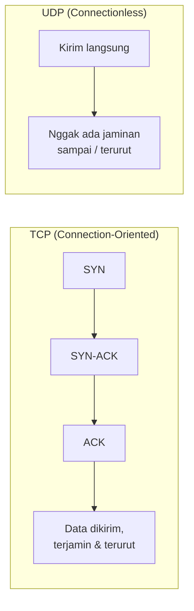
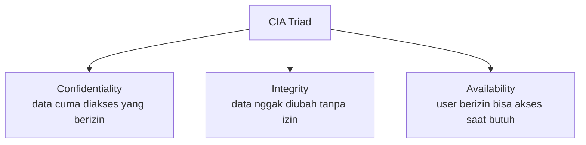
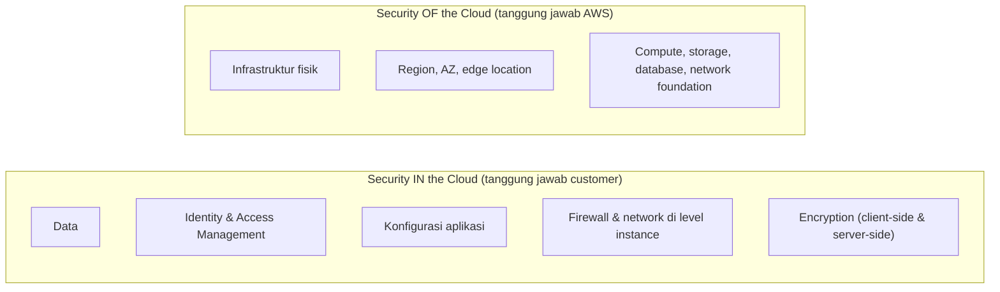
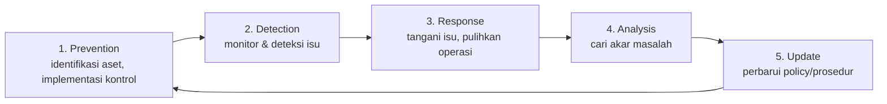

Materi hari ini gabungan dua topik besar: perbandingan protokol TCP/UDP, dan fondasi security yang katanya hampir pasti keluar di ujian CCP.

## TCP vs UDP: Tumbler vs Galon

Dua kategori protokol jaringan di layer 3-4:

- **Connection-oriented (synchronous)**: bangun koneksi dulu lewat proses handshake sebelum kirim data. Analoginya kayak telepon, kalau nggak diangkat, nggak ada komunikasi yang terjadi.
- **Connectionless (asynchronous)**: kirim data langsung tanpa peduli penerimanya siap atau enggak. Analoginya kayak paket yang dikirim kurir, dikirim aja, sampai atau enggaknya nggak dipastikan di awal.

**TCP (Transmission Control Protocol)**: reliable, connection-oriented, ngejamin data sampai dan terurut lewat proses **three-way handshake** (SYN, SYN-ACK, ACK). Overhead-nya lebih tinggi (lebih lambat) karena harus mastiin dulu semuanya oke.

**UDP (User Datagram Protocol)**: overhead rendah, jauh lebih cepat, tapi nggak reliable, nggak ngejamin data sampai atau terurut.

Analogi paling gampang: TCP itu kayak minum pake tumbler (ada "koneksi" jelas antara mulut dan tutup botol, minumnya nggak bisa buru-buru, tapi nggak ada yang tumpah/hilang). UDP itu kayak nenggak langsung dari galon (cepat abis, tapi ada yang muncrat ke mana-mana / hilang di jalan).

| | TCP | UDP |
|---|---|---|
| Koneksi | Ada (handshake dulu) | Tidak ada |
| Kecepatan | Lebih lambat | Lebih cepat |
| Keandalan | Data terjamin sampai & terurut | Tidak dijamin |
| Contoh pemakaian | Chat WhatsApp, transfer file, web browsing | Streaming video (YouTube, TikTok), video call |

Satu aplikasi bisa pakai keduanya sekaligus tergantung fitur, misal WhatsApp: teks chat pakai TCP, tapi share media/video call pakai UDP.

## Apa Itu Security

Security bukan cuma soal "satpam", tapi praktik melindungi aset berharga (digital, fisik, orang, data) dari akses nggak berizin, penyalahgunaan, atau pencurian.

## CIA Triad

- **Confidentiality**: data privat terlindungi dari akses yang nggak berizin.
- **Integrity**: memastikan data nggak diubah/dirusak tanpa izin, tetap autentik.
- **Availability**: user yang berizin tetap bisa akses resource saat mereka butuhkan.

## Istilah Dasar Security

- **Threat (ancaman)**: event yang berpotensi berdampak negatif ke sistem.
- **Vulnerability (kerentanan)**: kelemahan yang bisa dieksploitasi penyerang.
- **Exploit**: tindakan memanfaatkan vulnerability itu.
- **Breach**: kondisi ketika celahnya udah berhasil ditembus.

## Jenis-Jenis Ancaman

- **Malware**: software berbahaya yang bertujuan ganggu sistem, dapetin akses nggak sah, atau curi informasi sensitif.
- **Ransomware**: kode berbahaya yang membatasi akses sampai tebusan dibayar.
- **DoS (Denial of Service)**: serangan yang mencegah user berizin buat akses, biasanya lewat membanjiri sistem dengan traffic.
- **Man-in-the-Middle (MITM)**: penyerang menyusup di tengah komunikasi dua pihak dan menyamar jadi salah satunya, contohnya modus penipuan yang mengaku dari bank lewat video call dengan wajah dan latar yang dipalsukan biar mirip customer service asli.
- **Phishing**: penipuan yang menyamar sebagai entitas terpercaya (bank, layanan resmi) lewat link atau domain yang mirip tapi sebenarnya beda, tujuannya mancing korban masukin data sensitif.
- **Social engineering**: teknik manipulasi psikologis, bukan teknis, memanfaatkan korban yang panik supaya nggak bisa mikir jernih. Ini teknik hacking paling ampuh sepanjang masa, karena nggak butuh keahlian teknis, cuma butuh korban yang lengah.

## Shared Responsibility Model

Ini konsep paling penting soal cloud security, dan kemungkinan besar keluar di ujian CCP.

- **Security OF the cloud** (tanggung jawab AWS): infrastruktur fisik, hardware, jaringan foundation, ketersediaan region/AZ.
- **Security IN the cloud** (tanggung jawab customer): data, IAM, konfigurasi aplikasi, firewall, patching OS di instance, enkripsi.

Salah kaprah yang sering terjadi: mikir kalau sudah "deploy di cloud" otomatis aman. Padahal kalau ada virus di instance sendiri, atau aplikasi error karena bug sendiri, itu tanggung jawab customer, bukan AWS.

## Kontrol Keamanan: Preventive, Detective, Corrective

- **Preventive**: mencegah sebelum terjadi (setting firewall, security group, antivirus, policy).
- **Detective**: mendeteksi dan investigasi kenapa sesuatu bisa terjadi (root cause analysis).
- **Corrective**: perbaikan setelah penyebab diketahui, supaya sistem kembali normal.

## Security Lifecycle

Siklus ini muter terus tanpa akhir, karena ancaman baru terus bermunculan. Nggak ada titik "selesai" dalam security.

## Yang Perlu Diinget

- TCP itu reliable tapi lambat (butuh handshake), UDP itu cepat tapi nggak ada jaminan data sampai/terurut.
- CIA triad: Confidentiality, Integrity, Availability, tiga pilar utama security.
- Social engineering itu teknik hacking paling ampuh karena menyerang psikologi, bukan sistem.
- Shared responsibility model: AWS jaga "security of the cloud" (infrastruktur), customer jaga "security in the cloud" (data, konfigurasi, akses).
- Security itu siklus tanpa akhir: prevention, detection, response, analysis, lalu update policy, dan berulang.

## Referensi Resmi

- [AWS Security Overview Whitepaper](https://docs.aws.amazon.com/whitepapers/latest/aws-overview-security-processes/introduction.html)
