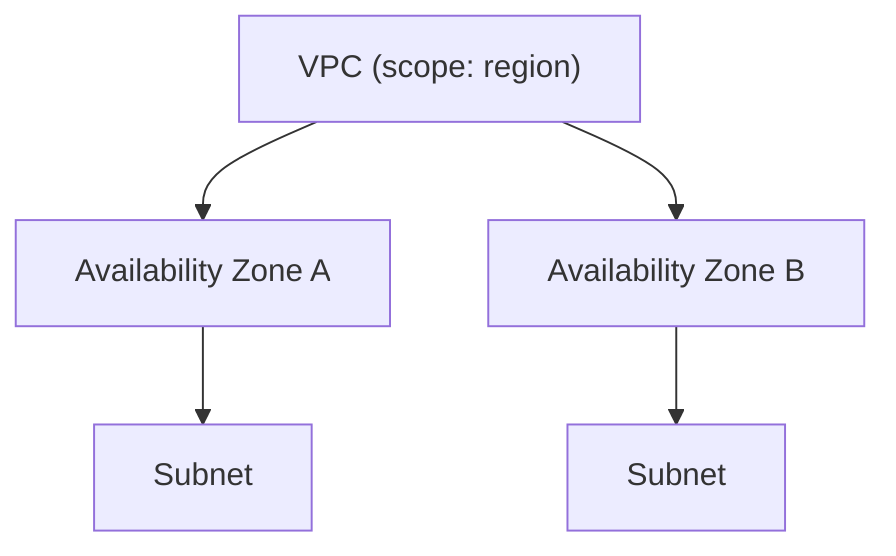
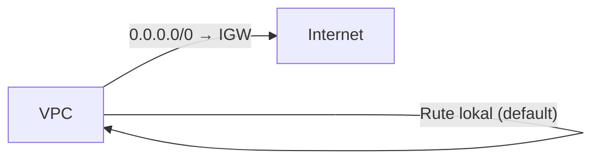
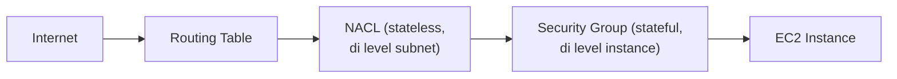
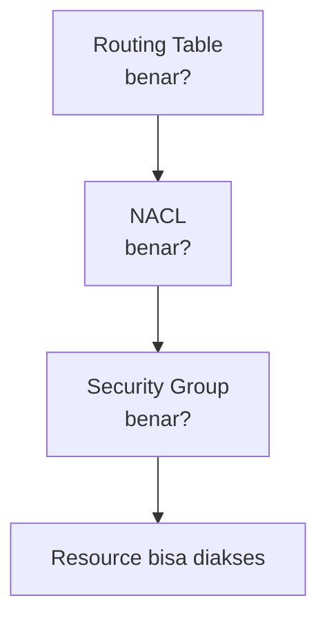

Lab paling berat sejauh ini: bikin VPC manual dari nol, nggak pake wizard otomatis, biar beneran ngerti tiap komponennya ngapain.

## Skenario: Hitung CIDR buat Customer

Skenarionya jadi cloud support engineer yang harus setting VPC buat customer, dengan kebutuhan: 15.000 IP untuk VPC, dan 50 IP untuk satu subnet publik, mulai dari kepala `192`.

Cara cepat bedain IP private vs public: hafalin kepala IP private-nya aja (kelas A: `10.x.x.x`, kelas B: `172.16.x.x`, kelas C: `192.168.x.x`), selain itu berarti public.

### Hitung CIDR

Total alamat IPv4 itu `2^32`. Buat nentuin ukuran subnet, tinggal hitung `2^(32 - prefix)`:

| Prefix | Total IP | Kira-kira |
|---|---|---|
| /19 | 2^13 | ~8.000 |
| /18 | 2^14 | ~16.000 |
| /17 | 2^15 | ~32.000 |

Karena kebutuhannya 15.000 IP, `/18` (dapet ~16.000) adalah pilihan yang paling pas, nggak kegedean (boros) atau kekecilan (kurang). Buat subnet yang butuh 50 IP, `/26` (dapet 64 dikurangi 5 = 59 IP) yang paling pas.

Poin penting: setelah VPC atau subnet dibuat, **rentang IP-nya nggak bisa diedit**. Kalau salah hitung, satu-satunya solusi adalah hapus dan bikin ulang dari awal (dengan syarat belum ada resource apapun di dalamnya).

## Opsi Tambahan Saat Bikin VPC

- **Tenancy**: `default` (hardware AWS dipakai bersama, gratis) vs `dedicated` (hardware eksklusif, ada biaya tambahan, kontrolnya sampai level hardware). Analoginya kayak booking meja di restoran: dapat meja acak (default) vs reservasi meja spesifik (dedicated, lebih mahal).
- **DNS hostname**: kalau diaktifkan, resource di VPC dapat DNS endpoint selain IP, gratis dan berguna banget buat kemudahan akses.

## Struktur Bertingkat: VPC → AZ → Subnet

## Internet Gateway: Rasio 1:1 dengan VPC

**Internet Gateway (IGW)** adalah "pintu depan" yang menghubungkan VPC ke internet, analoginya pintu umum di mall yang bisa diakses siapa aja. Aturan pentingnya: **rasio VPC ke IGW itu 1:1**, satu VPC cuma bisa punya satu IGW, dan IGW itu harus di-**attach** dulu ke VPC-nya (nggak otomatis nempel pas dibuat). Bikin IGW itu gratis.

## Routing Table: Ngarahin Traffic

Routing table mengarahkan traffic, analoginya jalur bus/angkot yang punya rute jelas dari mana ke mana. Secara default, VPC baru udah punya satu rute lokal aktif (jadi resource dalam satu VPC otomatis bisa saling connect lewat IP private, beda subnet atau beda AZ pun nggak masalah).

Supaya bisa akses internet, perlu nambah rute manual: `0.0.0.0/0` diarahkan ke IGW. Notasi `0.0.0.0/0` itu shortcut buat "semua alamat IP", karena IP di internet nggak terbatas dan nggak bisa didaftar satu-satu.

Setelah rute dibuat, subnet yang mau pake rute itu harus di-**associate** secara eksplisit ke routing table-nya, kalau nggak di-associate, subnet itu otomatis pakai "main route table" bawaan (yang cuma punya rute lokal, nggak bisa ke internet).

## "Real" Public Subnet: 3 Syarat

Subnet baru dianggap benar-benar public kalau **3 elemen** ini terpenuhi sekaligus:

1. Ada Internet Gateway yang ter-attach ke VPC-nya.
2. Ada rute di routing table yang mengarah ke IGW itu.
3. Instance di dalamnya punya IP public.

Kurang satu aja, itu cuma "subnet KW" (subnet yang namanya "public" tapi sebenarnya nggak beneran bisa diakses dari luar).

## NACL vs Security Group

Dua lapis firewall di jaringan AWS, levelnya beda:

| | Network ACL (NACL) | Security Group |
|---|---|---|
| Level | Subnet | Instance/resource |
| Cara kerja | **Stateless**: rule masuk dan keluar dicek terpisah, harus disetting 2 arah | **Stateful**: sekali diizinkan masuk, otomatis diizinkan keluar juga |
| Konsep | Bisa **allow** dan **deny** eksplisit | **Whitelist only** (cuma allow, defaultnya deny semua) |
| Urutan rule | **Diperhitungkan**, dicek dari nomor terkecil ke terbesar, berhenti begitu ketemu rule yang match | Nggak diperhitungkan, semua rule diproses |

Analogi NACL: petugas bandara yang meriksa penumpang pas berangkat DAN pas mendarat (dua arah dicek terpisah). Analogi Security Group: sekali dicek pas masuk gedung, keluar gedung nggak dicek lagi.

### Jebakan Urutan Rule di NACL

Kalau ada rule nomor 100 (`allow all traffic`) dan rule nomor 101 (`deny SSH`), request SSH tetap **berhasil**, karena NACL memproses rule dari nomor terkecil dulu dan berhenti begitu nemu yang cocok. Rule nomor 100 udah keburu meng-allow semuanya sebelum sampai ke rule 101. Jadi urutan penomoran itu krusial, bukan cuma soal allow/deny-nya doang.

## Troubleshooting Step-by-Step

Kalau resource nggak bisa diakses, urutan pengecekannya (bisa dari atas ke bawah atau sebaliknya, yang penting sistematis):

## Yang Perlu Diinget

- CIDR nggak bisa diedit setelah dibuat, hitung dulu sebelum submit atau harus hapus dan bikin ulang.
- Internet Gateway rasionya 1:1 sama VPC, dan wajib di-attach manual.
- Subnet baru dianggap "real public" kalau 3 syarat terpenuhi: IGW attached, ada rute ke IGW, instance punya IP public.
- NACL itu stateless (setting 2 arah, urutan rule penting), Security Group itu stateful (sekali izin masuk otomatis boleh keluar, urutan nggak penting).
- Kalau ada masalah akses, cek berurutan: routing table, NACL, security group.

## Referensi Resmi

- [Network ACLs](https://docs.aws.amazon.com/vpc/latest/userguide/vpc-network-acls.html)
- [Security Groups for Your VPC](https://docs.aws.amazon.com/vpc/latest/userguide/VPC_SecurityGroups.html)
