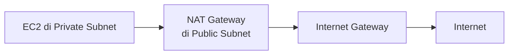

Hari terakhir minggu pertama. Sesi dibuka dengan materi network dan system hardening dulu, network discovery (nmap, port scanning), firewall trusted/untrusted zone, arsitektur multi-tier, sampe cara ngitung SLA uptime data center. Detail lengkapnya ada di [halaman khusus network dan system hardening](/blog/network-system-hardening-firewall-zones).

Lanjutan lab VPC dari kemarin kelar duluan, terus masuk materi NAT gateway, buat resource yang IP-nya private tetep bisa akses internet (misal buat update patch) tanpa perlu punya IP public sendiri, jadi "numpang" IP public dari NAT gateway-nya.

Ada trade-off juga soal NAT: mau satu NAT per AZ (murah tapi kalau AZ itu down, subnet lain ikut kena) atau NAT di tiap AZ (mahal tapi lebih tahan gangguan). Detail lengkapnya, plus tools troubleshooting network (ping, traceroute, netstat, telnet, curl), ada di [halaman khusus NAT Gateway](/blog/nat-gateway-network-troubleshooting-tools).

Sisa hari ini dipake buat trial-error bikin web server, sekali manual sekali otomatis pake VPC wizard plus user data script. Pas server-nya nggak bisa diakses, jadi belajar urutan troubleshooting yang bener: cek subnet, cek routing table, cek internet gateway, cek NACL, baru cek security group. Ujung-ujungnya emang paling sering port di security group yang belum dibuka.

Ada satu analogi yang lumayan nempel soal `systemctl` di Linux, dianalogikan kayak starter motor. Harus di-enable dulu (kunci kontak) baru di-start (starter), kalau cuma start doang tanpa enable, service-nya jalan sekarang tapi nggak bakal otomatis nyala lagi kalau server-nya restart. Detail lengkap lab-nya, plus kenapa HTTPS butuh sertifikat, ada di [halaman khusus web server troubleshooting](/blog/web-server-troubleshooting-systemctl-https).

Minggu pertama kelar. 66 lab, 5 hari, banyak banget yang harus diserap.

## Catatan Sampingan

- Instruktur kasih perbandingan harga sertifikat SSL: yang berbayar dari penerbit resmi (DigiCert dkk) bisa sekitar $130 per domain per tahun, dipakai bank-bank besar kayak BCA, Mandiri, sama Danamon, sementara yang gratis (Let's Encrypt) fungsi enkripsinya sama tapi levelnya beda soal trust dari penerbitnya.
- Analogi paling nempel buat jelasin kenapa penerbit sertifikat itu penting: kayak ijazah UGM asli vs "ijazah UGM" yang dibeli di Pramuka, sama-sama ngaku dari UGM tapi kepercayaannya beda jauh, cara ngeceknya sama, lihat siapa yang nerbitin.
