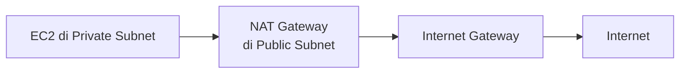

Nutup Week 1, ada dua topik praktis banget: NAT Gateway (biar resource private tetap bisa update/download tanpa harus punya IP public), dan tools command-line buat troubleshooting jaringan.

## NAT Gateway: "Numpang" IP Public

Resource di private subnet nggak punya IP public, jadi harusnya nggak bisa akses internet. Masalahnya, kadang resource itu tetap butuh keluar (misal buat download update/patch OS), tapi nggak boleh diakses dari luar. Solusinya: **NAT Gateway**.



NAT Gateway ditaruh di **public subnet**, dan resource di private subnet "numpang" IP public NAT Gateway itu buat komunikasi keluar. Arahnya cuma satu arah: private subnet bisa inisiasi koneksi keluar, tapi dunia luar nggak bisa inisiasi koneksi masuk ke private subnet lewat jalur ini.

### Trade-off: NAT per Region vs NAT per AZ

Ada dua strategi penempatan NAT Gateway:

- **Satu NAT Gateway buat semua AZ (regional-style)**: lebih murah, tapi kalau AZ tempat NAT Gateway itu down, semua subnet di AZ lain yang bergantung ke NAT itu ikut kena, nggak bisa akses internet lagi.
- **Satu NAT Gateway per AZ**: lebih mahal (karena tiap NAT Gateway pakai Elastic IP dan ada biaya per-jam plus biaya data processing), tapi lebih tahan gangguan, AZ satu down, AZ lain tetap jalan normal.

Pilihannya balik ke trade-off klasik: **murah tapi rapuh** vs **mahal tapi tahan banting**. NAT Gateway itu salah satu servis yang lumayan mahal di AWS, jadi keputusan ini perlu dipikirkan matang, bukan asal pilih yang paling lengkap.

## Tools Dasar Troubleshooting Jaringan

Beberapa command line tools yang kepake buat diagnosa masalah koneksi, dari layer 3 ke layer 7:

### ping

Cek konektivitas dasar ke sebuah host, sekaligus ukur latency-nya:

```bash
ping 8.8.8.8
```

Kalau host tidak merespons dalam waktu tertentu, hasilnya **request time out**. Beberapa layanan (kayak Tokopedia) sengaja menutup port ICMP supaya nggak bisa di-ping, salah satu alasannya buat menghindari traffic yang nggak perlu (dan biaya traffic yang menyertainya).

### traceroute

Menunjukkan **jalur** yang dilewati paket data dari sumber ke tujuan, lewat router mana aja:

```bash
traceroute google.com
```

Berguna buat diagnosa "lambatnya di mana", apakah dari sisi ISP kita atau dari jaringan tujuan. Tanda `*` di hasil traceroute berarti router di titik itu nggak merespons (request time out), bukan berarti jalurnya putus total.

### netstat

Cek koneksi jaringan yang aktif di server:

```bash
netstat -tp    # lihat koneksi established (siapa yang connect ke server)
netstat -tlp   # lihat port yang sedang listen
```

Berguna buat tahu siapa aja yang sedang terhubung ke server, dan port mana yang lagi "buka telinga" nunggu koneksi masuk.

### telnet

Alternatif tes koneksi ke port tertentu, meski sekarang udah dianggap usang buat remote access (kalah sama SSH karena nggak terenkripsi):

```bash
telnet example.com 80
```

Kalau berhasil connect, artinya port itu terbuka dan menerima koneksi. Keluar dari sesi telnet pakai `Ctrl + ]` lalu ketik `quit`.

### curl

Cek response dari sebuah aplikasi/website, termasuk proses handshake dan status code HTTP:

```bash
curl -v https://aws.com
```

Berguna buat lihat detail response, termasuk kalau ada redirect (kode 3xx) sebelum akhirnya sampai ke response final (kode 2xx untuk sukses).

## Yang Perlu Diinget

- NAT Gateway memungkinkan resource di private subnet akses internet keluar tanpa perlu IP public sendiri, tapi cuma satu arah (keluar doang, bukan buat diakses dari luar).
- Satu NAT Gateway per region itu murah tapi jadi single point of failure, NAT per AZ lebih mahal tapi lebih tahan gangguan.
- ping buat cek konektivitas dasar, traceroute buat lihat jalur/rute, netstat buat cek koneksi aktif, curl buat cek response aplikasi level HTTP.
- Banyak layanan besar (kayak Tokopedia) sengaja nutup ICMP/ping buat ngirit biaya traffic dan kurangi exposure.

## Referensi Resmi

- [NAT Gateways](https://docs.aws.amazon.com/vpc/latest/userguide/vpc-nat-gateway.html)
