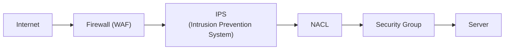
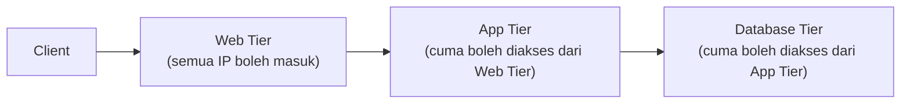

Sebelum masuk ke NAT Gateway dan lab web server, ada materi pengamanan jaringan yang lumayan padat: dari cara hacker "memetakan" jaringan sampe cara ngitung SLA data center.

## Network Hardening

Network hardening itu strategi pencegahan buat melindungi jaringan dari akses nggak berizin dan penyalahgunaan. Caranya lewat kombinasi network discovery protection, desain arsitektur yang aman, dan system hardening.

## Network Discovery: Alat yang Sama, Tujuan Beda

Tools yang dipake buat "memetakan" jaringan itu sama aja dipake attacker maupun defender, bedanya cuma niatnya:

- **Port scanning** (misal pake `nmap`): ngecek port mana yang terbuka di sebuah host.
  ```bash
  nmap -sP <IP>
  ```
- **ping**: cek host hidup atau enggak lewat ICMP.
- **traceroute**: cek jalur/rute paket data.

Analoginya kayak pisau: di tangan koki jadi alat bantu masak, di tangan penjahat jadi senjata. Kalau dipake defender (security analyst), tujuannya ngecek port mana yang ke-expose supaya bisa ditutup. Kalau dipake attacker, tujuannya nyari celah buat masuk.

## Lapisan Firewall Berlapis



Bisa sampai 5 lapis sebelum traffic beneran nyampe ke server. Kelihatan ribet, tapi itu emang perlu, apalagi buat sistem yang sensitif kayak perbankan, karena teknik hacking terus berkembang.

- **Firewall**: mekanisme filter traffic masuk/keluar berdasarkan source, destination, port, dan protokol. Bisa berbentuk hardware (fisik, harganya bisa puluhan sampai ratusan juta) atau software (lisensi).
- **IPS (Intrusion Prevention System)**: monitor traffic dan deteksi ancaman, biasanya pake deteksi berbasis **anomali** (pola nggak wajar, misal traffic yang tiba-tiba melonjak drastis) atau **signature** (pola yang udah dikenal sebagai ancaman).

### Trusted vs Untrusted Zone

- **Untrusted**: internet, nggak bisa dipercaya karena nggak terkontrol.
- **Trusted**: jaringan internal (kantor), terkontrol penuh siapa aja yang boleh akses.
- **DMZ (Demilitarized Zone) / Perimeter Zone**: zona setengah terkontrol, semacam area transisi antara trusted dan untrusted.

## Best Practice: Deny by Default

Prinsip firewall yang aman: **deny semua dulu**, baru izinkan yang beneran dibutuhkan (bukan sebaliknya, allow semua terus mikirin apa yang mau di-block). Semua traffic yang di-block/allow dicatat sebagai **log**, karena log itu barang bukti kalau ada investigasi.

## Arsitektur Multi-Tier

Pola security group buat arsitektur berlapis (web tier, app tier, database tier):



Client nggak bisa langsung nembak ke app tier atau database tier, harus lewat tier di depannya dulu. Database selalu jadi lapisan paling dalam dan paling dijaga, karena itu "ranjau terakhir" dari sebuah infrastruktur.

## Block vs Drop

Dua cara firewall merespons traffic yang ditolak:

- **Block**: firewall ngasih response penolakan eksplisit.
- **Drop**: firewall diem aja, nggak ngasih response sama sekali (kayak dicuekin).

**Drop lebih baik dari block**, karena block tetap makan resource buat generate response penolakan, sementara drop nggak membebani sistem sama sekali. Analogi ping ke server yang nge-drop ICMP: request-nya time out, bukan dapet pesan error yang jelas.

## Segmentasi Jaringan (Subnetting)

Subnetting itu motong satu jaringan besar jadi beberapa jaringan logis yang lebih kecil, tujuannya mempermudah manajemen dan **mengurangi broadcast traffic** (makin banyak device di satu jaringan flat, makin banyak broadcast traffic yang bikin performa turun).

Notasi CIDR (`/24` dst) itu beda-beda istilah tergantung vendor, tapi konsepnya sama: AWS bilang CIDR notation, Mikrotik bilang subnet mask, Cisco bilang prefix. Beda merek, konsep sama.

## System Hardening

Tujuannya mengurangi service yang berjalan (makin sedikit service aktif, makin sedikit celah), dan menerapkan prinsip **Triple A**:

- **Authentication**: user yang nggak valid nggak bisa masuk.
- **Authorization**: nentuin permission, user itu boleh ngapain aja.
- **Accounting**: pencatatan log, kalau ada yang mencurigakan bisa ditelusuri.

### Physical Security

Data center fisik (contoh: Cyber 1/Cyber 2 di Jakarta) punya prosedur akses yang ketat: verifikasi identitas, alasan kunjungan, tukar kartu akses, sampai check-out dan tanda tangan sebelum boleh keluar.

## Cara Ngitung SLA / Uptime

SLA data center biasanya dinyatakan dalam persentase uptime setahun. Makin banyak angka 9 di belakang koma, makin bagus:

| SLA | Downtime per Tahun (kira-kira) |
|---|---|
| 99% ("two nines") | ~3 hari 15 jam |
| 99.9% ("three nines") | ~8.7 jam |
| 99.99% ("four nines") | ~52 menit |

Data center di Indonesia umumnya masih di kisaran 99% (two nines), sementara data center kelas atas bisa sampai 99.999% (five nines).

## Yang Perlu Diinget

- Tools network discovery (nmap, ping, traceroute) itu netral, tergantung siapa dan tujuan apa yang makainya.
- Best practice firewall: deny semua dulu, baru allow yang dibutuhin, bukan sebaliknya.
- Drop lebih efisien dari block, karena nggak perlu ngeluarin resource buat generate response penolakan.
- Arsitektur multi-tier membatasi akses berlapis: client cuma bisa ke web tier, database tier cuma bisa diakses dari app tier.
- SLA uptime dihitung dari persentase, makin banyak angka 9, makin sedikit downtime yang ditoleransi dalam setahun.

## Referensi Resmi

- [AWS Security Overview Whitepaper](https://docs.aws.amazon.com/whitepapers/latest/aws-overview-security-processes/introduction.html)
