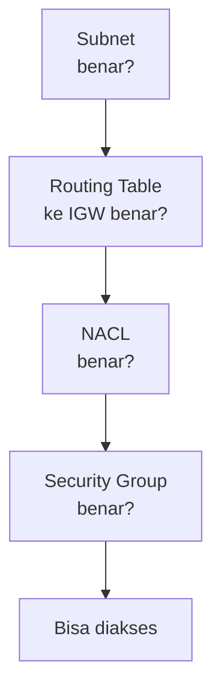
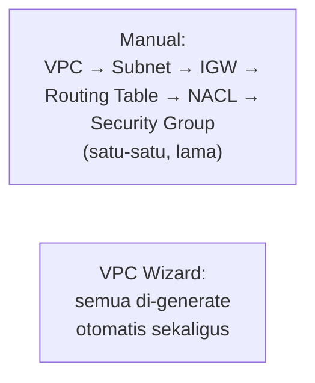

Lab terakhir Week 1: web server nggak bisa diakses, dan tugasnya nyari tahu kenapa. Ternyata dua masalah beda ketemu sekaligus di sini.

## Masalah 1: Service Terinstall Tapi Nggak Jalan

Aplikasi web server-nya (Apache/`httpd`) ternyata udah terinstall, tapi nggak jalan. Ceknya pake:

```bash
sudo systemctl status httpd
```

Statusnya `inactive`. Solusinya bukan cuma `start`, tapi juga `enable`:

```bash
sudo systemctl enable httpd
sudo systemctl start httpd
```

### Analogi: systemctl Itu Kayak Naik Motor

- **enable** = nyalain kunci kontak.
- **start** = starter, motornya jalan.

Kalau cuma `start` tanpa `enable`, motor (service) bisa jalan sekarang, tapi begitu server-nya restart, service itu nggak otomatis nyala lagi, karena "kunci kontaknya" belum di-enable. Analogi ini yang paling gampang diinget buat ngerti kenapa dua command ini sama-sama perlu dijalankan.

## Masalah 2: Port Belum Dibuka

Setelah service-nya jalan tapi masih tetap nggak bisa diakses, urutan troubleshooting yang dipakai:



Cara ceknya: masuk ke tab Networking di instance buat tahu instance itu di-deploy di subnet mana, lalu telusuri satu-satu: subnet-nya bener, routing table udah ngarah ke IGW, NACL nggak ada masalah (`ALLOW ALL`), sampai akhirnya ketemu di **security group**, ternyata port 80 belum dibuka (cuma port 22 buat SSH yang kebuka).

Setelah port 80 ditambahkan ke inbound rule, web server langsung bisa diakses.

## Kenapa HTTPS Nggak Otomatis Kepake

Meski port 443 (HTTPS) udah dibuka di security group, browser tetap butuh **sertifikat SSL/TLS** biar bisa serve lewat HTTPS. HTTPS itu sebenarnya HTTP + TLS (nama lama SSL, tapi orang masih sering nyebut SSL walau sekarang standarnya udah TLS).

Ada dua jenis sertifikat:
- **Berbayar** (dari Certificate Authority resmi kayak DigiCert, GlobalSign): dipakai institusi besar/perbankan, harganya bisa ratusan dolar per tahun per domain.
- **Gratis** (Let's Encrypt): fungsinya sama, mengenkripsi koneksi, tapi levelnya beda soal **trust**/kepercayaan penerbit.

### Cara Bedain Website Asli vs Phishing

Yang paling penting bukan cuma "ada gembok HTTPS atau enggak", tapi **siapa penerbit sertifikatnya**. Website perbankan biasanya pakai sertifikat dari penerbit berbayar yang reputable, bukan Let's Encrypt gratisan. Kalau nemu situs yang ngaku bank tapi sertifikatnya dari penerbit gratisan atau nggak jelas, itu jadi salah satu tanda mencurigakan, meskipun tampilannya persis sama dengan aslinya.

Cara ceknya: klik ikon gembok di address bar, lihat detail sertifikat, cek nama penerbit (issuer) dan domain yang tercantum.

## VPC Wizard: Cara Otomatis

Setelah sebelumnya bikin VPC manual (subnet, IGW, routing table, NACL, security group satu-satu), ada cara yang jauh lebih cepat: **VPC Wizard** (create VPC mode "auto"), yang otomatis bikin semuanya sekaligus, termasuk NAT Gateway kalau dipilih.



Alasan belajar manual dulu sebelum otomatis: supaya troubleshooting-nya nggak buta. Analoginya kayak belajar motor kopling dulu sebelum matic, biar ngerti mekanismenya, bukan cuma tahu "tinggal pencet".

## Yang Perlu Diinget

- `systemctl start` doang bikin service jalan sekarang, tapi `systemctl enable` yang bikin service itu otomatis nyala lagi pas server restart.
- Urutan troubleshooting jaringan yang sistematis: subnet, routing table, NACL, baru security group.
- HTTPS butuh sertifikat TLS, dan kepercayaan itu ditentukan dari penerbit sertifikatnya, bukan cuma dari ada-tidaknya gembok HTTPS.
- VPC Wizard bikin semua komponen jaringan otomatis, tapi belajar manual dulu penting biar ngerti cara troubleshoot-nya.

## Referensi Resmi

- [Troubleshoot Amazon EC2 Instances](https://docs.aws.amazon.com/AWSEC2/latest/UserGuide/TroubleshootingInstances.html)
