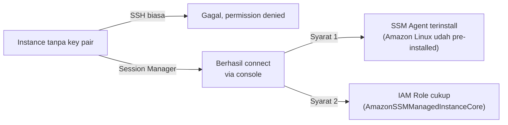

Lab ini sengaja mulai dari cara paling manual dulu: install MySQL sendiri di atas EC2, sebelum nanti lompat ke Amazon RDS (managed database service). Alasannya biar ngerti dulu apa yang sebenernya dikerjain RDS di balik layar, sebelum mulai manja sama service yang udah di-manage AWS.

## Connect Tanpa Key Pair: Kenalan Session Manager

Instance di lab ini sengaja nggak dikasih key pair pas dibuat, jadi SSH biasa (PuTTY atau terminal) nggak bisa dipake sama sekali. Solusinya pakai **Session Manager** dari Systems Manager, connect langsung dari AWS console tanpa perlu key sama sekali.



Dua syarat wajib biar bisa connect: instance-nya harus punya SSM Agent terinstall (Amazon Linux udah otomatis ada, distro lain kayak Ubuntu harus install manual), dan instance-nya harus punya IAM role dengan permission ke SSM. Kalau salah satu nggak terpenuhi, Session Manager nggak akan bisa connect.

## DDL: Bikin dan Hapus Database & Table

DDL (data definition language) itu buat ngatur struktur, bukan isinya. Perintah dasarnya:

```sql
-- bikin database
CREATE DATABASE world;
SHOW DATABASES;

-- bikin table
CREATE TABLE country (
    code CHAR(3) NOT NULL,
    name CHAR(52) NOT NULL,
    continent ENUM('Asia','Europe','North America','Africa','Oceania','Antarctica','South America') NOT NULL DEFAULT 'Asia',
    surface_area FLOAT(10,2) NOT NULL DEFAULT 0.00,
    population INT NOT NULL DEFAULT 0,
    PRIMARY KEY (code)
);
```

Beberapa hal soal tipe kolom yang worth dicatet:
- **`CHAR(3)`**: karakter dengan panjang maksimal, kalau input lebih panjang dari itu bakal kepotong.
- **`NOT NULL`**: kolom ini nggak boleh kosong. Penting dibedain, `NULL` itu artinya "nggak ada nilai/nggak jelas", beda sama string kosong yang tetap punya nilai (cuma kosong).
- **`ENUM`**: kolom yang isinya cuma boleh dari daftar pilihan tertentu, kayak dropdown di form.
- **`PRIMARY KEY`**: kolom yang nilainya wajib unik, nggak boleh ada yang sama, biasanya dipake juga buat relasi ke table lain lewat foreign key.

Buat ganti nama kolom, itu masuk DDL juga karena ngubah struktur, bukan isi:

```sql
ALTER TABLE country RENAME COLUMN continent TO region;
```

Dan buat hapus:

```sql
DROP TABLE country;   -- hapus table + struktur + isinya, abis total
DROP DATABASE world;  -- hapus database + semua table di dalamnya
```

## DML: Insert, Update, Delete

DML (data manipulation language) itu ngatur isinya, bukan strukturnya.

```sql
INSERT INTO country (code, name, region, surface_area, population)
VALUES ('IRL', 'Ireland', 'Europe', 70280, 4900000);

UPDATE country SET population = 5100000 WHERE code = 'IRL';

DELETE FROM country WHERE code = 'IRL';
```

Yang paling penting dari bagian ini: **`UPDATE` atau `DELETE` tanpa `WHERE` itu bahaya banget**, karena bakal ngenain SEMUA baris di table, bukan cuma yang dimaksud. Selalu cek dulu pakai `SELECT` dengan kondisi yang sama sebelum beneran jalanin `UPDATE`/`DELETE`, biar tau persis baris mana yang bakal kena.

Beda `DELETE` vs `DROP`: `DELETE` cuma hapus isi datanya, struktur table-nya tetep ada. `DROP` hapus semuanya, struktur ikut lenyap, harus bikin ulang dari nol kalau butuh lagi.

### Import/Export Database

```sql
mysql -u root -p world < world.sql
```

Command ini nge-import file `.sql` (isinya kumpulan statement `CREATE`/`INSERT`) ke database yang udah ada. Satu hal penting: nama database yang dituju harus sama persis sama yang ada di file backup-nya, kalau beda bisa error atau lebih parah lagi datanya masuk tapi berantakan.

## SELECT: Query Dasar

```sql
SELECT * FROM country;                          -- semua kolom, semua baris
SELECT COUNT(*) FROM country;                    -- jumlah baris doang
SELECT name, population FROM country;            -- kolom tertentu doang
SELECT surface_area AS luas FROM country;         -- kasih alias/nama sementara
```

Alias (`AS`) itu cuma ganti nama tampilan doang, sifatnya sementara, nggak ngubah nama kolom aslinya di database. Berguna banget kalau nama kolom aslinya ada spasi atau kurang enak dibaca.

### WHERE dan Kondisi

```sql
SELECT * FROM country WHERE population > 50000000;
SELECT * FROM country WHERE population > 50000000 AND population < 100000000;
SELECT * FROM country WHERE code = 'IRL' OR code = 'AUS';
SELECT * FROM country WHERE code IN ('IRL', 'AUS');
```

`IN` sama `OR` itu secara logika sama persis, bedanya cuma soal keterbacaan. `IN` lebih ringkas kalau daftar kondisinya banyak.

### ORDER BY, dan Jebakan Implicit ASC

```sql
SELECT * FROM country ORDER BY population;        -- defaultnya ascending (kecil ke besar)
SELECT * FROM country ORDER BY population DESC;   -- descending, besar ke kecil
```

Gotcha yang gampang bikin bingung: kalau `ORDER BY` nggak dikasih `ASC` atau `DESC` sama sekali, defaultnya tetep `ASC` (ascending), meskipun nggak ditulis eksplisit. Ini disebut **implicit syntax**, behavior default yang jalan walau nggak dideklarasikan. Beda sama `DESC` yang emang wajib ditulis eksplisit kalau mau descending.

Satu lagi kata yang gampang ketuker: `DESC` di depan sebuah statement (`DESC country`) itu singkatan dari `DESCRIBE` (nampilin struktur table), beda sama `DESC` di belakang `ORDER BY` yang artinya descending.

## Yang Perlu Diinget

- DDL ngatur struktur (`CREATE`, `ALTER`, `DROP`), DML ngatur isi data (`INSERT`, `UPDATE`, `DELETE`).
- `UPDATE`/`DELETE` tanpa `WHERE` itu bahaya, selalu cek dulu pakai `SELECT` dengan kondisi yang sama.
- `DELETE` cuma hapus isi, `DROP` hapus struktur + isi sekaligus.
- `ORDER BY` defaultnya ascending meski nggak ditulis eksplisit (implicit syntax).
- Session Manager bisa connect ke instance tanpa key pair sama sekali, asal SSM Agent dan IAM role-nya udah siap.

## Referensi Resmi

- [MySQL SQL Statement Reference](https://dev.mysql.com/doc/refman/8.0/en/sql-statements.html)
