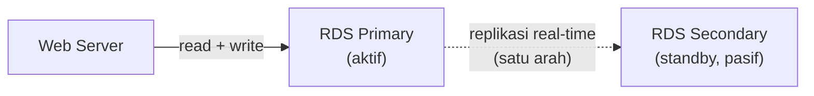
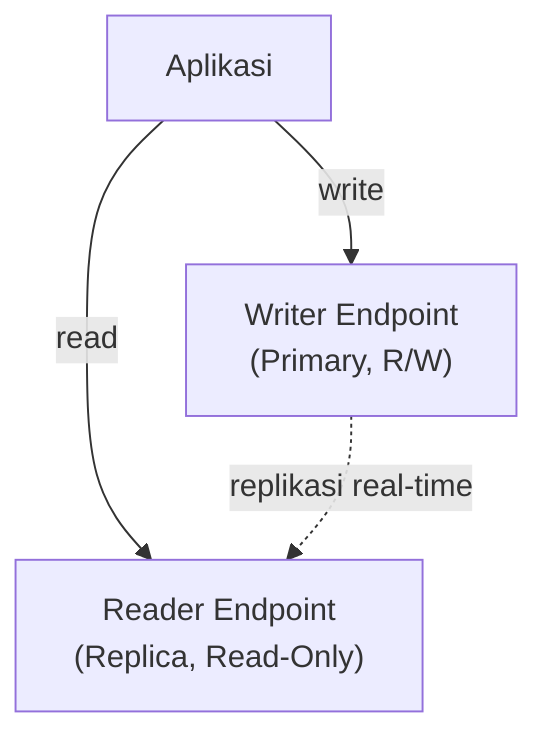
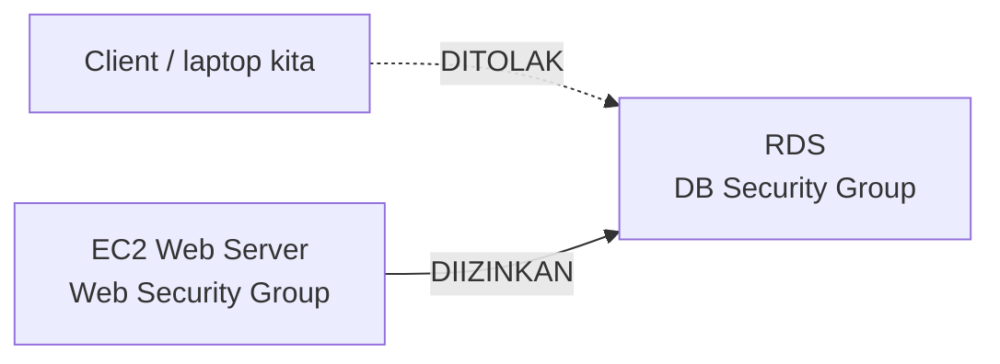

Lab ini ngelanjutin dari [database manual di EC2](/blog/database-ec2-ddl-dml-select), tapi sekarang naik level ke **Amazon RDS**, managed database service-nya AWS.

## RDS itu Sebenarnya EC2 + Database, Tapi Dibungkus

Konsepnya nggak jauh beda dari yang udah dipelajarin: EC2 yang diinstall MySQL manual. Bedanya, RDS itu paketan yang udah dibungkus AWS, semua hal yang tadinya harus di-setup manual (backup, failover, patching) tinggal centang doang. Trade-off-nya: RDS lebih mahal dibanding EC2+MySQL manual, karena bayar buat kemudahan management-nya.

## Primary-Secondary: Nama Beda, Konsep Sama

Istilah ini berubah-ubah tergantung generasi: dulu disebut **master-slave**, generasi 2000-an jadi **active-passive**, sekarang di dokumentasi AWS disebut **primary-secondary**. Konsepnya sama semua.

Web server cuma baca-tulis ke **primary**. **Secondary** cuma nerima replikasi satu arah dari primary, nggak pernah dikirim trafik langsung. Kelihatannya kayak "server nganggur digaji buta", tapi fungsinya baru kelihatan pas primary bermasalah, secondary langsung di-promote jadi primary baru (failover), dan AWS otomatis bikinin secondary pengganti di belakang layar. Ini konsep **disaster recovery**: nggak kelihatan gunanya sampai beneran ada masalah.

Replikasinya **event-based**, jalan tiap kali ada perubahan data (`INSERT`/`UPDATE`/`DELETE`), bukan polling per detik, jadi lebih efisien dari sisi biaya.

## RDS MySQL vs Aurora

|            | RDS MySQL/Postgres  | Aurora                                      |
| ------------| ---------------------| ---------------------------------------------|
| Kecepatan  | Baseline            | 5x lebih cepat dari MySQL, 3x dari Postgres |
| Engine     | Open-source standar | Proprietary, di-"overclock" AWS             |
| Serverless | Nggak ada           | Ada                                         |
| Harga      | Lebih murah         | Lebih mahal (kecuali mode serverless)       |

Restore backup cuma bisa antar engine yang sama (MySQL ke MySQL, Aurora MySQL ke Aurora MySQL). Aurora MySQL ke Aurora PostgreSQL nggak bisa langsung meskipun sama-sama Aurora, karena enginenya beda total, butuh proses konversi data dulu.

## Multi-AZ dan Aurora Cluster

Di level Aurora, ada juga **Multi-AZ DB Cluster** dengan **reader endpoint** (replica) yang bisa nerima trafik baca langsung, cuma nggak bisa nulis. Cocok buat aplikasi yang read-nya jauh lebih berat dari write, kayak e-commerce (banyak orang browsing, cuma sedikit yang checkout).

## Security Group Chaining

Security group buat RDS diatur biar cuma nerima trafik dari **security group web server**, bukan dari IP tertentu. Kenapa nggak pakai IP? Karena IP bisa berubah-ubah (apalagi kalau ada auto scaling, instance mati-nyala terus dapet IP baru), sementara security group jauh lebih stabil sebagai patokan. Ini juga alasan kenapa database nggak bisa diakses langsung dari laptop pribadi meskipun endpoint-nya udah ada, security group-nya emang sengaja cuma buka buat trafik dari web server.

## DB Subnet Group

Sebelum bikin RDS, wajib bikin **DB subnet group** dulu, isinya minimal 2 subnet di 2 AZ berbeda. Fungsinya dua: pertama, membatasi failover cuma terjadi di dalam AZ dan subnet yang udah ditentuin (nggak tiba-tiba pindah ke AZ lain yang nggak direncanain). Kedua, hasil dari sini adalah satu **endpoint** yang dipakai aplikasi buat connect, jadi nggak perlu pusing mikirin IP internal RDS.

## Konfigurasi Praktis di Lab

Beberapa keputusan konfigurasi yang diambil pas bikin RDS lab (dan alasannya):

- **Full config**, bukan Easy create, biar lebih ngerti tiap opsinya, bukan cuma klik-klik otomatis.
- **Instance type T3 medium**, karena T3 micro kelewat lemah buat nanganin trafik test.
- **Storage GP3 20GB** dengan storage auto-scaling diaktifin (bisa nambah sendiri sampai batas tertentu), tapi spek instance nggak auto-scale, harus stop dulu manual kalau mau upgrade.
- **Self-managed password**, bukan Secrets Manager, cuma buat ngirit biaya lab. Di production idealnya pakai Secrets Manager meskipun lebih mahal, karena urusan keamanan database itu nggak boleh dikompromiin demi murah.
- **Public access: No**, database cuma bisa diakses dari dalam VPC.
- **Backup retention**: konsep rolling window, misal di-set 5 hari, begitu masuk hari ke-6, backup hari pertama otomatis kehapus. Backup-nya disimpen di S3, bukan di instance secondary. Retention makin lama, makin mahal storage-nya, jadi kebanyakan orang pilih retention seminggu sebagai kompromi antara aman dan cost.
- **Enhanced monitoring & Performance Insights**: dimatiin di lab karena nambah biaya, tapi di production yang critical, ini worth diaktifin.

## Connect Aplikasi ke RDS

Setelah RDS jadi, aplikasi web (form CRUD sederhana) di-arahin ke RDS pakai endpoint-nya, plus nama database, username, dan password yang udah di-setting. Begitu connect, testing tambah-edit-hapus data langsung kerasa di aplikasi, buktinya aplikasi beneran nembak ke RDS, bukan lagi ke database lokal di EC2.

## Yang Perlu Diinget

- RDS itu konsepnya sama kayak EC2+database manual, cuma dibungkus jadi managed service, lebih mahal tapi lebih gampang di-maintain.
- Security group chaining (refer ke security group, bukan IP) itu best practice, karena IP bisa berubah tapi security group nggak.
- DB Subnet Group wajib ada sebelum bikin RDS, fungsinya batesin scope failover dan ngasih satu endpoint stabil.
- Failover itu otomatis lewat endpoint, aplikasi nggak perlu tau IP baru sama sekali.
- Aurora reader endpoint cocok buat aplikasi yang read-nya jauh lebih berat dari write-nya.

## Referensi Resmi

- [Amazon Aurora Overview](https://docs.aws.amazon.com/AmazonRDS/latest/AuroraUserGuide/Aurora.Overview.html)
- [High Availability for Amazon RDS](https://docs.aws.amazon.com/AmazonRDS/latest/UserGuide/Concepts.MultiAZ.html)
