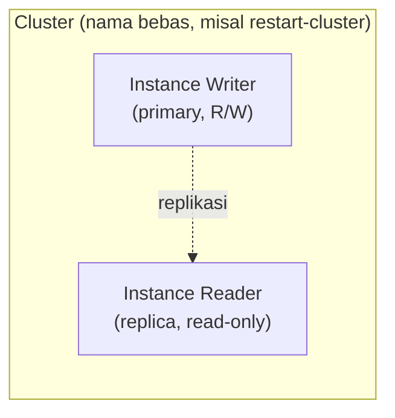
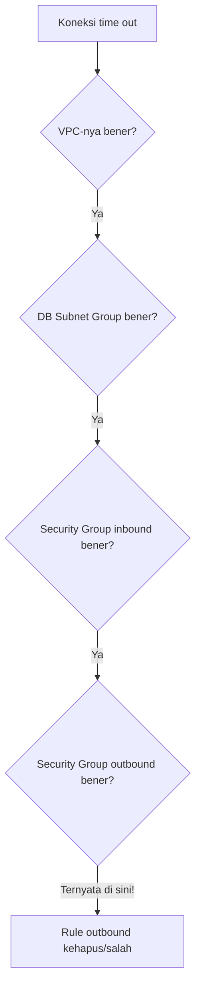

Lanjutan dari [RDS dan Aurora dasar](/blog/rds-aurora-multi-az), sekarang lebih dalam lagi ke spesifik Aurora.

## Aurora RDS vs Aurora, Biar Nggak Bingung

RDS itu nama service-nya (Relational Database Service), sementara Aurora itu salah satu **engine** di dalam RDS, sejajar sama MySQL, PostgreSQL, MariaDB, Microsoft SQL, Oracle, dan IBM DB2. Jadi "Aurora RDS" itu maksudnya "Aurora, di dalam service RDS", bukan dua hal yang beda.

## Cluster: Cuma Istilah buat Ngelompokin



**Cluster** itu sekadar nama buat ngelompokin instance-instance yang sebenernya satu kesatuan (primary + secondary, atau primary + reader replica). Namanya bebas, nggak harus "aurora", analoginya kayak nama komplek perumahan, isinya bisa disusun macem-macem (mau primary-secondary doang, mau ditambah reader replica, terserah), tapi tetep dipayungin satu nama cluster.

## Aurora Capacity Unit (ACU)

Kalau instance biasa spek-nya diukur pakai core CPU + RAM (misal T3 medium = 2 core, 4GB), Aurora versi **serverless** pakai satuan sendiri: **ACU (Aurora Capacity Unit)**. Konsepnya kayak beda satuan suhu Celsius vs Fahrenheit, isinya sama-sama ngukur "kapasitas", cuma satuannya beda biar lebih gampang buat scaling otomatis.

Aurora serverless bisa di-set minimum dan maksimum ACU (misal minimum 2, maksimum 16), dan dia bakal scaling vertikal otomatis di antara rentang itu tergantung beban. Makin tinggi ACU yang dipakai, makin mahal, jadi worth di-monitor biar nggak kaget billing.

## IO-Optimized vs Standard Storage

Ada 2 pilihan storage: **Standard** (lebih murah) dan **IO-Optimized** (lebih cepat buat read/write, tapi lebih mahal). Sama kayak beda hard disk biasa sama SSD, storage yang lebih cepet selalu lebih mahal.

## Right Forwarding di Replica

Replica itu defaultnya cuma bisa read, tapi ada opsi **right forwarding** (write forwarding) yang bikin replica bisa "numpang" nulis, request write-nya di-forward ke primary di belakang layar. Fiturnya gratis, tapi ngurangin performa replica itu sendiri, karena replica didesain buat fokus read doang.

## Backtrack: Rollback Aurora

**Backtrack** itu fitur buat "mundurin waktu" database ke titik tertentu, mirip restore point di Windows. Bedanya sama snapshot biasa: backtrack pakai storage yang benar-benar terpisah, jadi billing-nya juga kecatet terpisah, bukan bagian dari billing instance utama.

## Encryption: RDS-Managed vs Customer KMS Key

- **RDS-managed key**: kunci enkripsi built-in dari AWS, nggak bisa di-rotate manual, tapi nggak perlu di-manage sendiri dan lebih murah.
- **Customer KMS key**: kunci terpisah yang bisa di-rotate sendiri, cocok kalau ada requirement compliance, tapi lebih ribet dan ada biaya tambahan.

## Connect Manual ke Aurora

Beda sama RDS kemarin yang connect-nya lewat aplikasi web (GUI), kali ini connect-nya manual lewat command line dari EC2:

```bash
sudo yum install -y mariadb105  # atau mysql client
mysql -u admin -p -h <aurora-writer-endpoint>
```

Penting banget pakai **writer endpoint**, bukan reader endpoint (yang ada embel-embel `-ro` di endpoint-nya), karena buat `CREATE TABLE` dan `INSERT` butuh akses write.

## Troubleshooting: Kenapa Koneksi Time Out

Di challenge lab, disuruh ngulang bikin Aurora + connect ke web server sendiri, dan beneran ketemu error `timeout` pas connect. Urutan debug yang dipakai buat nyari akar masalahnya:



Ternyata semua konfigurasi (VPC, subnet group, security group inbound) udah bener, tapi tetep time out. Setelah dicek satu-satu, ternyata rule **outbound**-nya yang kehapus atau salah setting. Pelajarannya: troubleshooting koneksi database itu harus runut dari lapisan paling luar (network) ke dalam, dan jangan cuma cek inbound doang, outbound juga sama pentingnya.

## Yang Perlu Diinget

- Aurora itu engine di dalam RDS, bukan service yang beda.
- Cluster cuma istilah pengelompokan, namanya bebas.
- ACU itu satuan kapasitas khusus Aurora serverless, beda cara ukur tapi konsepnya sama kayak spek core+RAM biasa.
- Backtrack itu rollback dengan storage dan billing terpisah dari instance utama.
- Kalau koneksi database time out, cek berurutan: VPC, subnet group, security group inbound, DAN outbound.

## Referensi Resmi

- [Amazon Aurora Serverless v2](https://docs.aws.amazon.com/AmazonRDS/latest/AuroraUserGuide/aurora-serverless-v2.html)
- [Managing an Amazon Aurora DB Cluster](https://docs.aws.amazon.com/AmazonRDS/latest/AuroraUserGuide/Aurora.Managing.html)
