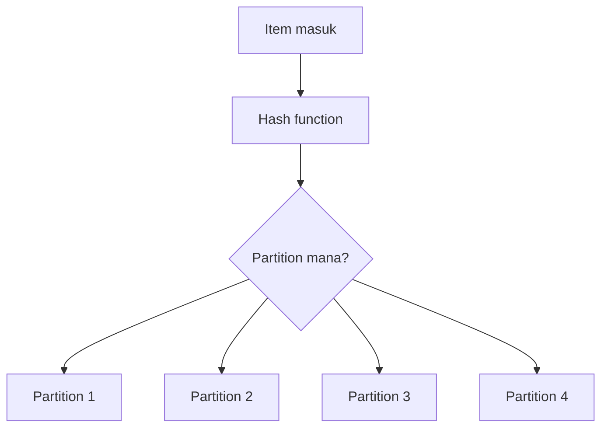
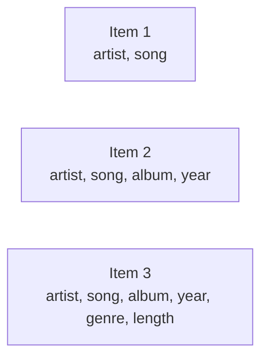
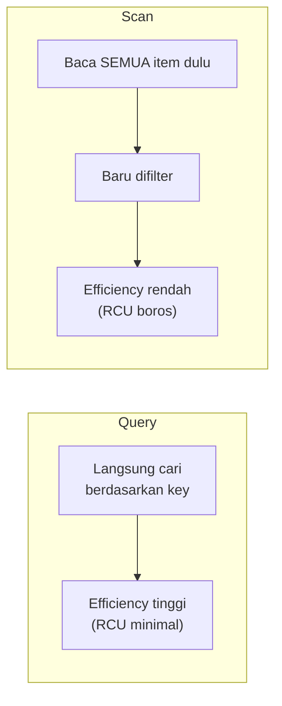

Setelah 3 hari full SQL, hari ini pindah ke dunia yang mindset-nya beda total: **NoSQL**, lewat DynamoDB.

## SQL vs NoSQL, Kenapa Dua-Duanya Masih Dipake

| | SQL | NoSQL |
|---|---|---|
| Struktur | Rigid (table, kolom tetap) | Fleksibel (schema-less) |
| Scaling | Vertikal | Horizontal |
| Harga | Lebih murah | Lebih mahal |
| Contoh | RDS, Aurora | DynamoDB, DocumentDB, Neptune |

NoSQL sendiri ada banyak jenis: **key-value** (DynamoDB), **document** (MongoDB, atau DocumentDB versi AWS-nya), **graph** (Neptune), masing-masing punya use case beda, jadi kalau soal ujian nanya "mau migrasi MongoDB ke AWS pakai apa", jawabannya DocumentDB, bukan DynamoDB, meskipun dua-duanya NoSQL, engine-nya beda.

Menariknya, sistem yang butuh presisi tinggi kayak ATM masih pakai SQL sampai sekarang, bukan karena NoSQL nggak canggih, tapi karena dari sisi operasional SQL jauh lebih murah dan cukup buat kebutuhan itu. NoSQL butuh spek jauh lebih gede (bisa 4x lipat) buat throughput yang sama, jadi dipilih SQL kalau kebutuhannya nggak butuh scaling horizontal yang ekstrem.

## Partition Key vs Composite Key

DynamoDB punya 2 cara nentuin key: **partition key** doang (nama lainnya **hash key**, harus unik), atau **partition key + sort key** (nama lain sort key: **range key**, kombinasinya disebut **composite key**).

Bedanya: kalau cuma pakai partition key, nilainya wajib unik semua. Kalau pakai composite key (partition key + sort key), partition key-nya boleh sama di beberapa item, asal kombinasi partition key + sort key-nya yang unik. Ini beda banget sama primary key di SQL yang harus unik sendirian.

Partition key itu yang nentuin item masuk ke "partisi" fisik mana di belakang layar (lewat proses hashing), tujuannya buat distribusi data yang merata.

## Schema-Less: Kelebihan Sekaligus Jebakan

Ini yang paling beda dari SQL. Di DynamoDB, tiap **item** (istilah DynamoDB buat row/baris) bisa punya atribut (istilah buat kolom) yang beda-beda:

Item pertama bisa cuma punya 2 atribut, item kedua bisa punya 4, item ketiga bisa punya 6, semua dalam satu table yang sama, tanpa perlu ubah struktur table dulu. Ini yang disebut **schema-less**, table-nya nggak maksa semua baris punya struktur identik.

Konsekuensinya: kalau item nggak punya atribut tertentu, nilainya bukan "kosong", tapi emang nggak ada sama sekali (beda konsep sama `NULL` di SQL yang tetap terdaftar sebagai kolom).

## Capacity: RCU dan WCU

Biaya DynamoDB dihitung pakai **RCU** (Read Capacity Unit) dan **WCU** (Write Capacity Unit). Rasio biayanya nggak simetris, **1 WCU setara 4 RCU**, artinya nulis data itu secara kapasitas "lebih mahal" 4x dibanding baca.

Yang paling penting: **ukuran item ngaruh langsung ke capacity yang kepake**. Item 4KB butuh capacity jauh lebih kecil dibanding item 400KB. Makanya best practice-nya: jangan simpen file gede (foto, video) langsung di DynamoDB, itemnya bikin kecil aja, biar capacity unit-nya irit. Kalau butuh nyimpen file besar, taruh di S3, DynamoDB cukup nyimpen link/reference-nya doang.

## Query vs Scan: Beda Jauh dari Sisi Biaya

Ini pelajaran paling penting soal cost di DynamoDB.

**`Query`** langsung nyari berdasarkan key yang udah ditentuin, efisien, RCU yang kepake minimal. **`Scan`** baca semua item dulu, baru difilter belakangan, jadi capacity yang kepake jauh lebih boros meskipun hasil akhirnya sama. Kalau datanya jutaan item, sekali `Scan` polos bisa ngabisin ratusan RCU sekaligus, ujung-ujungnya billing bengkak. Selalu prioritasin `Query` kalau memungkinkan, `Scan` cuma dipake kalau beneran nggak ada pilihan lain.

## Delete Table Itu Hard Delete

Beda sama SQL yang kadang ada opsi soft delete, hapus table di DynamoDB itu **hard delete**, table dan semua isinya lenyap permanen, nggak bisa di-undo. CloudWatch logs (buat nyimpen log query) juga nambah biaya kalau dibiarin aktif, jadi kalau nggak perlu, mending dimatiin biar nggak nambah beban billing yang nggak perlu.

## Yang Perlu Diinget

- SQL rigid + murah + vertikal scaling. NoSQL fleksibel + mahal + horizontal scaling. Dua-duanya masih relevan tergantung kebutuhan.
- Partition key doang harus unik. Composite key (partition + sort key) partition key-nya boleh sama, kombinasinya yang unik.
- Schema-less artinya tiap item bisa punya atribut beda-beda dalam satu table yang sama.
- 1 WCU setara 4 RCU, dan ukuran item ngaruh langsung ke capacity yang kepake, jangan simpen file besar di DynamoDB.
- `Query` jauh lebih murah dari `Scan`, karena `Scan` baca semua data dulu baru difilter.

## Referensi Resmi

- [Introduction to Amazon DynamoDB](https://docs.aws.amazon.com/amazondynamodb/latest/developerguide/Introduction.html)
