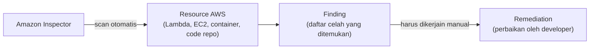

Amazon Inspector itu service buat scan vulnerability (celah keamanan) di resource AWS secara otomatis. Nama servicenya AWS emang suka bikin bingung, ada Inspector, ada Detective, ada GuardDuty, beda-beda fungsinya.

## Cuma Nyari, Bukan Ngebenerin

Poin paling penting soal Inspector: dia **cuma nyari masalah, nggak otomatis benerin**. Hasil scan-nya disebut **finding** (temuan), dan eksekusi perbaikannya tetep tanggung jawab manusia.



Konteksnya: banyak perusahaan nggak sanggup hire tim IT security khusus (mahal), jadi cloud engineer/developer merangkap pake automated security tool kayak Inspector. Tapi keputusan remediasi tetep di tangan manusia, Inspector nggak akan otomatis nge-patch kodingan kita.

## Apa Aja yang Bisa Di-scan

Inspector bisa scan 4 jenis resource: **container** (image Docker), **virtual machine** (EC2), **serverless function** (Lambda), dan **code repository**. Yang nggak bisa di-scan: database. Dan scan-nya nggak terbatas cuma resource dalam AWS doang, jadi kalau punya antivirus/security tool dari luar AWS juga tetep bisa dipake barengan, itu opsional.

## Billing: 3 Komponen

Ini yang bikin Inspector nggak murah, biayanya kena dari 3 sisi:

1. **Aktivasi**: begitu Inspector diaktifin, billing langsung mulai jalan (base per waktu), meskipun belum scan apa-apa.
2. **Per scan**: makin banyak resource yang di-scan, makin mahal.
3. **Storage**: hasil finding disimpen (biasanya di S3), jadi ada biaya storage tambahan.

Makanya harus hati-hati aktifin Inspector kalau nggak beneran butuh scan rutin, karena biaya aktivasinya jalan terus meski nggak ada aktivitas scan.

## Lab: Scan Lambda Function

Di lab ini, ada Lambda function yang deploy pake library Python `requests` versi lama yang punya celah keamanan (bug proxy authorization di versi tertentu). Setelah Inspector diaktifin dan nge-scan, ketemu **finding** dengan severity medium (skor sekitar 6.1), lengkap sama detail: library apa, versi berapa, dan rekomendasi perbaikannya.

Cara benerinnya: update versi package di `requirements.txt` ke versi yang udah di-fix, terus redeploy kodingannya. Habis itu Inspector otomatis nge-scan ulang, dan finding-nya ilang begitu package-nya udah di-update.

```bash
# sebelum: requirements.txt
requests==2.20  # versi rentan

# sesudah
requests  # tanpa versi spesifik, ambil versi terbaru
```

## Tiga Jenis Compute Service

Momen ini juga jadi kesempatan review 3 jenis compute service AWS: **virtual machine** (EC2, harus declare spek CPU/RAM manual), **container** (Docker, juga declare spek), dan **serverless** (Lambda, nggak perlu declare spek sama sekali, tinggal upload kode). Lambda ini yang disebut **FaaS** (Function as a Service), billing-nya berbasis "kena hit baru bayar", bukan per jam kayak EC2. Satu batasan penting Lambda: eksekusi maksimal **15 menit**, kalau kodingannya butuh proses lebih lama (misal ETL berat), Lambda bukan pilihan yang tepat.

## Yang Perlu Diinget

- Inspector cuma nemuin masalah (finding), remediasi tetep manual.
- Bisa scan container, VM, serverless function, dan code repository. Database nggak bisa.
- Billing-nya 3 lapis: aktivasi, per scan, dan storage buat nyimpen finding.
- Lambda punya batas eksekusi maksimal 15 menit, cocok buat proses ringan dan cepat, bukan buat job berat/lama.

## Referensi Resmi

- [What Is Amazon Inspector?](https://docs.aws.amazon.com/inspector/latest/user/what-is-inspector.html)
