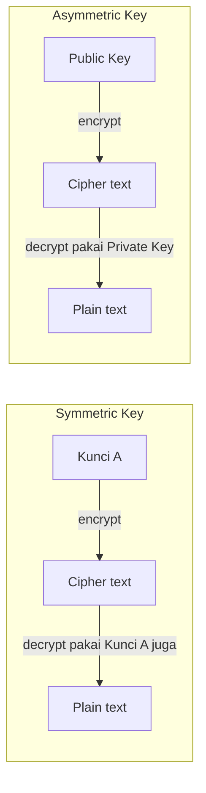

## Encryption itu Cuma Ngerubah yang Kebaca Jadi Nggak Kebaca

Sederhananya gitu doang. **Encryption** ngubah teks biasa (plain text) jadi teks acak yang nggak kebaca (cipher text), dan **decryption** yang ngebalikinnya. Ilmunya disebut **kriptografi**. Service AWS buat ngurusin ini namanya **KMS (Key Management Service)**.

## Symmetric vs Asymmetric Key



**Symmetric**: kunci buat encrypt dan decrypt itu **sama**, kayak kunci motor, buat nyalain dan matiin pake kunci yang sama persis.

**Asymmetric**: kuncinya **beda**, ada **public key** (buat encrypt) dan **private key** (buat decrypt). Contoh paling gampang: SSH, di mana private key dipegang user, public key ditaruh di server.

Di lab ini, dipake **symmetric key**.

## Bikin KMS Key

Beberapa keputusan pas bikin key:

- **AWS managed key vs Customer managed key**: pilih customer managed biar bisa kontrol penuh (siapa admin, siapa user, bisa di-rotate).
- **Region**: single-region (kunci cuma valid di satu region) vs multi-region (kunci yang sama valid lintas region).
- **Admin vs User**: admin bisa ngatur siapa aja yang boleh pake kunci ini (termasuk hapus kunci), user cuma bisa pake buat encrypt/decrypt doang.
- **Alias**: kunci KMS itu ID-nya susah diapalin, jadi dikasih nama alias yang lebih gampang diinget.

Satu hal penting: setelah kunci dibuat, **konfigurasi inti nggak bisa diubah** (tipe symmetric/asymmetric, region). Yang masih bisa diubah cuma alias, admin, dan user. Dan bikin kunci itu **nggak gratis**, ada biaya per kunci.

## Baca ARN

```
arn:aws:kms:us-west-2:123456789012:key/abcd1234-...
```

ARN (AWS Resource Name) itu formatnya konsisten: nama AWS, nama service, region, account ID, dan identifier resource-nya. Begitu ngerti polanya, ARN dari service manapun jadi gampang dibaca.

## Satu Kunci Bisa Dipake di Banyak Service

Satu KMS key nggak terikat ke satu service doang, bisa dipake buat encrypt S3, RDS, EC2, dan service lain sekaligus, tergantung kebutuhan. AWS punya soft limit sampai 100.000 kunci per akun, jadi kalau mau bikin kunci terpisah per service juga nggak masalah dari sisi limit, cuma jadi pertimbangan manajemen dan biaya aja (makin banyak kunci, makin ribet di-manage, meski masing-masing biayanya nggak gede).

## Inject Credential ke EC2

Sebelum bisa pake AWS CLI dari instance, credential (access key, secret key, session token) perlu di-inject dulu ke file `~/.aws/credentials`:

```bash
cd ~/.aws
nano credentials
# paste access key, secret key, session token dari detail lab
```

Catatan keamanan penting: file `credentials` ini isinya kunci yang bisa dipake login sebagai kita dari mana aja. Kalau file ini kebuka atau ke-share ke orang lain, itu sama bahayanya kayak access key bocor, orang lain bisa langsung pake identitas kita.

## Install AWS Encryption SDK CLI dan Setup

```bash
pip install aws-encryption-sdk-cli
export PATH=$PATH:~/.local/bin
```

Lab ini sempet ketemu error karena versi Python-nya kurang baru (encryption SDK butuh minimal Python 3.8), jadi harus update Python dulu sebelum install SDK-nya jalan lancar.

## Encrypt dan Decrypt File

```bash
# siapin file yang mau di-encrypt
echo "top secret1" > secret1.txt
mkdir output

# deklarasi variable kunci
KRN="arn:aws:kms:us-west-2:xxx:key/xxx"

# encrypt
aws-encryption-cli --encrypt \
  --input secret1.txt \
  --wrapping-keys key=$KRN \
  --metadata-output output/metadata \
  --encryption-context test=test \
  --commitment-policy require-encrypt-require-decrypt \
  --output output/

# decrypt (context harus sama persis kayak waktu encrypt)
aws-encryption-cli --decrypt \
  --input output/secret1.txt.encrypted \
  --wrapping-keys key=$KRN \
  --encryption-context test=test \
  --output output/
```

Setelah di-encrypt, isi file jadi cipher text yang nggak kebaca sama sekali. Buat decrypt, `encryption-context`-nya harus persis sama kayak waktu encrypt, kalau beda, proses decrypt-nya bakal gagal.

## Yang Perlu Diinget

- Symmetric key: satu kunci buat encrypt dan decrypt. Asymmetric key: public key buat encrypt, private key buat decrypt.
- Konfigurasi inti KMS key (tipe, region) nggak bisa diubah setelah dibuat, cuma alias/admin/user yang masih bisa di-edit.
- Satu KMS key bisa dipake di banyak service sekaligus, nggak terikat satu service doang.
- File credential AWS (`~/.aws/credentials`) itu sensitif banget, jangan sampai kebuka atau ke-share.
- `encryption-context` waktu decrypt harus sama persis kayak waktu encrypt.

## Referensi Resmi

- [AWS Key Management Service Concepts](https://docs.aws.amazon.com/kms/latest/developerguide/overview.html)
