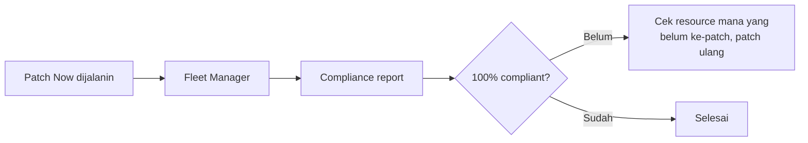

Lanjutan praktek [Patch Manager](/blog/aws-systems-manager), kali ini fokus ke cara nge-target patching pake tag, dan bikin patch baseline custom.

## Tagging: Kunci Biar Patching Nggak Ribet

Sebelum patching, server-server di-tag dulu (misal `patch group = windows-pro`), biar nanti patching bisa ditarget berdasarkan tag itu, bukan pilih satu-satu manual. Kalau server-nya ada 3, mungkin nggak berasa, tapi kalau ada 100 atau 5000 server, tagging di awal itu yang nyelametin waktu.

```bash
# tagging dilakukan di awal pembuatan instance, atau ditambahkan belakangan
Key: patch-group
Value: windows-pro
```

## Jebakan Spasi Saat Tagging

Ini pelajaran paling berkesan dari lab ini: waktu nge-tag 3 server dengan tag yang sama, pas di-filter cuma ketemu 2. Ternyata salah satu tag-nya kena spasi nyelip di ujung (`windows-pro ` bukan `windows-pro`) pas copy-paste, jadi dianggap beda dari 2 lainnya. AWS nganggep tag itu case-sensitive dan whitespace-sensitive, spasi yang nggak keliatan bisa bikin resource "hilang" dari hasil filter meskipun keliatannya sama persis di layar.

Solusinya cuma satu: teliti pas nge-tag, dan kalau hasil filter kelihatan nggak sesuai ekspektasi, curigain dulu ada karakter tersembunyi kayak spasi.

## Patch Now: Target Berdasarkan Tag

```bash
# Patch Manager > Patch now
Patch baseline: [custom baseline]
Targets: Specify tag
Tag: patch-group = windows-pro
```

Setelah tag beres, tinggal jalanin **Patch Now**, arahin target-nya ke tag yang udah dibikin. Semua server dengan tag itu bakal ke-patch bareng, nggak perlu remote satu-satu.

## Compliance Reporting



Hasil patching bisa dicek di **Fleet Manager**, bagian compliance. Kalau ada server yang masih **non-compliant**, itu tanda ada yang gagal ke-patch atau belum kena target. Solusinya simpel: jalanin **Patch Now** lagi, arahin ke server yang masih kurang. Nge-timpa server yang udah ke-patch dengan patch yang sama itu aman, biasanya AWS otomatis skip yang udah sesuai.

Satu insight penting soal proses belajar di lab: nggak harus sampai 100% compliance buat dianggap "selesai". Yang penting ngerti alurnya, konsepnya, dan cara troubleshoot-nya kalau ada yang nggak sesuai, bukan soal ngejar angka sempurna di lab yang emang dibatesin waktu.

## Yang Perlu Diinget

- Tagging server sebelum patching itu best practice, biar targeting-nya presisi dan gampang di-scale.
- Tag itu sensitif banget sama spasi, satu karakter nyelip bisa bikin resource "ilang" dari hasil filter.
- Compliance report di Fleet Manager nunjukin server mana yang masih perlu di-patch ulang.
- Belajar dari lab itu nggak harus 100% sempurna, yang penting ngerti alur dan cara troubleshoot-nya.

## Referensi Resmi

- [AWS Systems Manager Patch Manager](https://docs.aws.amazon.com/systems-manager/latest/userguide/systems-manager-patch.html)
