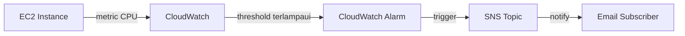

Lab terakhir Week 2, bikin sistem monitoring yang beneran notif kalau ada masalah, bukan cuma nampilin grafik doang.

## Monitoring vs Logging

Dua istilah yang sering ketuker: **monitoring** itu ngawasin metrik (CPU, memory, network) secara berkelanjutan, sedangkan **logging** itu nyatet kejadian/aktivitas yang udah terjadi. Monitoring buat tau kondisi "sekarang", logging buat investigasi "apa yang udah kejadian".

## Event-Driven: Nggak Perlu Ngecek Manual

Konsep intinya **event-driven architecture**: daripada tim harus buka dashboard tiap beberapa menit buat ngecek kondisi server, biarin sistem yang notif sendiri kalau ada kondisi tertentu yang kepenuhi. Sistem cuma bereaksi kalau ada "event" yang match kriteria, efisien dan nggak buang waktu buat ngecek yang nggak perlu.



## SNS: Topic dan Subscription

**SNS (Simple Notification Service)** kerja dengan model **topic** dan **subscription**. Topic itu kayak "saluran" pesan, subscriber (email, SMS, atau endpoint lain) daftar ke topic itu, dan begitu ada pesan masuk ke topic, semua subscriber otomatis dapet notifikasinya.

Ada 2 jenis topic:
- **Standard**: throughput tinggi, tapi urutan pesan nggak dijamin.
- **FIFO** (First In First Out): urutan pesan dijamin sesuai urutan masuk, tapi throughput lebih terbatas.

Buat lab ini dipake **Standard**, karena yang penting notifnya nyampe, bukan soal urutan.

### Setup Subscription

```
SNS > Create topic (Standard) > nama: cpu-alarm-topic
Create subscription > Protocol: Email > Endpoint: email@contoh.com
```

Setelah subscription dibuat, email konfirmasi bakal masuk ke inbox, dan **wajib** diklik link konfirmasinya, kalau nggak, subscription-nya tetep berstatus "pending" dan nggak akan nerima notifikasi apapun.

## Bikin CloudWatch Alarm

```
CloudWatch > Alarms > Create alarm
Metric: EC2 > Per-Instance Metrics > CPUUtilization (Classic Metrics)
Period: 1 minute
Threshold type: Static
Condition: Greater than 60%
Datapoints to alarm: 1 out of 1
Notification: pilih SNS topic yang udah dibikin
```

Alarm ini bakal berubah status jadi **ALARM** begitu CPU rata-rata dalam periode 1 menit itu ngelewatin 60%, dan begitu status berubah, SNS otomatis ngirim notifikasi ke semua subscriber.

## Stress Test: Buktiin Alarm-nya Jalan

Biar alarm-nya beneran kepicu, CPU instance dipaksa naik pake tools `stress`:

```bash
sudo yum install -y stress
stress --cpu 8 --timeout 600
```

Command ini bikin 8 proses yang sengaja ngebebanin CPU selama 600 detik (10 menit). Setelah beberapa saat, alarm status berubah dari `OK` ke `In alarm`, dan email notifikasi beneran masuk ke inbox.

## Bukan Real-Time

Satu catatan penting: CloudWatch itu **bukan real-time**. Ada jeda sekitar **5 menit** dari kondisi CPU beneran kelewat threshold sampai alarm berubah status dan notifikasi terkirim. Jeda ini karena proses pengumpulan metrik, evaluasi periode, sampai trigger notifikasi butuh waktu, bukan instan.

## Bikin Dashboard Custom

Selain alarm, CloudWatch juga bisa bikin **Dashboard** custom, gabungan beberapa widget (grafik CPU, network, disk, dsb) dalam satu tampilan, biar bisa liat kondisi beberapa resource sekaligus tanpa buka satu-satu.

## CloudWatch vs Grafana

Sempet dibahas juga perbandingan sama tools monitoring pihak ketiga kayak **Grafana**:

- **CloudWatch**: native AWS, setup cepat, langsung terintegrasi tanpa instalasi tambahan, tapi visualisasinya lebih terbatas.
- **Grafana**: visualisasi jauh lebih fleksibel dan bagus, bisa gabungin banyak sumber data (bukan cuma AWS), tapi butuh effort setup dan maintenance sendiri.

Pilihannya balik lagi ke kebutuhan: kalau cuma butuh monitoring dasar AWS yang cepat jadi, CloudWatch udah cukup. Kalau butuh visualisasi kompleks atau gabungan banyak sumber data, Grafana lebih worth effort-nya.

## Yang Perlu Diinget

- Monitoring ngawasin kondisi sekarang, logging nyatet kejadian yang udah lewat.
- Event-driven architecture: sistem notif sendiri, nggak perlu dicek manual terus-terusan.
- SNS topic Standard buat throughput tinggi, FIFO buat urutan pesan yang dijamin.
- Subscription email wajib dikonfirmasi dulu lewat link, kalau nggak, statusnya pending selamanya.
- CloudWatch bukan real-time, ada jeda sekitar 5 menit dari kondisi ke notifikasi.
- CloudWatch cepat setup tapi visualisasi terbatas, Grafana fleksibel tapi butuh effort setup sendiri.

## Referensi Resmi

- [Create an Amazon CloudWatch Alarm That Sends an Email](https://docs.aws.amazon.com/AmazonCloudWatch/latest/monitoring/AlarmThatSendsEmail.html)
