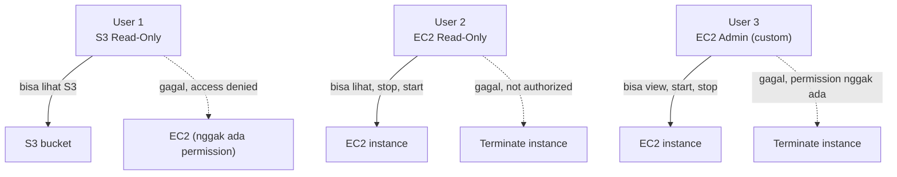
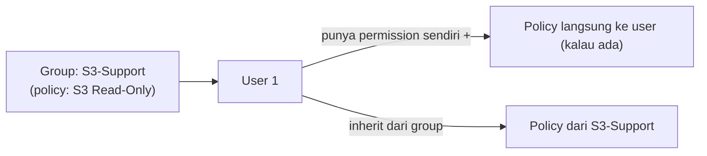
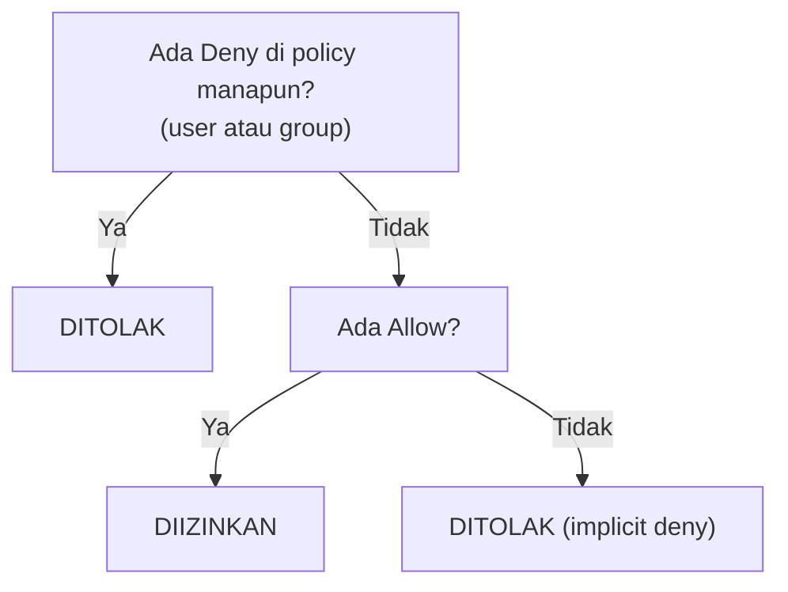

Lanjutan dari [materi IAM sebelumnya](/blog/iam-policy-permission-role), kali ini bener-bener praktik pake 3 user beda.

## IAM itu Global, Bukan Per-Region

IAM itu salah satu dari sedikit service AWS yang scope-nya **global**, bukan per-region. Artinya, setting yang dibuat di IAM berlaku ke semua region dan semua VPC sekaligus, nggak perlu di-setup ulang tiap pindah region.

## Password Policy Custom

Default password policy AWS itu minimal 8 karakter. Bisa di-custom jadi lebih ketat:

```
Minimal panjang: 10 karakter
Wajib: huruf besar, huruf kecil, angka, karakter spesial
Password reuse prevention: 1 (nggak boleh pake password yang sama persis dengan sebelumnya)
Password expiration: 90 hari
```

Satu hal penting: perubahan password policy **nggak retroaktif**. Kalau ada user yang passwordnya udah di-set sebelum policy diubah, password lama itu tetap valid sampai user itu ganti password sendiri, baru aturan barunya berlaku.

## Console Access vs Access Key

Ada 2 cara login sebagai IAM user:

1. **Management Console** (GUI): pakai username + password.
2. **CLI/SDK**: pakai access key + secret access key, di-setup lewat `aws configure`.

Dua-duanya independen, user bisa punya salah satu atau dua-duanya sekaligus.

## Praktik: 3 User, 3 Permission Beda



Dites langsung lewat browser private window (biar bisa login sebagai user beda-beda tanpa logout):

- **User 1** (S3 Read-Only): bisa liat isi bucket S3, tapi upload/delete/download gagal. Buka EC2 sama sekali nggak bisa, `access denied`.
- **User 2** (EC2 Read-Only): bisa liat detail instance EC2, bahkan **stop/start** karena itu ke-include di permission-nya, tapi **terminate** gagal, `you are not authorized`.
- **User 3** (EC2 Admin custom): permission-nya spesifik cuma buat describe/view/start/stop, sengaja **nggak** dikasih hak terminate. Coba terminate tetep gagal, meskipun namanya "admin".

Pelajaran dari sini: nama policy/user (kayak "admin") itu cuma label, yang beneran nentuin bisa-nggaknya adalah isi permission JSON-nya.

## Group: Biar Nggak Ngatur Satu-Satu

Daripada assign permission ke tiap user satu-satu, lebih efisien bikin **group** yang udah punya permission tertentu, terus tinggal masukin user ke group itu. User otomatis **inherit** permission dari group-nya.



Satu user bisa masuk ke **lebih dari satu group** sekaligus, dan permission-nya jadi gabungan dari semua group + policy langsung yang nempel ke user itu sendiri. Batasannya: satu group maksimal **9 user**.

## Policy Logic Evaluation: Deny Selalu Menang

Ini konsep paling penting soal resolusi konflik. Kalau ada 2 policy yang bentrok (satu **allow**, satu **deny**) buat action yang sama, nggak peduli itu ketemu di level user atau di level group, **deny selalu menang**.



Nggak perlu pusing mikirin "yang mana duluan dievaluasi" atau "user vs group siapa yang menang", karena patokannya bukan urutan atau sumbernya, tapi murni: **kalau ada deny di manapun, hasilnya deny**.

## Best Practice Bikin Policy

Cara paling aman nyusun policy: mulai dari **deny semua**, baru tambahin **allow** buat yang beneran dibutuhin. Ini lebih aman daripada mulai dari allow semua terus mikirin apa yang harus di-deny satu-satu, karena kalau ada yang kelewat nggak ke-deny, itu jadi celah keamanan.

## Yang Perlu Diinget

- IAM itu service global, setting-nya berlaku di semua region sekaligus.
- Password policy nggak retroaktif ke password yang udah ada sebelumnya.
- Nama policy/user itu cuma label, yang nentuin akses adalah isi permission-nya.
- User bisa masuk banyak group sekaligus, permission-nya gabungan dari semua sumber.
- Deny selalu menang dari allow, di manapun ketemunya (user atau group).
- Best practice: mulai dari deny semua, baru tambahin allow yang dibutuhin (least privilege).

## Referensi Resmi

- [Setting an Account Password Policy for IAM Users](https://docs.aws.amazon.com/IAM/latest/UserGuide/id_credentials_passwords_account-policy.html)
