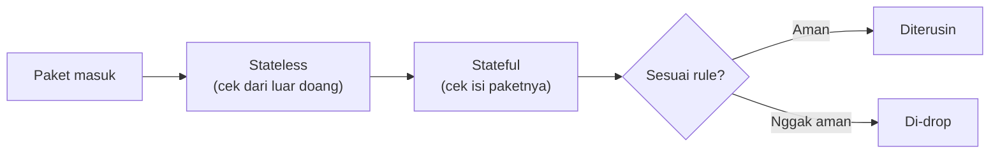

Materi ini soal AWS Network Firewall, service buat proteksi dari malware (malicious software) di level jaringan. Lab-nya beneran nyoba download 2 file "malware" (yang udah dijinakin buat keperluan lab) dan verifikasi firewall-nya nge-block akses ke situs itu.

## Stateless vs Stateful: Analogi Paket dan Bubble Wrap

Firewall policy di AWS Network Firewall punya 2 lapis: **stateless** dan **stateful**.



Analoginya kayak paket belanja online yang dibungkus bubble wrap: **stateless** itu kayak cuma ngecek dus-nya dari luar (aman/rusak secara fisik), nggak tau isinya apa. **Stateful** itu yang beneran buka dan cek isi paketnya (header, metadata, konten). Paket jaringan sendiri ada 2 jenis: **full** (utuh) dan **fragmented** (pecah), dan dua-duanya tetep harus lewat pengecekan stateless dulu sebelum ke stateful.

## Setup: Forward Semua ke Stateful

```
Stateless default action: Forward to stateful rule group
```

Karena aturan detailnya ada di stateful, konfigurasi stateless-nya cukup di-set forward semua paket (baik full maupun fragmented) ke stateful buat inspeksi lebih dalam.

## Bikin Rule Pakai Suricata

**Suricata** itu tools open-source buat IPS/IDS (Intrusion Prevention/Detection System), alternatif gratis dari tools komersial kayak Fortinet.

```
drop http $HOME_NET any -> $EXTERNAL_NET 80 (msg:"MALWARE custom solution"; flow: to_server,established; classtype:trojan-activity; sid:2002001; content:"/data/js_crypto_miner.html"; http_uri; rev:1;)

drop http $HOME_NET any -> $EXTERNAL_NET 80 (msg:"MALWARE custom solution"; flow: to_server,established; classtype:trojan-activity; sid:2002002; content:"/data/java_jre17_exec.html"; http_uri; rev:1;)
```

Rule ini nge-drop koneksi HTTP ke path tertentu yang diketahui berisi malware. Setelah rule group dibikin, tinggal di-attach ke firewall policy bagian stateful.

## Kapasitas Rule = Biaya

Tiap rule group punya **capacity** (misal 100), yang nentuin seberapa banyak rule bisa ditampung. Semakin besar kapasitas, semakin mahal, dan sekali di-set, kapasitas nggak bisa diubah lagi (harus bikin rule group baru kalau butuh lebih).

Total kapasitas per akun ada batas atas **30.000**. AWS juga nyediain **managed rule group** (bawaan, tinggal pakai) yang jauh lebih lengkap tapi juga jauh lebih mahal, misal satu rule bawaan soal botnet aja udah makan kapasitas 3.500.

## Custom vs Managed: Trade-off Biaya vs Effort

| | Custom (Suricata sendiri) | Managed (bawaan AWS) |
|---|---|---|
| Biaya | Lebih murah | Lebih mahal |
| Effort | Harus explicit, tulis rule satu-satu | Tinggal aktifin, udah lengkap |
| Cocok buat | Budget terbatas, tau persis apa yang mau di-block | Mau cakupan luas, budget nggak masalah |

Prinsipnya: custom itu "murah tapi capek", managed itu "mahal tapi tinggal pakai". Keputusannya balik lagi ke budget dan kebutuhan.

## Hati-Hati Sama Wildcard

Kalau pakai wildcard (`*`) buat nge-block semuanya sekaligus biar nggak capek nulis rule satu-satu, itu bisa ke-block semuanya, termasuk situs yang sah kayak Google atau Gmail. Rule custom sebaiknya **eksplisit**, sebutin domain/URL spesifik yang mau di-block, bukan pola umum yang bisa nyangkut ke banyak hal.

## Testing: Verifikasi Blokirnya Jalan

Setelah rule di-attach, dicoba akses lagi ke 2 URL malware tadi lewat `wget`. Hasilnya request nggak pernah selesai (`awaiting response` terus), karena koneksinya udah di-drop firewall sebelum sempet nyampe.

## Kalau Udah Terlanjur Ke-download

Kalau ternyata malware-nya udah keburu ke-download sebelum rule-nya aktif, urutan mitigasinya: putusin koneksi dulu, hapus file yang udah ke-download, baru bikin/aktifin rule block-nya sebelum buka koneksi lagi.

## Yang Perlu Diinget

- Stateless cek paket dari luar doang, stateful cek isi/header-nya lebih dalam.
- Rule capacity nentuin biaya, dan nggak bisa diubah setelah di-set, batas per akun 30.000.
- Custom rule (Suricata) lebih murah tapi effort-nya nulis manual, managed rule lebih mahal tapi tinggal pakai.
- Hindari wildcard buat blocking, bisa ke-block situs yang sah juga.
- Kalau udah terlanjur ke-download, urutan mitigasinya: putus koneksi, hapus file, baru pasang rule block.

## Referensi Resmi

- [What Is AWS Network Firewall?](https://docs.aws.amazon.com/network-firewall/latest/developerguide/what-is-aws-network-firewall.html)
