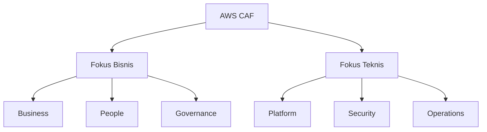

Materi ini nggak dibahas langsung di sesi Zoom, jadi bagian dari self-study minggu ini sebelum masuk Week 3.

## Kenapa Butuh CAF

Migrasi IT ke cloud itu bukan cuma soal teknis mindahin server. Biar berhasil, tiga elemen ini harus align: **people, process, technology**. AWS CAF (Cloud Adoption Framework) adalah panduan buat nyusun rencana migrasi yang matang, biar organisasi nggak asal pindah tanpa arah.

## 6 Perspektif CAF

CAF ngebagi tanggung jawab migrasi ke 6 area fokus (perspectives), 3 buat kapabilitas bisnis, 3 buat kapabilitas teknis:

### Business

Stakeholder-nya: manajer bisnis, finance, budget owner. Fokusnya mastiin strategi IT selaras sama strategi bisnis, dan investasi IT bisa dilacak hasilnya ke bisnis (business risk management, IT finance, benefit realization).

### People

Stakeholder-nya: HR, staffing, people manager. Fokusnya evaluasi struktur organisasi, skill gap, dan nyiapin training/perubahan organisasi biar makin agile.

### Governance

Stakeholder-nya: CIO, program manager, enterprise architect. Fokusnya nyelarasin strategi IT dan bisnis biar investasi IT-nya maksimal manfaatnya dan minim risiko (portfolio management, license management).

### Platform

Stakeholder-nya: CTO, IT manager, solutions architect. Fokusnya bikin dan komunikasiin arsitektur sistem target, termasuk prinsip dan pola buat implementasi solusi baru atau migrasi workload dari on-premise ke cloud.

### Security

Stakeholder-nya: CISO, IT security manager. Fokusnya mastiin organisasi capai tujuan security-nya (identity/access management, deteksi ancaman, proteksi data, incident response).

### Operations

Stakeholder-nya: IT operations manager, IT support manager. Fokusnya ngatur gimana operasional bisnis jalan sehari-hari sampe tahunan (monitoring, disaster recovery, service catalog).

## Yang Perlu Diinget

- CAF itu panduan, bukan aturan baku, tujuannya nyelarasin people, process, dan technology biar migrasi cloud berhasil.
- 3 perspektif fokus bisnis: Business, People, Governance.
- 3 perspektif fokus teknis: Platform, Security, Operations.
- Tiap perspektif punya stakeholder dan kapabilitas masing-masing yang jelas, biar tanggung jawab migrasi nggak numpuk di satu divisi doang.

## Referensi Resmi

- [AWS Cloud Adoption Framework](https://aws.amazon.com/professional-services/CAF/)
