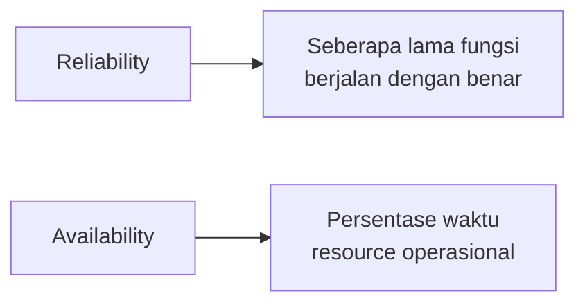

Lanjutan self-study soal arsitektur cloud, kali ini Well-Architected Framework, panduan buat evaluasi apakah arsitektur yang dibangun udah sesuai best practice cloud atau belum.

## 6 Pillar

Well-Architected Framework terdiri dari 6 pillar, tiap pillar punya design principles dan best practice sendiri: **operational excellence, security, reliability, performance efficiency, cost optimization, sustainability**.

## Cost Optimization

Tujuannya: eliminasi pengeluaran yang nggak perlu.

- **Implement cloud financial management**: perlakukan manajemen biaya cloud sebagai kapabilitas serius, sama kayak security atau operations, bukan sekadar ngecek tagihan doang.
- **Adopt a consumption model**: bayar cuma buat resource yang kepake. Contoh: environment dev/test yang cuma dipake 8 jam sehari pas kerja, kalau instance-nya dimatiin pas nggak kepake, bisa hemat sampai 75% (40 jam vs 168 jam seminggu).
- **Measure overall efficiency**: ukur output bisnis dibanding biaya buat nyampein output itu.
- **Reduce spending on data center operations**: AWS yang urusin rak server, listrik, sampe OS-level management, biar fokus ke bisnis.
- **Analyze and attribute expenditure**: cloud mempermudah lacak biaya per workload/tim, jadi ROI-nya lebih jelas.

## Sustainability

Tujuannya: minimalin dampak lingkungan (emisi karbon, konsumsi energi, limbah).

- **Understand your impact**, ukur dampak workload dari awal sampe eventual decommissioning-nya.
- **Establish sustainability goals**, misal ngurangin resource yang dibutuhin per transaksi.
- **Maximize utilization**, right-sizing workload, karena 2 host jalan di 30% utilisasi itu kurang efisien dibanding 1 host di 60% (ada baseline power consumption per host).
- **Anticipate lebih efisien hardware/software**, terus pantau opsi yang lebih hemat energi.
- **Pakai managed service**, karena resource dipakai bareng-bareng banyak customer jadi utilisasinya lebih maksimal (contoh: S3 Lifecycle, EC2 Auto Scaling).
- **Reduce downstream impact**, kurangin energi/resource yang dibutuhin customer buat pakai servis kamu.

## Design Principles Umum

- **Stop guessing capacity**: di cloud nggak perlu nebak-nebak kapasitas, tinggal monitor demand dan scale otomatis.
- **Test at production scale**: bikin environment duplikat buat testing on-demand, abis itu decommission, bayar cuma pas dipake.
- **Automate**: replikasi sistem dengan biaya rendah, gampang di-rollback kalau ada masalah.
- **Provide for evolutionary architectures**: karena testing on-demand risikonya rendah, sistem bisa terus berkembang seiring waktu.
- **Drive architectures using data**: infrastruktur sebagai kode artinya bisa dikumpulin data nyata buat keputusan arsitektur, bukan asumsi doang.
- **Improve through game days**: simulasi kegagalan sistem secara terjadwal (contoh: Chaos Monkey dari Netflix, yang sengaja matiin instance random buat nguji ketahanan sistem).

## Reliability vs Availability

Dua istilah yang keliatan mirip tapi beda:

- **Reliability**: ukuran seberapa lama sebuah resource menjalankan fungsinya dengan benar.
- **Availability**: persentase waktu resource dalam kondisi operasional normal, dihitung dari `waktu normal ÷ total waktu`.

### Tabel Downtime per Jumlah "9"

| Jumlah 9 | Uptime | Downtime Maks/Tahun | Setara Downtime/Hari |
|---|---|---|---|
| Satu 9 | 90% | 36.5 hari | 2.4 jam |
| Dua 9 | 99% | 3.65 hari | 14 menit |
| Tiga 9 | 99.9% | 8.77 jam | 1.4 menit |
| Empat 9 | 99.99% | 52.6 menit | 8.6 detik |
| Lima 9 | 99.999% | 5.25 menit | 0.86 detik |

## High Availability (HA)

HA itu soal minimalin downtime tanpa perlu campur tangan manusia. Tiga faktor utamanya:

- **Fault tolerance**: kemampuan tetap jalan meski ada komponen yang gagal, biasanya pakai redundansi hardware.
- **Scalability**: seberapa cepat infrastruktur merespons kenaikan kebutuhan kapasitas.
- **Recoverability**: proses dan prosedur buat mulihin servis setelah kejadian besar (bencana, dst).

Di on-premise, HA itu mahal dan biasanya cuma buat aplikasi mission-critical doang. Di AWS, HA dicapai lewat data center redundan di tiap AZ, banyak AZ per region, banyak region di seluruh dunia, plus servis yang fault-tolerant by design.

## Yang Perlu Diinget

- 6 pillar Well-Architected: operational excellence, security, reliability, performance efficiency, cost optimization, sustainability.
- Reliability ngukur seberapa lama fungsi jalan benar, availability ngukur persentase waktu operasional, dua hal yang beda meski sering ketuker.
- Makin banyak angka 9 di uptime, makin sedikit downtime yang ditoleransi per tahun.
- HA di cloud dicapai lewat kombinasi fault tolerance, scalability, dan recoverability, bukan cuma nambah server doang.

## Referensi Resmi

- [AWS Well-Architected](https://aws.amazon.com/architecture/well-architected/)
- [AWS Well-Architected Reliability Pillar](https://docs.aws.amazon.com/wellarchitected/latest/reliability-pillar/wellarchitected-reliability-pillar.pdf#welcome)
