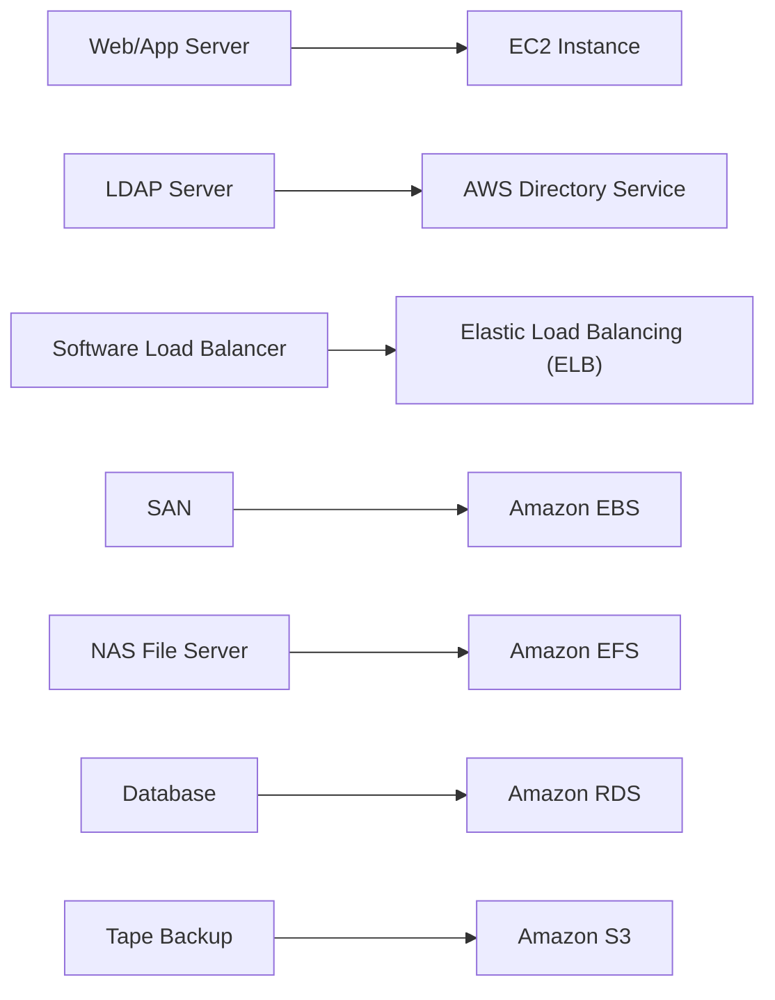

Latihan self-study: dikasih diagram data center korporat tradisional, terus diminta mapping tiap komponennya ke servis AWS yang setara. Nerapin konsep dari [CAF](/blog/aws-cloud-adoption-framework-caf) dan [Well-Architected Framework](/blog/aws-well-architected-framework) yang udah dipelajari sebelumnya.

## Komponen Data Center Tradisional

Contoh data center korporat biasanya isinya: web server, load balancer (software-based), app server, database primer dan sekunder, tape backup storage, server Active Directory/LDAP, NAS file server, dan SAN.

## Mapping ke Servis AWS

| Komponen On-Premise | Servis AWS |
|---|---|
| Server (web/app) | EC2 instance |
| LDAP | AWS Directory Service |
| Load balancer software | Elastic Load Balancing (ELB) |
| SAN | Amazon EBS |
| NAS file server | Amazon EFS |
| Database | Amazon RDS |
| Tape backup storage | Amazon S3 |

### Penjelasan Tiap Mapping

- **Server** → EC2 instance bisa jalanin Windows Server, Red Hat, SUSE, Ubuntu, atau Amazon Linux, jadi support hampir semua jenis aplikasi server yang tadinya jalan di server fisik.
- **LDAP** → AWS Directory Service support autentikasi LDAP, bisa setup Active Directory baru di cloud atau konek ke Active Directory on-premise yang udah ada.
- **Load balancer software** → ELB itu managed load balancing, auto-scaling sesuai traffic, health check otomatis ke resource yang di-attach, dan otomatis nge-redirect traffic dari resource yang lagi unhealthy.
- **SAN** → volume EBS bisa di-attach ke instance buat penyimpanan jangka panjang dan sharing data antar-instance.
- **NAS file server** → EFS itu file storage buat EC2, kapasitasnya nambah/ngurang otomatis sesuai file yang ditambah/dihapus.
- **Database** → RDS support Aurora, PostgreSQL, MySQL, MariaDB, Oracle, dan SQL Server, dikelola AWS.
- **Tape backup** → RDS bisa di-backup otomatis ke S3, ngeliminasi kebutuhan hardware backup fisik.

## Benefit Setelah Migrasi

- **Trade upfront cost jadi variable cost**, nggak perlu beli hardware di depan.
- **Economies of scale**, ikut kebagian daya beli AWS yang gede.
- **Nggak perlu nebak-nebak kapasitas**, tinggal desain sistem yang scalable.
- **Speed dan agility naik**, deploy/decommission tinggal beberapa klik.
- **Nggak perlu lagi biaya maintenance data center**, bayar servis yang dipake doang.
- **Bisa go global dalam hitungan menit**, tinggal pilih region.

## Yang Perlu Diinget

- Hampir semua komponen data center tradisional ada padanannya di AWS: server → EC2, SAN → EBS, NAS → EFS, database → RDS, tape backup → S3, load balancer → ELB, LDAP → Directory Service.
- ELB itu bukan cuma bagi traffic, tapi juga otomatis health-check dan reroute traffic dari resource yang unhealthy.
- Migrasi ke cloud itu nukar upfront cost (beli hardware) jadi variable cost (bayar sesuai pakai).

## Referensi Resmi

- [AWS Well-Architected](https://aws.amazon.com/architecture/well-architected/)
- [AWS Cloud Adoption Framework](https://aws.amazon.com/professional-services/CAF/)
