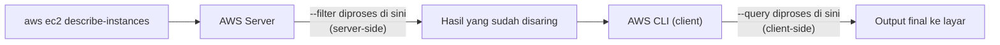
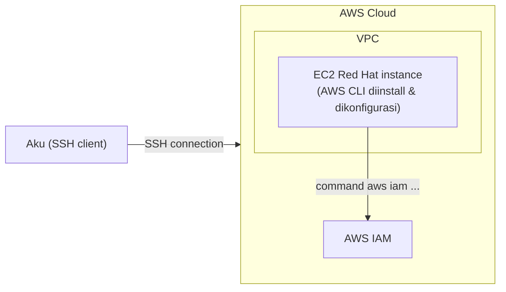

Lanjutan materi AWS CLI, fokus ke 3 opsi yang paling sering kepake buat kerja sehari-hari: `--query`, `--filter`, dan `--dry-run`.



## --query: Nyaring di Sisi Client

`--query` itu buat ngebatasin apa yang ditampilin dari hasil response, prosesnya di sisi client (bukan di server).

```bash
aws ec2 describe-instances --query 'Reservations[0].Instances[0]'
```

Command di atas cuma nampilin instance pertama dari reservation pertama. Bisa lebih spesifik lagi:

```bash
aws ec2 describe-instances --query 'Reservations[0].Instances[0].State.Name'
```

Ini cuma balikin satu baris doang, isinya state name-nya aja (misal `terminated`). Kepake banget kalau lagi query banyak instance dan cuma butuh field tertentu.

## --filter: Nyaring di Sisi Server

Beda sama `--query`, `--filter` itu nyaringnya di server, jadi yang dikirim balik ke kita emang udah sesuai kriteria dari awal.

```bash
aws ec2 describe-instances --filter "Name=platform,Values=windows"
```

Bisa juga dikombinasi `--query` sama `--filter` bareng:

```bash
aws ec2 describe-instances \
  --query "Reservations[*].Instances[*].InstanceId" \
  --filter "Name=instance-type,Values=t2.micro,t2.small"
```

Ini nyari semua instance di akun, tapi cuma nampilin InstanceId dari yang tipenya t2.micro atau t2.small.

## --dry-run: Ngetes Permission Doang

`--dry-run` itu buat ngecek apakah kita punya permission buat jalanin suatu action, tanpa beneran ngejalanin action-nya.

```bash
aws ec2 run-instances \
  --image-id ami-1a2b3c4d \
  --count 1 \
  --instance-type c5.large \
  --key-name MyKeyPair \
  --security-groups MySecurityGroup \
  --dry-run
```

Kalau authorized, hasilnya error `DryRunOperation` yang bunyinya "request would have succeeded". Kalau nggak authorized, errornya `UnauthorizedOperation`. Berguna banget buat ngetes IAM policy sebelum beneran eksekusi.

## Profile: Kelola Banyak Akun dari CLI yang Sama

Kalau `aws configure` dijalanin biasa, itu nyetel credential ke profile `default`. Tapi kalau kerja sama beberapa akun AWS sekaligus (misal akun pribadi vs akun kerjaan), bisa bikin profile terpisah:

```bash
aws configure --profile admin
# isi access key, secret, region, output buat akun ini

aws s3 ls --profile admin
```

Jadi satu mesin, satu instalasi CLI, bisa nyimpen kredensial banyak akun sekaligus, tinggal tambahin `--profile <nama>` di command mana pun yang mau pake kredensial itu. Kalau nggak disebutin, defaultnya ya pake profile `default`.

## Command yang Sering Kepake

| Command | Fungsi |
|---|---|
| `aws ec2 run-instances` | Launch instance dari AMI |
| `aws ec2 describe-instances` | Lihat instance yang ada |
| `aws ec2 create-volume` | Bikin EBS volume |
| `aws ec2 create-vpc` | Bikin VPC baru |
| `aws s3 ls` | List bucket/isi bucket S3 |
| `aws s3 cp` | Copy file ke/dari S3 |
| `aws s3 mv` | Pindahin file lokal/S3 |
| `aws s3 rm` | Hapus object S3 |

## Case Study: Kenapa Pake CLI

Ada kasus café yang mau install AWS CLI buat urusan admin. Dua pertanyaan checkpoint yang menurutku worth dicatet:

**Kenapa developer pilih CLI daripada console?** Buat automasi, bikin dan bangun infrastruktur berulang kali tanpa klik-klik manual.

**Apa arsitektur solusinya berubah kalau pake CLI?** Nggak, arsitekturnya tetep sama. Yang beda cuma cara implementasinya. Dengan CLI, ratusan command bisa dijalanin lewat satu file script.

## Lab: Install dan Konfigurasi AWS CLI dari Nol

Lab ini prakteknya di instance Red Hat Linux yang sengaja belum ada AWS CLI-nya (beda sama Amazon Linux yang udah pre-installed), jadi bener-bener install dari nol.


_Akses instance EC2 Red Hat lewat SSH, install & konfigurasi AWS CLI di situ, terus dipake buat interaksi ke IAM._



Alurnya:

1. **Connect ke instance lewat SSH.** Di Windows pake PuTTY (butuh file `.ppk`), di macOS/Linux pake terminal biasa dengan key `.pem`:

```bash
chmod 400 labsuser.pem
ssh -i labsuser.pem ec2-user@<ip-address>
```

2. **Install AWS CLI-nya**, karena Red Hat belum ada bawaan:

```bash
curl "https://awscli.amazonaws.com/awscli-exe-linux-x86_64.zip" -o "awscliv2.zip"
unzip -u awscliv2.zip
sudo ./aws/install
aws --version
```

3. **Cek dulu IAM policy yang udah ada** lewat console (user `awsstudent`, policy `lab_policy` dalam format JSON), sekalian catet access key ID-nya buat langkah berikutnya.

4. **Konfigurasi CLI-nya** biar konek ke akun AWS:

```bash
aws configure
# AWS Access Key ID: ...
# AWS Secret Access Key: ...
# Default region name: us-west-2
# Default output format: json
```

5. **Test koneksinya** dengan nge-list IAM user:

```bash
aws iam list-users
```

Kalau berhasil, balik response JSON isi daftar user di akun itu.

### Challenge: Ambil Policy Document Lewat CLI Doang

Ada tantangan tambahan: download `lab_policy` dalam bentuk JSON, tapi nggak boleh pake console sama sekali, harus full CLI. Solusinya:

```bash
# cari policy custom (scope local)
aws iam list-policies --scope Local

# ambil isi JSON policy-nya, simpen ke file
aws iam get-policy-version --policy-arn arn:aws:iam::<account-id>:policy/lab_policy --version-id v1 > lab_policy.json
```

Yang aku pelajarin dari challenge ini: buat cari command yang tepat, cara paling efektif ya buka [AWS CLI Command Reference](https://docs.aws.amazon.com/cli/latest/reference/iam/index.html) dan baca command apa aja yang tersedia, bukan ngapalin semua command dari awal.

## Yang Perlu Diinget

- `--filter` jalan di server, `--query` jalan di client buat batesin tampilan hasil.
- `--dry-run` buat ngecek permission tanpa beneran eksekusi.
- CLI nggak ngubah arsitektur solusi, cuma ngubah cara implementasinya jadi bisa diotomasi.
- Buat connect ke AWS lewat CLI butuh access key ID + secret access key, beda sama login console yang pake username/password.

## Referensi Resmi

- [Connect to Your Linux Instance from Windows Using PuTTY](https://docs.aws.amazon.com/AWSEC2/latest/UserGuide/connect-linux-inst-from-windows.html)
- [AWS CLI IAM Command Reference](https://docs.aws.amazon.com/cli/latest/reference/iam/index.html)
