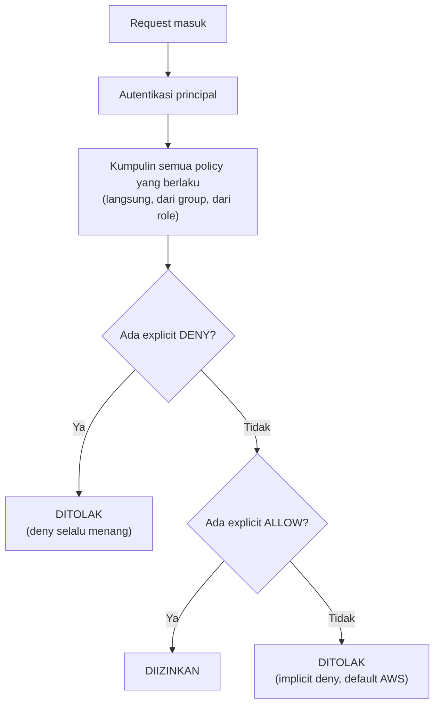

## Policy dan Permission

Policy itu dokumen (format JSON) yang isinya definisi allow/deny buat suatu action & resource. Ada juga **ACL (access control list)**, ini satu-satunya tipe policy yang nggak pake struktur JSON, tapi fungsinya sama, ngatur principal (user/resource) mana yang boleh akses resource tertentu.

Contoh policy yang ngasih akses EC2 tapi cuma kalau MFA aktif dan dari IP tertentu:

```json
{
  "Version": "2012-10-17",
  "Statement": [
    {
      "Sid": "MFA-Access",
      "Effect": "Allow",
      "Action": "ec2:*",
      "Resource": "*",
      "Condition": {
        "BoolIfExists": { "aws:MultiFactorAuthPresent": "true" },
        "IpAddress": { "aws:SourceIp": "1.2.3.4/32" }
      }
    }
  ]
}
```

Cara evaluasi policy-nya: autentikasi principal dulu, tentuin policy mana yang berlaku, evaluasi semua policy yang berlaku, baru tentuin allowed atau nggak. Urutan evaluasi policy-nya sendiri nggak ngaruh ke hasil akhir, karena **explicit deny selalu menang** dari allow manapun.



## IAM Role

Role dipake buat ngasih akses temporary, bisa buat AWS service yang butuh akses ke resource lain, atau buat single sign-on (SAML 2.0, OAuth 2.0). Role bisa di-**assume**: aplikasi/service minta temporary security credential buat request programmatic ke AWS.

Cara pake role ada 3: lewat console, lewat CLI, atau lewat SDK.

## User-Based vs Resource-Based Permission

**User-based**: nanya "entity ini punya akses ke apa aja?" Contoh, user Saanvi dikasih role yang punya akses Read ke Resource Y dan Z.

**Resource-based**: nanya "siapa aja yang punya akses ke resource ini?" Contoh, Resource X cuma bisa diakses Carlos, Wang, Efua, dan Mateo, masing-masing dengan level akses beda-beda (Read/Write/List).

## Root Account vs IAM User

Root account itu identitas paling tinggi di akun AWS, nggak bisa dibatasi permission-nya sama sekali, jadi kalau kecolongan, satu-satunya solusi ya tutup akun. Bandingin sama IAM user yang kalau kecolongan, tinggal matiin access key-nya terus bikin baru, jauh lebih gampang di-recover.

Makanya root account cuma dipake buat hal yang beneran nggak bisa dilakuin IAM user, misalnya ganti support plan atau kalau IAM admin lupa password dan nggak ada yang bisa reset. Selebihnya, kerjaan harian (manage server, infrastruktur, dst) tetep pake IAM user, biasa disebut juga *federated user* dalam konteks perusahaan, staff baru dikasih akun IAM sendiri, bukan dipinjemin akses root.

Satu hal yang gampang ketuker: **root account AWS** itu beda level sama **root user di Linux** pas kita SSH ke sebuah EC2 instance. Yang satu itu identitas tertinggi di ekosistem AWS (akun), yang satu lagi cuma user administratif di dalam OS instance itu sendiri (server). Dua hal yang kebetulan namanya sama tapi scope-nya beda.

## Access Key Itu Kayak Kunci Fisik, Bukan Password Personal

Kalau di console kita login pakai username + password yang ngewakilin satu identitas, access key itu beda konsepnya, siapa pun yang pegang key ID + secret-nya bisa login sebagai user itu dari mana aja, device apa aja, nggak ada ikatan ke satu device tertentu. Makanya kalau access key bocor (kadang disebut *credential leak* atau, becandaannya, "id shopping"), orang lain bisa langsung pakai identitas kita dari CLI di komputer manapun tanpa kita sadar sampai tagihan billing-nya muncul.

Kalau itu kejadian, langkahnya sama kayak IAM user kecolongan: matiin access key yang lama, baru bikin yang baru. Ini juga kenapa secret access key cuma bisa dilihat sekali pas awal dibuat, nggak ada cara buat "lihat lagi" belakangan, jadi kalau lupa nyimpen, ya harus generate ulang.

## Best Practice

- Jangan pake root user buat kerjaan harian, bikin IAM user terpisah begitu akun baru dibuat.
- Terapin **least privilege**: kasih akses seperlunya doang, bisa ditambah belakangan kalau emang butuh.
- Pake role buat cross-account access.
- Aktifin MFA buat user yang punya privilege tinggi.
- Rotate credential secara berkala.
- Satu user idealnya cukup satu access key aktif. Boleh punya 2, tapi itu bukan best practice, lebih susah di-audit kalau ada yang aneh.

## Yang Perlu Diinget

- IAM punya 3 tipe identity: User, Group, Role. Policy bukan identity, tapi dokumen aturan.
- Explicit deny selalu menang dari allow, di identity manapun policy itu nempel.
- Kalau nggak ada policy yang secara eksplisit allow, defaultnya deny (implicit deny).
- Jangan pake root account, terapin least privilege, aktifin MFA.

## Referensi Resmi

- [IAM Roles](https://docs.aws.amazon.com/IAM/latest/UserGuide/id_roles.html)
- [Policies and Permissions in IAM](https://docs.aws.amazon.com/IAM/latest/UserGuide/access_policies.html)
- [IAM Security Best Practices](https://docs.aws.amazon.com/IAM/latest/UserGuide/best-practices.html)
