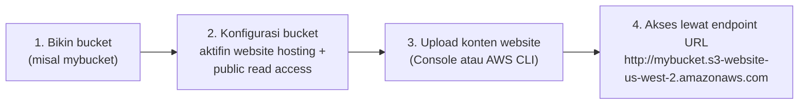
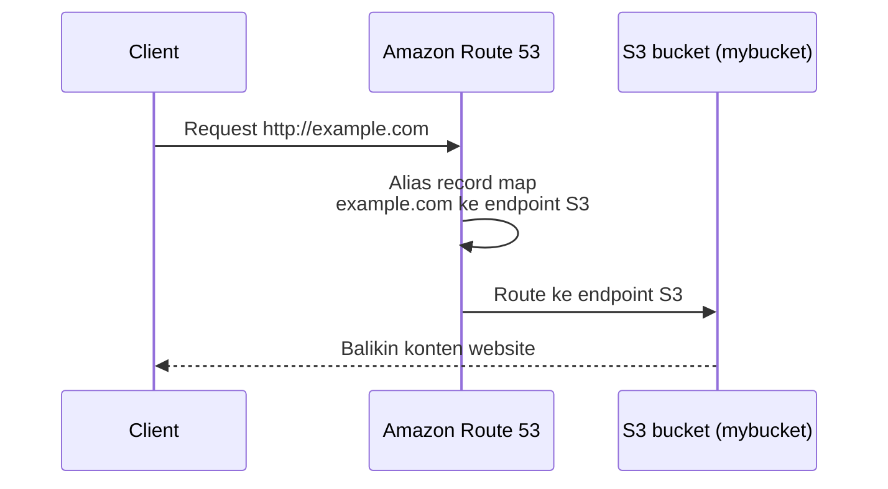

## Kenapa S3 Bisa Buat Hosting Website

S3 itu object storage, tapi salah satu fiturnya bisa dipake buat hosting **static website** (html, css, js doang, nggak ada server-side processing kayak PHP/JSP). Bedanya sama dynamic website yang butuh server buat proses logic-nya.

Enaknya pake S3 buat static website:
- Nggak perlu ngurus infrastruktur sama sekali.
- Otomatis scale kalau trafiknya naik.
- Murah, nggak ada server yang perlu di-maintain.

Batasannya cuma satu: S3 cuma bisa serve HTTP, kalau butuh HTTPS harus ditambah CloudFront di depannya.

## Static vs Dynamic, Biar Nggak Ketuker

Contoh paling gampang buat static website: company profile, website sekolah yang isinya cuma berubah setahun sekali (misal ganti tahun ajaran doang), atau portofolio pribadi. Kontennya jarang banget di-update, dan nggak ada proses kayak checkout, apply voucher, atau update stock, itu semua ciri-ciri **server-side scripting** yang bikin sebuah website nggak lagi bisa dianggap static.

Bandingin sama Tokopedia atau Shopee, itu **dynamic website**: tiap jam bisa ada event baru, harga berubah, stock berkurang pas ada yang checkout. Atau aplikasi kayak Grab yang di baliknya udah microservices, banyak API, dan database real-time, jauh lebih kompleks dari sekadar S3 doang. Jadi kalau ada yang nanya "boleh dong bikin marketplace di S3 static hosting", jawabannya nggak bisa, karena semua transaksi itu butuh server-side processing yang S3 nggak punya.

## Aturan Penamaan Bucket

Nama bucket S3 itu nggak sembarangan, karena ujungnya jadi bagian dari endpoint DNS:

- Panjang 3 sampai 63 karakter.
- Cuma boleh huruf kecil (a-z), angka (0-9), titik (.), dan strip (-). Nggak boleh huruf besar.
- Harus **unik secara global**, se-AWS, bukan cuma unik di akun kita doang. Makanya sering ketemu bucket name yang aneh-aneh, abis nama yang "wajar" biasanya udah kepake orang lain.

## Cara Kerjanya

Endpoint URL-nya ada 2 format tergantung region, dipisah pake titik atau strip sebelum nama region-nya. Bucket juga harus punya index document (default `index.html`) yang jadi halaman default kalau diakses ke root.

Kalau mau custom domain, tinggal bikin alias record di Route 53 yang map domain kita ke endpoint S3-nya.

## Lab: Bikin Website Café Pake CLI

_Client akses website café langsung lewat bucket endpoint URL, setelah bucket S3 dikonfigurasi buat website hosting._

Lab ini prakteknya pake AWS CLI dari EC2 instance, bukan klik-klik console. Alurnya kira-kira:

1. Konek ke EC2 pake Session Manager, jalanin `aws configure` buat setup credential.
2. Bikin bucket S3 lewat `aws s3api create-bucket`.
3. Bikin IAM user baru (`awsS3user`) yang dikasih policy full access ke S3, biar nggak pake credential akun utama.
4. Atur bucket permission: matiin block public access, aktifin ACL.
5. Extract file website (`index.html`, folder `css`, `images`) dari arsip yang udah disiapin.
6. Aktifin website hosting di bucket: `aws s3 website s3://<bucket>/ --index-document index.html`.
7. Upload semua file: `aws s3 cp ... --recursive --acl public-read`.
8. Buka bucket website endpoint URL, websitenya langsung kebuka.

Yang menurutku paling kepake buat kerjaan sehari-hari itu bagian terakhirnya: bikin batch file (`update-website.sh`) yang isinya command `aws s3 cp` tadi, jadi kalau ada perubahan konten tinggal jalanin script itu lagi, nggak perlu ngetik ulang command panjang.

Ada juga optional challenge yang bagus: ganti `aws s3 cp` jadi `aws s3 sync`. Bedanya, `cp` upload ulang SEMUA file tiap dijalanin (walau nggak ada yang berubah), sedangkan `sync` cuma upload file yang beneran berubah. Lebih efisien buat update rutin.

## Yang Perlu Diinget

- 3 langkah utama: bikin IAM user dengan akses S3, bikin & konfigurasi bucket buat hosting, upload file website.
- `aws s3 cp` buat upload file ke bucket, `aws s3 sync` versi efisiennya (cuma upload yang berubah).
- Custom domain buat static website S3 diatur lewat Route 53.

## Referensi Resmi

- [aws s3 sync — AWS CLI Reference](https://docs.aws.amazon.com/cli/latest/reference/s3/sync.html)
- [AWS CLI s3api Command Reference](https://docs.aws.amazon.com/cli/latest/reference/s3api/)
- [Installing or Updating the AWS CLI](https://docs.aws.amazon.com/cli/latest/userguide/getting-started-install.html)
