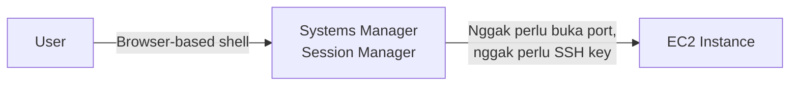

Systems Manager ini kumpulan kapabilitas buat sentralisasi operational data dan otomasi tugas di banyak resource AWS sekaligus. Ada beberapa capability yang paling sering kepake:

## Run Command

Cara otomatis buat jalanin command yang udah didefinisiin ke banyak EC2 instance sekaligus, bisa pake command bawaan atau custom, bisa target instance manual atau pake tag, bisa langsung atau terjadwal. Enaknya, nggak perlu setup bastion host atau ngurus SSH key.

## Session Manager

Ini yang paling kerasa manfaatnya: connect ke instance lewat browser-based shell, tanpa buka inbound port, tanpa bastion host, tanpa SSH key sama sekali.




_User start session ke Systems Manager, yang bikin browser command session, baru nyambung ke managed instance di dalam security group-nya, tanpa buka port apapun ke instance itu._

Semua akses lewat Session Manager tercatat, siapa yang connect ke instance mana dan kapan, bisa diaudit lewat CloudTrail. Command yang dijalanin juga bisa di-log ke S3 atau CloudWatch Logs.

## Patch Manager

Otomasiin patching OS/software ke banyak instance. Alurnya: bikin **patch baseline** (aturan approve/reject patch), definisiin **maintenance window**, apply patch, terus review hasilnya.

## Maintenance Windows

Jadwal buat jalanin task yang berpotensi disruptive (patching, update driver, install software) di waktu tertentu. Alurnya: bikin window, assign target (resource yang kena), assign task (Run Command, Automation, Step Functions, atau Lambda), terus review status.

## State Manager

Jaga instance tetep konsisten di state yang kita definisiin, biar nggak ada configuration drift. Caranya: bikin automation document (SSM document) yang definisiin state yang diinginkan, associate ke instance, atur jadwal penerapannya.

## Parameter Store

Tempat nyimpen config data atau secret secara terpusat, format name-value pair, bisa plain text atau ter-enkripsi pake KMS.

```bash
aws ssm get-parameter --name /Dev/DB/Password --with-decryption
```

## Inventory

Ngumpulin info soal instance dan software yang keinstall di dalamnya, tanpa perlu login satu-satu ke tiap instance.

## Lab: Install Aplikasi Tanpa Remote Manual

Lab ini prakteknya: pake Fleet Manager buat generate inventory list, pake Run Command buat install aplikasi (Widget Manufacturing Dashboard) lengkap sama web server dan dependency-nya secara otomatis, pake Parameter Store buat toggle fitur beta di aplikasi tanpa perlu redeploy, dan terakhir pake Session Manager buat masuk ke instance dan jalanin command AWS CLI langsung dari browser, tanpa SSH sama sekali.


_User jalanin AWS-RunShellScript lewat Run Command, yang otomatis nge-install Apache HTTP Server, PHP, AWS SDK for PHP, dan aplikasi Widget Manufacturing ke EC2 instance sekaligus._

Yang paling menarik buat aku itu bagian Parameter Store-nya: aplikasi bisa cek parameter tertentu (`/dashboard/show-beta-features`) buat mutusin nampilin fitur beta atau nggak. Konsep "dark feature" ini, fitur yang udah keinstall tapi belum diaktifin, jadi kerasa relevan banget sama praktik feature flag di dunia development modern.

## Yang Perlu Diinget

- Session Manager: akses instance tanpa buka port, tanpa bastion, tanpa SSH key.
- Patch Manager + Maintenance Windows buat otomasiin patching terjadwal.
- Parameter Store buat simpen config/secret terpusat, bisa dienkripsi.
- Semua akses lewat Systems Manager bisa diaudit lewat CloudTrail.

## Referensi Resmi

- [What Is AWS Systems Manager?](https://docs.aws.amazon.com/systems-manager/latest/userguide/what-is-systems-manager.html)
- [AWS Systems Manager Session Manager](https://docs.aws.amazon.com/systems-manager/latest/userguide/session-manager.html)
