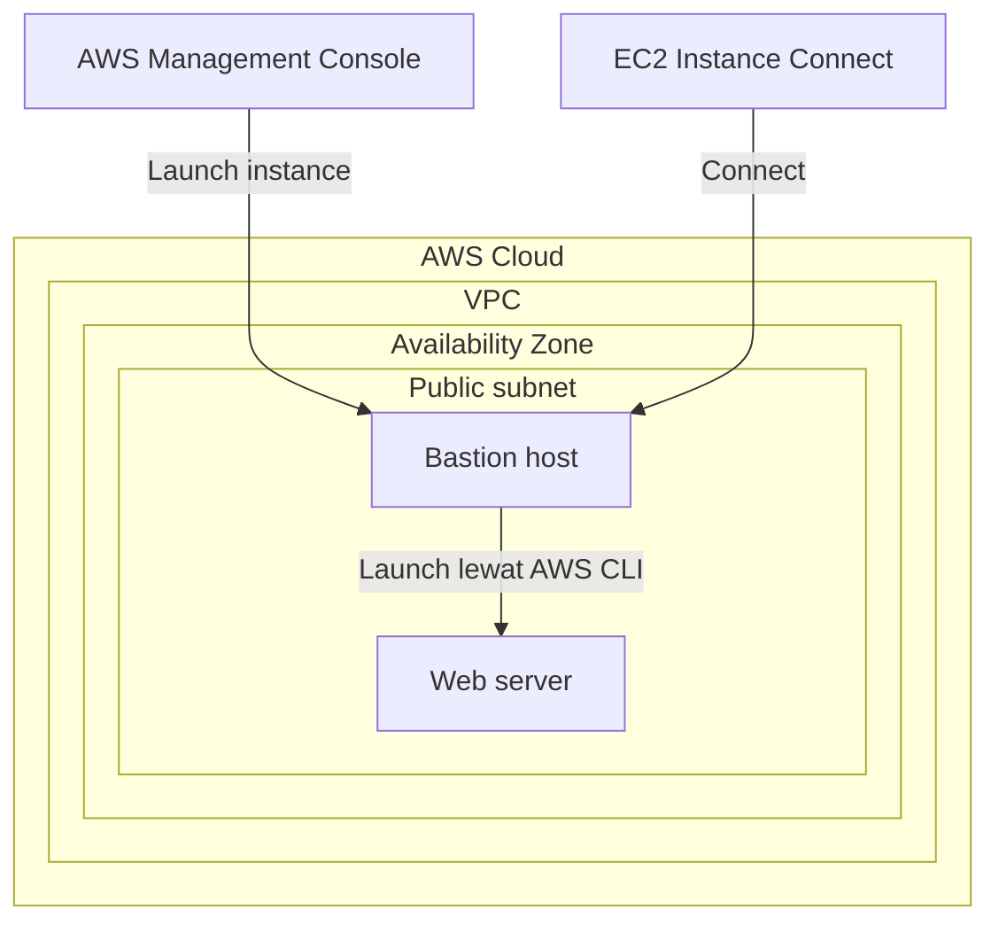

Lab ini menarik karena bikin instance-nya dengan 2 cara sekaligus, biar kerasa bedanya: satu lewat AWS Management Console, satu lagi lewat AWS CLI. Konsep yang dipake juga baru buat aku: **bastion host**.

## Arsitektur


_EC2 Instance Connect dan AWS Management Console sama-sama nyampe ke bastion host di public subnet; bastion host yang launch web server instance lewat AWS CLI._



## Kenapa Butuh Bastion Host

Bastion host itu instance perantara yang jadi "pintu masuk" buat ngatur instance lain, biar instance lain nggak perlu diakses langsung dari luar. Di lab ini, bastion host di-launch lewat console (pake AMI Amazon Linux, tipe `t3.micro`), terus dari bastion host itu (via EC2 Instance Connect, browser-based, nggak perlu key pair) kita jalanin AWS CLI buat launch instance kedua yang jadi web server.

## Alur Launch Instance Kedua (Web Server) Lewat CLI

Bagian paling menarik menurutku itu gimana script CLI-nya ngambil semua parameter secara dinamis, bukan hardcode:

```bash
# ambil region dari metadata instance sendiri
AZ=`curl -s http://169.254.169.254/latest/meta-data/placement/availability-zone`
export AWS_DEFAULT_REGION=${AZ::-1}

# ambil AMI Amazon Linux 2 terbaru dari Parameter Store
AMI=$(aws ssm get-parameters --names /aws/service/ami-amazon-linux-latest/amzn2-ami-hvm-x86_64-gp2 --query 'Parameters[0].[Value]' --output text)

# ambil subnet & security group yang udah disiapin
SUBNET=$(aws ec2 describe-subnets --filters 'Name=tag:Name,Values=Public Subnet' --query Subnets[].SubnetId --output text)
SG=$(aws ec2 describe-security-groups --filters Name=group-name,Values=WebSecurityGroup --query SecurityGroups[].GroupId --output text)

# launch instance-nya, sekalian pasang user data buat auto-install web app
INSTANCE=$(aws ec2 run-instances \
  --image-id $AMI \
  --subnet-id $SUBNET \
  --security-group-ids $SG \
  --user-data file:///home/ec2-user/UserData.txt \
  --instance-type t3.micro \
  --tag-specifications 'ResourceType=instance,Tags=[{Key=Name,Value=Web Server}]' \
  --query 'Instances[*].InstanceId' --output text)
```

Yang bikin nempel di kepala: AMI-nya nggak di-hardcode, tapi diambil live dari Parameter Store (`/aws/service/ami-amazon-linux-latest/...`), jadi selalu dapet AMI terbaru yang AWS maintain, nggak ketinggalan patch.

Setelah instance jalan, tinggal cek status-nya sampe `running`, terus ambil public DNS name-nya buat dibuka di browser:

```bash
aws ec2 describe-instances --instance-ids $INSTANCE --query 'Reservations[].Instances[].State.Name' --output text
aws ec2 describe-instances --instance-ids $INSTANCE --query Reservations[].Instances[].PublicDnsName --output text
```

## Kapan Pake Metode yang Mana

- **Console**: buat instance one-off atau sementara yang cepet.
- **Script/CLI**: buat automasi yang perlu repeatable dan reliable.
- **CloudFormation**: buat launch banyak resource terkait sekaligus.

## Yang Perlu Diinget

- Bastion host jadi titik masuk tunggal buat ngatur instance lain di private/internal network.
- AMI ID bisa diambil dinamis dari Systems Manager Parameter Store, nggak perlu hardcode.
- Metadata instance (`169.254.169.254`) bisa dipake buat ambil info kayak availability zone tanpa perlu tau manual.

## Referensi Resmi

- [Launching an Instance Using the Launch Instance Wizard](https://docs.aws.amazon.com/AWSEC2/latest/UserGuide/LaunchingAndUsingInstances.html)
- [Connect Using EC2 Instance Connect](https://docs.aws.amazon.com/AWSEC2/latest/UserGuide/Connect-using-EC2-Instance-Connect.html)
- [Run Commands on Your Linux Instance at Launch (User Data)](https://docs.aws.amazon.com/AWSEC2/latest/UserGuide/user-data.html)
