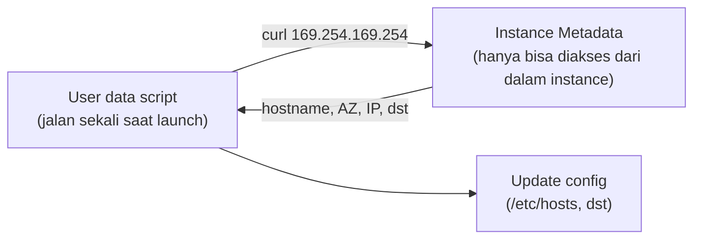

## Instance Metadata

Tiap EC2 instance bisa akses informasi soal dirinya sendiri lewat URL internal `http://169.254.169.254/latest/meta-data/`. Ini kepake banget di user data script, misal buat ambil hostname:



```bash
#!/bin/bash
newHost=$(curl http://169.254.169.254/latest/meta-data/hostname/)
sudo sed -i "s/\<localhost\>/$newHost/g" /etc/hosts
sudo sed -i "s/\<localhost\>/$newHost/g" /etc/sysconfig/network
sudo reboot
```

Script ini ambil hostname dari metadata, ganti semua "localhost" di config file jadi hostname yang bener, terus reboot biar perubahannya kepake.

User data yang dipasang pas launch juga bisa dicek lagi dari dalam instance:

```bash
curl http://169.254.169.254/latest/user-data
```

## Launch Instance Lewat CLI

```bash
aws ec2 run-instances \
  --image-id ami-0123456789012345 \
  --instance-type t2.micro \
  --key-name mykeypair \
  --security-group-ids sg-0123456789012345 \
  --subnet-id subnet-0123456789012345 \
  --iam-instance-profile Name=EC2Admin \
  --user-data file://UserData.txt \
  --tag-specifications 'ResourceType=instance,Tags=[{Key=Name,Value=WebServer}]'
```

## Best Practice Security Instance

- **Lindungi default user account** (`ec2-user` di Linux, `Administrator` di Windows), karena punya permission admin. Bikin akun terpisah buat user baru.
- Pake key pair buat SSH access di Linux, jangan password login.
- Di Windows, pake Active Directory / AWS Directory Service buat kontrol akses terpusat.
- Apply security patch secara berkala.

## Cara Remote yang Direkomendasikan

| Tool | Karakteristik |
|---|---|
| **EC2 Instance Connect** | Support Amazon Linux 2 & Ubuntu, lewat console, kontrol akses pake IAM policy, tetep butuh buka port SSH |
| **Session Manager** | Support Linux/Windows/macOS, lewat console/CLI, kontrol akses pake IAM policy, TIDAK perlu buka port SSH sama sekali |

Dua-duanya nggak butuh install SSH/RDP client, dan connection request-nya kecatet di CloudTrail buat audit.

## Best Practice Tambahan

- **Instance console screenshot**: buat troubleshoot instance yang crash atau nggak bisa diremote, bisa generate screenshot console-nya dari AWS Management Console.
- **Termination protection**: aktifin biar instance nggak kehapus nggak sengaja.
- **Matiin source/destination check** kalau instance-nya jadi NAT instance, karena NAT instance emang harus bisa kirim/terima trafik yang bukan buat dirinya sendiri.

## Yang Perlu Diinget

- Metadata instance diakses lewat `169.254.169.254`, kepake buat ambil info kayak hostname/AZ dari dalam user data script.
- EC2 Instance Connect dan Session Manager lebih direkomendasikan daripada SSH key manual, apalagi Session Manager yang nggak perlu buka port sama sekali.
- Termination protection dan security patch rutin itu 2 hal simpel yang sering keskip padahal penting.

## Referensi Resmi

- [Instance Metadata and User Data](https://docs.aws.amazon.com/AWSEC2/latest/UserGuide/ec2-instance-metadata.html)
