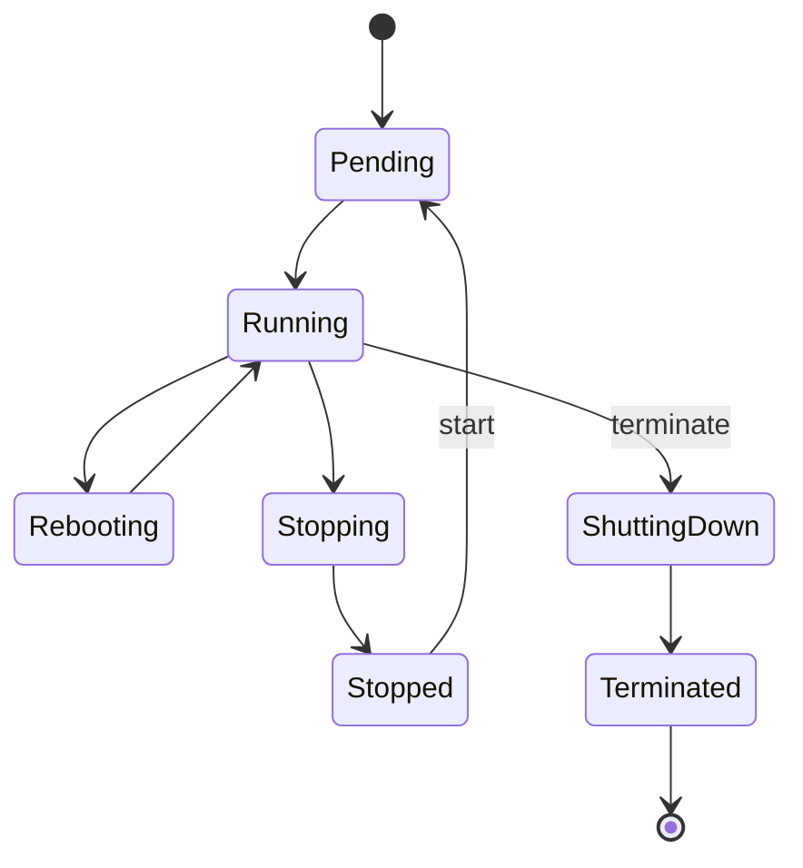

## State-State EC2 Instance



## Hibernation

Hibernation itu nyimpen isi RAM ke EBS root volume pas instance di-stop, terus dimuat balik pas instance di-start lagi, jadi proses yang lagi jalan bisa lanjut kayak nggak pernah mati. Bedanya sama stop biasa: boot time-nya jauh lebih cepet karena nggak perlu boot ulang dari nol.

Syaratnya: EBS root volume harus ter-enkripsi, ada batas maksimal RAM (150 GB buat Linux, 16 GB buat Windows), dan hibernation harus diaktifin dari awal pas instance di-launch, nggak bisa diaktifin belakangan.

## Karakteristik Tiap State

**Billing**: cuma kena charge kalau state-nya **running**, atau **stopping** akibat aksi stop-hibernate.

**Data persistence**: data di instance store volume hilang begitu instance nggak running/rebooting. Data di EBS volume tetep ada di semua state, kecuali root volume yang defaultnya kehapus pas terminate.

**IP address**: public IPv4 berubah tiap kali instance di-start ulang. Elastic IP tetep nempel sampe instance-nya di-terminate.

## Instance Itu Ephemeral, Desain Sesuai Itu

Best practice-nya: anggap instance sebagai resource yang bisa dibangun dan dibongkar kapan aja, karena banyak skenario yang butuh instance baru: auto scaling, cost saving (matiin pas nggak dipake, nyalain lagi pas butuh), downgrade/upgrade instance type, sampe recovery kalau hardware di baliknya bermasalah.

## Modifikasi Instance

Buat resize instance (ganti instance type), harus di-stop dulu, ganti tipenya, baru di-start lagi:

```bash
aws ec2 modify-instance-attribute \
  --instance-id i-1234567890abcdef0 \
  --instance-type "{\"Value\": \"m4.large\"}"
```

Syaratnya: root device-nya harus EBS, dan instance type baru harus kompatibel arsitekturnya (64-bit ke 64-bit, dst).

## AMI Deprecation

AMI publik itu di-deprecate otomatis 2 tahun setelah dibuat. Instance yang udah kepake AMI itu sebelum tanggal deprecation tetep aman jalan, tapi AMI-nya nggak bisa dipake buat launch instance baru lewat console lagi (via CLI/API masih bisa).

## Yang Perlu Diinget

- Public IPv4 berubah tiap start ulang, Elastic IP tetep sampe di-terminate.
- Cuma dikenain biaya pas state running (atau stopping akibat hibernate).
- Resize instance type wajib stop dulu, dan root device-nya harus EBS.
- Instance itu ephemeral by design, jangan nyimpen data penting cuma di instance store.

## Referensi Resmi

- [Amazon EC2 Instance Lifecycle](https://docs.aws.amazon.com/AWSEC2/latest/UserGuide/ec2-instance-lifecycle.html)
