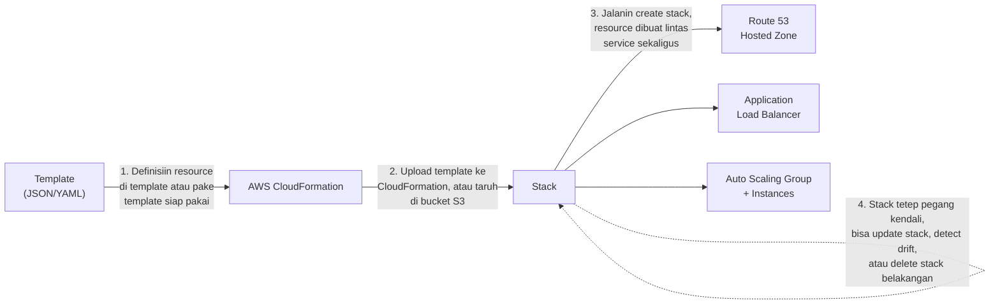
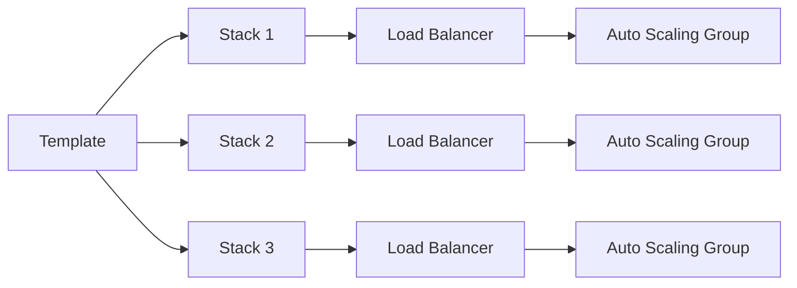

Konsep **infrastructure as code (IaC)** ini yang bikin cloud computing beda banget sama IT tradisional: infrastruktur nggak lagi diklik-klik manual, tapi didefinisiin lewat kode yang bisa di-versioning, di-review, dan dijalanin ulang secara konsisten.

## AWS SDK

SDK itu buat akses AWS secara programmatic, ada buat banyak bahasa: .NET, C++, Go, Java, JavaScript, Node.js, PHP, Python, Ruby, plus Kotlin, Rust, dan Swift. Developer bisa manfaatin fungsi-fungsi AWS langsung dari kode tanpa nulis dari nol.

## AWS CloudFormation

CloudFormation itu cara bikin, update, dan hapus sekumpulan resource AWS sebagai **satu unit**. Kita definisiin resource-nya di **template** (JSON atau YAML), terus CloudFormation provisioning semuanya jadi satu **stack**.

Satu template bisa langsung ngehasilin resource lintas service sekaligus (Route 53, load balancer, Auto Scaling group, dst), dan stack-nya sendiri tetep "nempel" ke resource-resource itu, jadi bisa di-update, dicek driftnya, atau dihapus semua sekaligus belakangan.

Fitur yang bikin CloudFormation kepake:
- **Preview perubahan**: bisa liat dulu dampak perubahan ke stack sebelum beneran dijalanin.
- **Drift detection**: ngecek apakah kondisi resource sekarang udah "melenceng" dari yang didefinisiin di template (misal ada yang diubah manual lewat console).
- **Custom extension pake Lambda**: bisa nulis logic provisioning custom, misal buat nyari AMI ID terbaru secara otomatis.

Benefit utamanya: **reusability, repeatability, maintainability**. Satu template bisa dipake bikin environment test dan production yang persis sama, jadi kalau test-nya jalan baik, kemungkinan besar production juga bakal jalan baik, karena konfigurasinya emang identik.

Misal Stack 2 itu environment test dan Stack 3 itu production, satu template yang sama bisa dipake buat bikin dua-duanya, jadi risiko konfigurasi yang beda antara test dan production jauh berkurang. Dan kalau ada perubahan config, tinggal update template-nya sekali, propagate ke semua stack yang make. Begitu juga sebaliknya, kalau environment test udah nggak dipake, tinggal hapus stack-nya, semua resource ikut kebersihin sekaligus.

## AWS OpsWorks

OpsWorks itu configuration management service, berbasis Chef dan Puppet, buat otomasiin gimana server dikonfigurasi, di-deploy, dan di-manage.

3 varian OpsWorks:
- **OpsWorks for Chef Automate**: managed Chef Automate server, buat workflow automation (config OS, compliance, install package, dst).
- **OpsWorks for Puppet Enterprise**: managed Puppet Enterprise server, config server bisa di-maintain dan di-versioning kayak source code aplikasi.
- **OpsWorks Stacks**: configuration management buat aplikasi berbagai skala pake Chef.

## Yang Perlu Diinget

- SDK dipake buat akses AWS programmatic dari kode.
- CloudFormation: definisiin infrastruktur di template, provisioning jadi satu stack, bisa di-update/delete sebagai satu unit.
- Drift detection ngecek apakah resource udah menyimpang dari template aslinya.
- OpsWorks nyediain managed Chef/Puppet buat configuration management server.

## Referensi Resmi

- [AWS Developer Tools](https://aws.amazon.com/developer/tools/)
- [AWS OpsWorks](https://aws.amazon.com/opsworks/)
