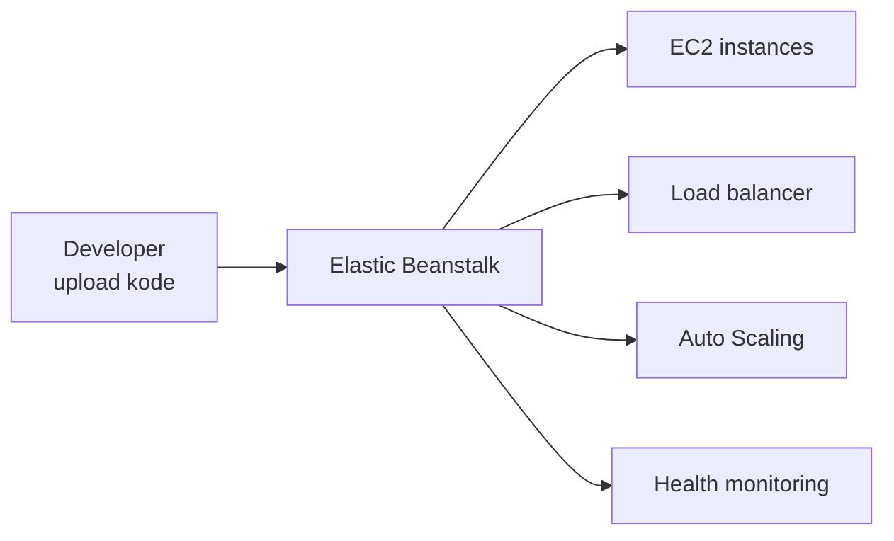

## Apa Itu Elastic Beanstalk

Elastic Beanstalk itu PaaS (platform as a service) yang nyepetin deploy, scaling, dan manage aplikasi. Bedanya sama EC2 biasa, kita nggak perlu urus infrastrukturnya sama sekali, tinggal upload kode, sisanya di-handle otomatis: provisioning, deployment, load balancing, auto scaling, sampe health monitoring.

Beanstalk sendiri dibangun dari service-service AWS yang udah proven: EC2, RDS, ELB, EC2 Auto Scaling, S3, sampe SNS. Jadi bukan teknologi baru, cuma dibungkus jadi satu paket yang gampang dipake.

## Platform yang Didukung

- **Bahasa**: Java, .NET, PHP, Node.js, Python, Ruby, Go
- **Web server**: Apache, Nginx, IIS
- **Application server**: Tomcat, Passenger, Puma
- **Docker container**

Deploy-nya bisa lewat AWS Management Console, AWS CLI, atau langsung dari IDE kayak Visual Studio/Eclipse.

## Kontrol yang Tetep Ada di Kita

Meski infrastrukturnya di-handle otomatis, kita tetep bisa atur: instance type EC2, konfigurasi database, opsi Auto Scaling, sampe load balancer. Dan kalau suatu saat mau ambil alih kontrol sebagian atau semua infrastrukturnya secara manual, itu juga bisa, Beanstalk nggak ngunci kita.

## Biaya

Elastic Beanstalk sendiri gratis, nggak ada charge buat pake service-nya. Yang dibayar cuma resource AWS di baliknya (EC2, S3, dll) sesuai pemakaian.

## Kenapa Ini Kepake

3 benefit utama: developer jadi lebih produktif (fokus nulis kode, bukan setup server), scalability udah built-in, dan management complexity berkurang karena Beanstalk yang jaga platform-nya tetep update sama patch terbaru.

## Yang Perlu Diinget

- Elastic Beanstalk itu PaaS, kita upload kode, infrastruktur di-handle otomatis.
- Support banyak bahasa/platform, termasuk Docker.
- Gratis pake Beanstalk-nya, yang dibayar cuma resource di baliknya.
- Kontrol infrastruktur tetep bisa diambil alih kalau butuh.

## Referensi Resmi

- [AWS Elastic Beanstalk Developer Guide](https://docs.aws.amazon.com/elasticbeanstalk/latest/dg/Welcome.html)
