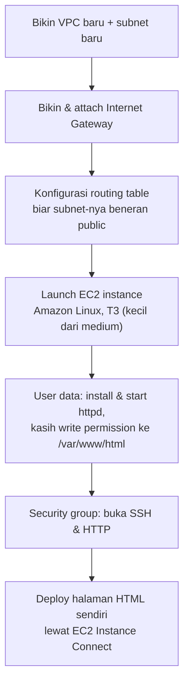

Beda sama lab-lab sebelumnya yang dituntun langkah demi langkah, ini **challenge lab**: cuma dikasih requirement level tinggi, sisanya kita yang mikirin sendiri urutan dan cara ngerjainnya. Instrukturnya eksplisit bilang ini tugas mandiri, nggak di-demoin di kelas, jadi dikerjain sendiri di luar sesi.

## Requirement-nya



Rincian requirement-nya:
- Instance Amazon Linux, tipe T3 yang lebih kecil dari medium (`t3.micro` atau `t3.small`).
- VPC baru, subnet baru, public IPv4 di-auto-assign.
- Root volume tipe General Purpose SSD (gp2).
- User data script yang install `httpd` dan langsung dijalanin, plus kasih write permission ke `/var/www/html`.
- Bisa diakses lewat SSH.
- Screenshot system log instance yang nunjukin `httpd` berhasil terinstall.

## Bagian Kedua: Deploy Halaman Sendiri

Setelah instance-nya jalan, tugas berikutnya connect pake EC2 Instance Connect, terus taruh file HTML sendiri di `/var/www/html`:

```html
<!DOCTYPE html>
<html>
<body>
<h1>Nama-Kamu's re/Start Project Work</h1>
<p>EC2 Instance Challenge Lab</p>
</body>
</html>
```

Buka public IP-nya di browser, harusnya halaman itu langsung muncul.

## Hint yang Kepake

- Internet gateway dan routing table subnet harus dikonfigurasi dulu sebelum instance-nya bisa diakses dari luar, ini yang paling gampang keskip.
- Pastiin security group buka SSH (22) dan HTTP (80).
- Butuh `sudo` buat naruh file ke `/var/www/html/`.

## Yang Aku Pelajarin

Challenge lab kayak gini bagus buat ngetes apakah kita bener-bener paham urutan dependency antar komponen jaringan, bukan cuma hafal langkah klik-klik. Kalau lupa bikin internet gateway atau lupa associate routing table, instance-nya bakal jalan tapi nggak bisa diakses dari luar sama sekali, dan itu jenis kesalahan yang baru ketauan pas udah nyoba akses, bukan pas launch instance-nya.

## Yang Perlu Diinget

- Subnet baru itu default-nya nggak otomatis "public" cuma karena namanya dikasih public, internet gateway dan routing table-nya yang nentuin.
- User data script jalan otomatis sekali pas instance pertama kali dibuat, cocok buat automasiin install web server.
- Root volume gp2 itu pilihan default yang cukup buat kebutuhan umum.

## Referensi Resmi

- [Amazon EC2 User Guide](https://docs.aws.amazon.com/AWSEC2/latest/UserGuide/concepts.html)
