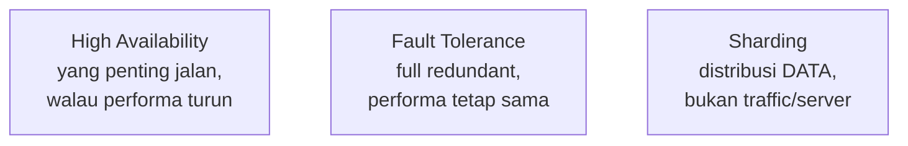
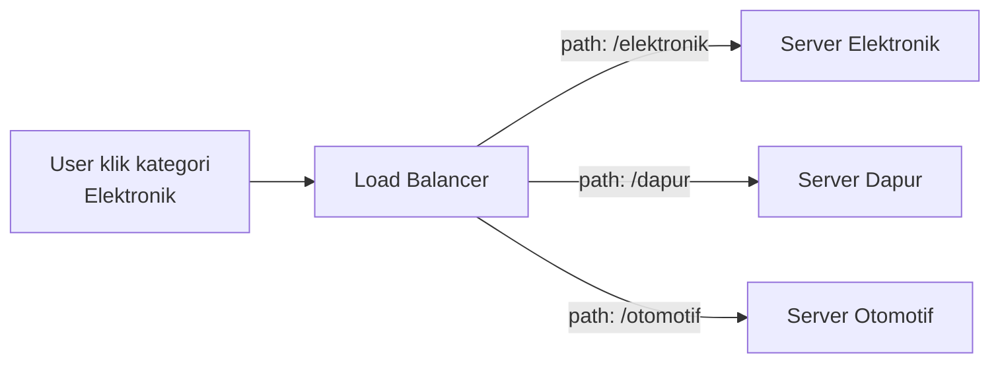
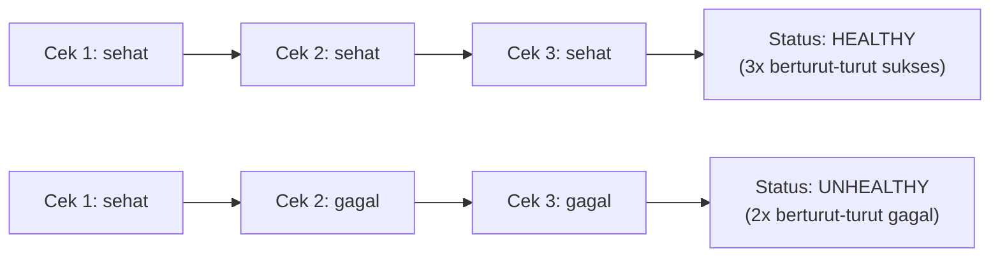

Materi ini dijelasin panjang lebar pake analogi dulu sebelum masuk konsol, karena instrukturnya sadar nggak semua orang di kelas punya background jaringan.

## Kenapa Butuh Load Balancer: Analogi SPBU

Bayangin SPBU dengan 2 karyawan, satu jaga pompa Pertalite (rame terus), satu jaga Pertamax (sepi). Kalau dua-duanya digaji sama tapi satu kerja jauh lebih berat, itu nggak adil, dan yang jaga Pertalite lama-lama bisa kecapekan sampe "down". Server sama persis: kalau semua traffic numplek ke satu server sementara server lain nganggur, ujung-ujungnya server yang kebanyakan beban itu down duluan padahal biayanya dibayar sama rata.

Load balancer ngebagi traffic itu supaya rata, biar nggak ada server yang "kerja mati-matian" sementara yang lain santai. Ini mencegah kondisi yang mirip **denial of service**, bukan karena diserang, tapi karena emang overload beneran.

Kalau traffic udah dibagi rata tapi masih tetep kewalahan, itu tandanya bukan soal pembagian lagi, tapi kapasitasnya emang kurang, solusinya nambah server baru (kerjaan **Auto Scaling**, bukan load balancer). Load balancer dan Auto Scaling itu dua servis yang biasanya jalan bareng: load balancer bagi rata, Auto Scaling nentuin jumlah servernya.

## High Availability ≠ Fault Tolerance ≠ Sharding

Tiga istilah yang gampang ketuker:

- **High Availability (HA)**: yang penting tetep bisa jalan, walaupun "pincang" alias nggak dengan kapasitas penuh. Analoginya, ada server pasif yang nyala standby, begitu server aktif bermasalah, trafik lari ke situ, tapi performanya belum tentu sama kayak kondisi normal.
- **Fault Tolerance**: server aktif-aktif, dua-duanya nyala penuh dan performanya sama, bukan cuma "yang penting jalan". Ini jauh lebih mahal karena butuh redundansi penuh, bukan sekadar cadangan.
- **Sharding**: ini beda konsep lagi, cara distribusi data di database (misalnya biar nggak numpuk di satu partition), lebih ke arsitektur data, bukan soal traffic atau redundansi server.

## Ingress dan Egress = Inbound dan Outbound

Istilah yang beda-beda tapi konsepnya sama tergantung vendor: kalau di security group AWS dipakai istilah **inbound**/**outbound**, di dunia networking umum sering disebut **ingress**/**egress**. Sama kayak istilah CIDR notation (AWS) vs subnet mask (Mikrotik) vs prefix (Cisco), beda merek, konsep sama.

## Path-Based dan Host-Based Routing

Ini yang bikin ALB (Application Load Balancer) beda dari sekadar "bagi rata": ALB bisa ngarahin request ke server yang beda-beda **berdasarkan URL path atau host-nya**, bukan cuma asal round-robin.

Analoginya pake Tokopedia: waktu buka `tokopedia.com`, itu satu server. Begitu klik kategori "Elektronik", secara diam-diam itu udah **beda server**, tapi user nggak sadar karena transisinya seamless (feels-like satu website). Itu karena ada **path-based routing**: request dengan pattern URL tertentu (misal `/elektronik`) diarahin load balancer ke target group server yang khusus nanganin kategori elektronik, sementara `/dapur` diarahin ke server lain, `/otomotif` ke server lain lagi.

- **Path-based routing**: berdasarkan bagian URL setelah domain (`/promo`, `/checkout`, dst).
- **Host-based routing**: berdasarkan subdomain atau hostname sebelum domain (misal `api.example.com` vs `admin.example.com`).

## Ini Dasar dari Microservice

Konsep di atas itu persis gimana **microservice** kerja: satu produk besar (kayak e-commerce) dipecah jadi banyak service kecil, dan idealnya **satu service = server-nya sendiri** (meski kecil/mikro). Jadi kalau traffic ke kategori Elektronik lagi meledak (misal lagi ada promo gadget), itu nggak bakal bikin kategori Dapur atau Otomotif ikut down, karena server-nya emang udah kepisah dari awal. Auto Scaling juga bisa jalan per-service, jadi cuma bagian yang lagi rame aja yang di-scale, nggak seluruh aplikasi.

## Target Group dan Health Check

Load balancer nggak nembak langsung ke instance, tapi ke **target group**, kumpulan server yang punya tujuan sama (analoginya kayak kantor cabang, tiap kantor punya "aturan masuk" sendiri). Satu target group bisa isinya banyak server sekaligus.

Health check target group kerjanya beda dari health check EC2 biasa: EC2 cuma ngecek instance-nya nyala atau enggak, sementara load balancer ngecek apakah **aplikasinya** merespons request dengan benar (bukan cuma "hidup").

Evaluasi sehat/nggak-sehatnya pakai prinsip **consecutive** (berturut-turut), bukan total keseluruhan:

Threshold-nya bisa diatur (misal 3x berturut-turut sukses = healthy, 2x berturut-turut gagal = unhealthy), tapi kalau urutannya keselang (sehat-gagal-sehat), itu nggak dihitung sebagai "berturut-turut", jadi statusnya belum berubah.

## TLS Termination

Waktu request masuk ke load balancer pake HTTPS, load balancer bisa "memutus" koneksi terenkripsi itu di dirinya sendiri (pake sertifikat TLS-nya sendiri), baru bikin koneksi baru ke instance di belakangnya. Ini disebut **TLS termination** (atau offloading). Alasannya: kita nggak pernah tahu sertifikat yang dipegang pihak luar itu valid atau enggak, jadi load balancer yang jadi "penjaga gerbang" sertifikatnya.

Bisa aja koneksi dari load balancer ke instance-nya nggak dienkripsi lagi (HTTP biasa), lebih cepat secara performa, tapi itu bukan best practice, apalagi kalau ujung-ujungnya nyambung ke database.

## Wajib Multi-AZ

Load balancer **wajib** di-setup minimal di 2 Availability Zone, bukan cuma best practice tapi requirement teknis pas setup. Alasannya sama kayak alasan Multi-AZ di servis lain: kalau satu AZ bermasalah, trafik masih bisa failover ke AZ sebelahnya.

## Yang Perlu Diinget

- Load balancer ngebagi traffic biar rata, kalau udah dibagi rata tapi tetep kewalahan, itu tandanya butuh nambah server (kerjaan Auto Scaling), bukan load balancer.
- High Availability itu "yang penting jalan meski pincang", beda dari Fault Tolerance yang aktif-aktif penuh performa, dan beda lagi dari Sharding yang soal distribusi data.
- Ingress/egress itu istilah lain buat inbound/outbound, beda vendor beda sebutan, konsep sama.
- Path-based dan host-based routing adalah fondasi dari arsitektur microservice: request diarahin ke server berbeda berdasarkan URL, biar satu bagian yang overload nggak nge-down-in bagian lain.
- Health check target group dievaluasi berdasarkan hitungan **berturut-turut**, bukan total, dan levelnya di target group, bukan langsung di load balancer.

## Referensi Resmi

- [Elastic Load Balancing User Guide](https://docs.aws.amazon.com/elasticloadbalancing/latest/userguide/what-is-load-balancing.html)
- [Elastic Load Balancing Features](https://aws.amazon.com/elasticloadbalancing/features/)
