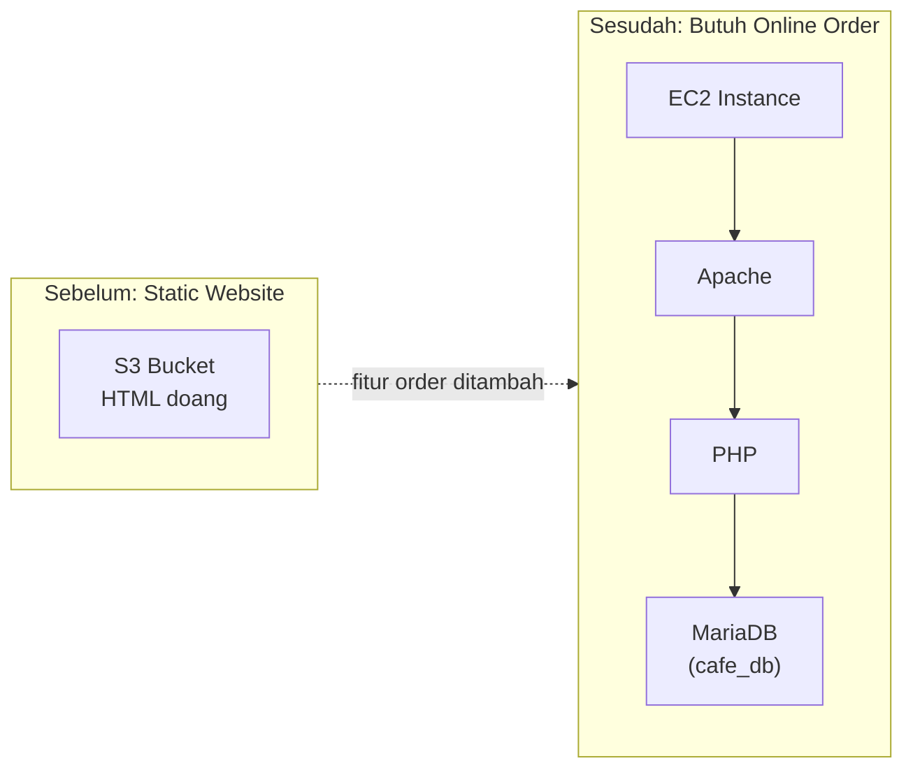

Case study ini lanjutan cerita dari materi [S3 static website hosting](/blog/s3-static-website-hosting). Awalnya website café cuma static (html doang di S3), tapi begitu butuh fitur order online, arsitekturnya harus berubah total.

## Kenapa Nggak Bisa Tetep di S3

Website yang cuma nampilin menu itu static, cukup S3. Tapi begitu ada fitur order (submit data, simpan ke database, nampilin riwayat order), itu udah butuh **server-side processing**, dan S3 nggak bisa ngerjain itu. Makanya solusinya pindah ke **LAMP stack**: Linux, Apache, MariaDB, PHP.

## Kenapa LAMP, Bukan yang Lain

LAMP itu kombinasi open-source klasik yang udah kebukti buat aplikasi web dinamis: Linux sebagai OS, Apache sebagai web server, MariaDB (fork dari MySQL) buat database, PHP buat logic aplikasi dan interaksi ke database.

## Deployment yang Sempet Bermasalah

Di case study ini, proses deploy-nya sempet gagal. Sofía sempet bikin user data script biar deployment-nya repeatable, tapi errornya baru ketauan pas dijalanin. Ini juga yang jadi latar belakang lab [troubleshooting LAMP instance](/blog/troubleshooting-lamp-stack-ec2), nyari dan benerin bug di script deployment-nya bareng-bareng.

## Arsitektur Akhir

Aplikasi café jalan di instance `cafeserver`, di dalam VPC, dilindungi security group `cafeSG`. Apache jalanin kode PHP aplikasinya, PHP yang koneksi ke database MariaDB `cafe_db` yang juga ada di instance yang sama.

## Yang Perlu Diinget

- Static website (S3) cukup buat konten yang nggak butuh logic server-side. Begitu butuh proses data (kayak submit order), harus naik ke arsitektur dinamis kayak LAMP.
- LAMP = Linux + Apache + MariaDB/MySQL + PHP.
- Port 80 wajib kebuka biar trafik HTTP bisa masuk-keluar dari instance.

## Referensi Resmi

- [Tutorial: Install a LAMP web server on Amazon Linux 2](https://docs.aws.amazon.com/AWSEC2/latest/UserGuide/ec2-lamp-amazon-linux-2.html)
