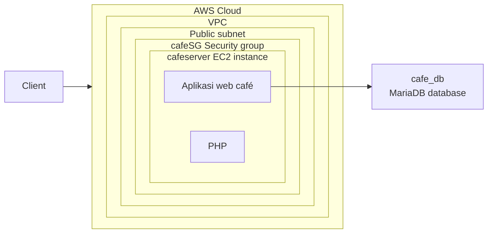

Ini lab yang paling seru menurutku, karena bukan lab "ikutin langkah, semuanya jalan mulus", tapi lab **troubleshooting**: dikasih script yang sengaja ada bug-nya, terus kita cari dan benerin sendiri.

## Arsitektur


_Client akses instance cafeserver (di dalam security group cafeSG, di public subnet), di mana Apache jalanin aplikasi café dan PHP, yang konek ke database cafe_db (MariaDB) di instance yang sama._



## Konteksnya: LAMP Stack

LAMP itu singkatan Linux, Apache, MySQL/MariaDB, PHP, kombinasi klasik buat bikin website dengan database backend dalam satu mesin. Di lab ini, satu user data script yang ngerjain semuanya: install Apache, MariaDB, PHP, deploy file website, sampe setup database-nya.

## Proses Troubleshooting-nya

Script `create-lamp-instance-v2.sh` yang dijalanin itu sengaja punya 2 masalah, dan urutannya ketauan satu-satu (fix yang pertama dulu baru ketauan masalah kedua).

### Issue #1: AMI ID Nggak Ketemu

```
An error occurred (InvalidAMIID.NotFound) when calling the RunInstances operation
```

Ternyata masalahnya di region. Script-nya nyari VPC bernama "Cafe VPC" dengan loop ke semua region, tapi AMI ID yang dipake nggak sesuai sama region tempat VPC itu ketemu. Setelah dibenerin (samain region-nya), instance berhasil kebuat dan dapet public IP.

### Issue #2: Website Nggak Kebuka

Instance-nya udah jalan dan punya public IP, tapi buka `http://<public-ip>` nggak kebuka. Cara ngeceknya pake `nmap`, tool port scanner:

```bash
sudo yum install -y nmap
nmap -Pn <public-ip>
```

Dari situ ketauan port 80-nya belum kebuka (kemungkinan security group-nya belum ngizinin HTTP). Setelah dibenerin, buka lagi `http://<public-ip>` dan muncul "Hello From Your Web Server!" tanda web server-nya udah jalan.

### Verifikasi User Data Script Beneran Jalan

```bash
sudo tail -f /var/log/cloud-init-output.log
```

Log ini nunjukin proses instalasi MariaDB dan PHP, sampe proses download & extract file aplikasi café-nya. Kalau semuanya bersih tanpa error, tandanya user data script-nya jalan sukses dari awal sampe akhir.

## Verifikasi Akhir

Setelah kedua issue dibenerin, akses `http://<public-ip>/cafe` buat liat halaman utama café, coba pilih menu, submit order, terus cek order history buat mastiin data-nya beneran tersimpan ke database.

## Yang Aku Pelajarin

Yang paling kepake dari lab ini bukan cara benerin bug-nya doang, tapi urutan mikirnya: kalau `run-instances` gagal, cek dulu parameter yang dikirim (AMI, region). Kalau instance-nya udah jalan tapi nggak bisa diakses, baru cek layer jaringan/security group pake tool kayak `nmap`. Dan kalau udah bisa diakses tapi kontennya aneh, baru cek log user data script-nya. Urutan debugging dari infrastruktur ke aplikasi ini kepake juga di luar konteks lab ini.

## Yang Perlu Diinget

- `nmap -Pn <ip>` berguna buat ngecek port mana yang beneran kebuka dari luar.
- `cloud-init-output.log` nyimpen log lengkap eksekusi user data script, tempat pertama buat ngecek kalau setup otomatis gagal.
- Debug infrastruktur cloud itu berlapis: cek parameter request dulu, baru jaringan/security, baru aplikasi.

## Referensi Resmi

- [Tutorial: Install a LAMP web server on Amazon Linux 2](https://docs.aws.amazon.com/AWSEC2/latest/UserGuide/ec2-lamp-amazon-linux-2.html)
- [Troubleshoot Amazon EC2 instances](https://docs.aws.amazon.com/AWSEC2/latest/UserGuide/TroubleshootingInstances.html)
