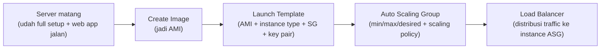
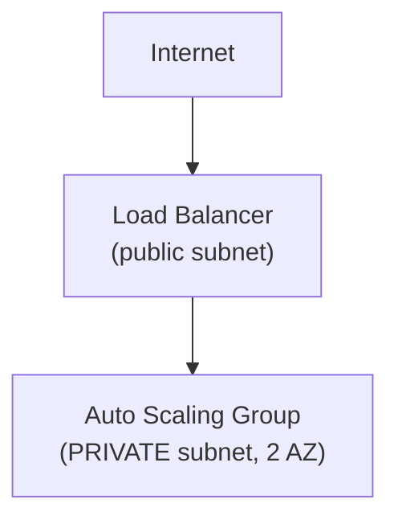

Lab paling "berat" sejauh ini kata instrukturnya sendiri, karena banyak konsep baru numpuk sekaligus: image, launch template, Auto Scaling group, sampe load balancer, semua kepake bareng.

## Arsitektur Sebelum dan Sesudah


_Sebelum lab: cuma ada satu instance "Web Server 1" sendirian di public subnet, langsung diakses lewat internet gateway._


_Sesudah lab: Application Load Balancer di public subnet (2 AZ) nerima traffic dari internet gateway, terus distribusiin ke instance-instance yang dikelola Auto Scaling group, semuanya dipindah ke private subnet (2 AZ juga)._

## Alur Besarnya



## Server Matang → Jadi Image

"Server matang" itu istilah buat instance yang udah beres full: OS ke-install, web server jalan, kode aplikasi udah nempel dan bisa diakses. Instance ini di-**restart dulu** sebelum di-convert jadi image, tujuannya biar service yang lagi jalan ke-capture dengan bener pas di-clone (kalau nggak di-restart, ada resiko state service-nya nggak ke-include, mirip kasus Windows yang perlu restart dulu sebelum bisa di-clone karena ada layanan kayak Windows Defender yang masih nyangkut).

```bash
# via console: Actions > Image and templates > Create image
```

AMI hasil clone-an ini defaultnya **private** (cuma bisa dipake akun sendiri), tapi bisa diubah jadi public. AMI ini juga **region-specific**, kalau butuh dipake di region lain, harus di-copy dulu ke region itu.

Bikin image itu **bayar**, karena di baliknya nyimpen data di S3 (ukurannya proporsional sama storage instance aslinya), dan kalau image-nya dijadiin public terus banyak yang pakai, ada biaya traffic tambahan juga.

## Launch Template: Bungkusan Settingan

Launch template itu paket settingan siap pakai: AMI mana yang dipakai, instance type, mau pake key pair atau nggak, security group apa. Begitu launch template udah jadi, deploy instance baru tinggal nembak ke template itu, nggak perlu setting ulang dari nol tiap kali.

Penting: kalau instance-nya di-deploy dari image yang udah matang, banyak setting jadi otomatis "terkunci" sesuai kondisi image itu (misal instance type harus `t3.micro` kalau image-nya di-capture dari instance `t3.micro`).

## Auto Scaling Group: Deploy-nya di Private Subnet



Best practice: instance yang di-manage Auto Scaling Group itu **nggak butuh public IP sendiri**, karena akses masuknya lewat load balancer. Kalau tiap instance dikasih public IP dinamis satu-satu, itu jadi biaya percuma padahal traffic-nya udah lewat load balancer semua.

### Konfigurasi Kapasitas

- **Minimum**: jumlah instance paling sedikit yang harus selalu ada.
- **Maximum**: batas atas, nggak akan nambah lebih dari ini walau traffic makin tinggi.
- **Desired**: jumlah awal instance yang langsung dibuat pas Auto Scaling Group ini di-deploy (harus di antara min dan max).

### Scaling Policy: Target Tracking

Pake **target tracking policy** berbasis CPU utilization, misal threshold 50%, kalau CPU rata-rata instance di grup itu ngelewatin 50%, otomatis nambah instance baru.

Instance baru yang baru dibuat Auto Scaling Group itu **langsung menerima traffic** dari load balancer setelah lolos health check, bukan cuma nyala doang. Ini bedanya sama Auto Scaling tanpa load balancer, kalau nggak ada load balancer yang gantian bagi traffic-nya, instance baru nggak otomatis kebagian beban.

## Load Test: Mancing Auto Scaling-nya Jalan

Dites langsung pake fitur stress test bawaan lab, CPU instance dipaksa naik. Auto Scaling butuh waktu **sekitar 5 menit** buat bereaksi (CloudWatch metric evaluation-nya nggak instan), jadi kalau butuh respons lebih cepat dari itu, ada biaya tambahan buat detailed monitoring.

Setelah CPU ngelewatin threshold, instance baru otomatis muncul, kelihatan dari **Auto Scaling Group > Activity tab**, ada history baru nunjukin instance ditambah.

## Update Konfigurasi: Bikin AMI Baru atau Modify Template Aja?

Kalau ada perubahan konfigurasi/kode di aplikasi, dua opsi:

- **Perubahan besar** (ganti versi aplikasi, ganti dependency besar): bikin AMI baru dari server yang udah di-update, terus update launch template buat pake AMI baru itu.
- **Perubahan kecil** (config minor): nggak perlu bikin AMI baru, cukup **modify launch template** dan tambahin lewat user data tambahan (semacam "extension" di atas image yang lama).

Launch template lama **jangan dihapus** kalau masih dipake Auto Scaling Group, karena itu jadi acuan kalau ada scaling event baru.

## Yang Perlu Diinget

- Restart instance dulu sebelum di-convert jadi image, biar service yang lagi jalan ke-capture dengan benar.
- AMI itu region-specific dan berbayar (nyimpen storage di S3), harus di-copy manual kalau butuh dipakai di region lain.
- Instance dalam Auto Scaling Group idealnya nggak punya public IP sendiri, karena akses masuk lewat load balancer.
- Auto Scaling butuh sekitar 5 menit buat bereaksi ke perubahan metric (bukan instan), sesuai interval CloudWatch standar.
- Update konfigurasi kecil cukup modify launch template, update besar butuh AMI baru.

## Referensi Resmi

- [Create a Launch Template for an Auto Scaling Group](https://docs.aws.amazon.com/autoscaling/ec2/userguide/create-launch-template.html)
- [Create Amazon EBS-Backed AMI](https://docs.aws.amazon.com/AWSEC2/latest/UserGuide/AMIs.html)
- [Target Tracking Scaling Policies](https://docs.aws.amazon.com/autoscaling/ec2/userguide/as-scaling-target-tracking.html)
