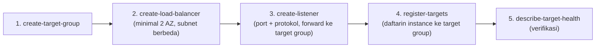

Lanjutan dari [materi ELB kemarin](/blog/elastic-load-balancing-elb), sekarang beneran praktek bikin load balancer-nya, dan kali ini pake CLI dari sebuah "Command Host" instance.


_Sebelum lab: cuma ada instance "Command Host" di public subnet, tempat semua command CLI dijalanin._


_Sesudah lab: Application Load Balancer di public subnet nerusin traffic ke instance "WebApp" yang dikelola Auto Scaling group di private subnet, Command Host tetap ada buat jalanin command CLI berikutnya._

## Urutan Bikinnya: Target Group Dulu, Baru Load Balancer

Walaupun secara arsitektur load balancer "di atas" target group, urutan bikinnya justru lebih enak dibalik: **bikin target group dulu**, biar gampang di-refer pas bikin listener belakangan. Bonus lain, bikin target group itu **gratis**, yang bayar cuma load balancer-nya sendiri.



## Bikin Load Balancer

```bash
aws elbv2 create-load-balancer \
  --name my-load-balancer \
  --subnets subnet-1 subnet-2 \
  --security-groups sg-xxxxxx
```

Aturan wajibnya: **2 subnet, di 2 AZ berbeda**. Nggak bisa cuma 1, karena begitu load balancer dibuat, dia otomatis berfungsi sebagai bagian dari high availability, dan itu butuh minimal 2 AZ. Dua-duanya juga wajib **satu VPC yang sama**, karena load balancer kerja di dalam satu VPC doang, nggak bisa lintas VPC.

## Bikin Target Group

```bash
aws elbv2 create-target-group \
  --name my-targets \
  --protocol HTTP \
  --port 80 \
  --vpc-id vpc-xxxxxx \
  --target-type instance
```

VPC-nya harus sama dengan VPC load balancer. Target type-nya bisa instance, IP, atau Lambda, tergantung kebutuhan. Kalau pake tipe IP, defaultnya IPv4, soalnya IPv6 ada biaya tambahan.

## Daftarin Instance ke Target Group

```bash
aws elbv2 register-targets \
  --target-group-arn arn:aws:elasticloadbalancing:...:targetgroup/my-targets/xxxx \
  --targets Id=i-xxxxxxxxxxxxx
```

## Bikin Listener

```bash
aws elbv2 create-listener \
  --load-balancer-arn arn:aws:elasticloadbalancing:...:loadbalancer/app/my-load-balancer/xxxx \
  --protocol HTTP \
  --port 80 \
  --default-actions Type=forward,TargetGroupArn=arn:aws:elasticloadbalancing:...:targetgroup/my-targets/xxxx
```

Port dan protokol di listener harus **sama persis** sama yang didaftarin di target group, kalau beda, koneksinya nggak akan nyambung. Kalau pake CLI, kebanyakan parameter minta **ARN**, beda sama console yang tinggal klik-klik nunjuk resource-nya langsung.

## Verifikasi Kesehatan Target

```bash
aws elbv2 describe-target-health \
  --target-group-arn arn:aws:elasticloadbalancing:...:targetgroup/my-targets/xxxx
```

Output-nya bakal nunjukin status tiap target (`healthy`/`unhealthy`), sesuai health check yang udah dikonfigurasi di target group-nya.

## Yang Perlu Diinget

- Bikin target group dulu sebelum load balancer, biar gampang di-refer, dan target group-nya sendiri gratis.
- Load balancer wajib minimal 2 AZ (2 subnet berbeda), dan semua komponennya (load balancer, target group, instance) wajib satu VPC yang sama.
- Port dan protokol di listener harus match sama target group, kalau beda nggak connect.
- CLI kebanyakan pake ARN buat nunjuk resource, beda dari console yang tinggal klik.

## Referensi Resmi

- [Create a Target Group for Your Application Load Balancer](https://docs.aws.amazon.com/cli/latest/reference/elbv2/create-target-group.html)
- [Register Targets with Your Target Group](https://docs.aws.amazon.com/cli/latest/reference/elbv2/register-targets.html)
- [Create a Listener for Your Application Load Balancer](https://docs.aws.amazon.com/cli/latest/reference/elbv2/create-listener.html)
- [Health Checks for Your Target Groups](https://docs.aws.amazon.com/cli/latest/reference/elbv2/describe-target-health.html)
