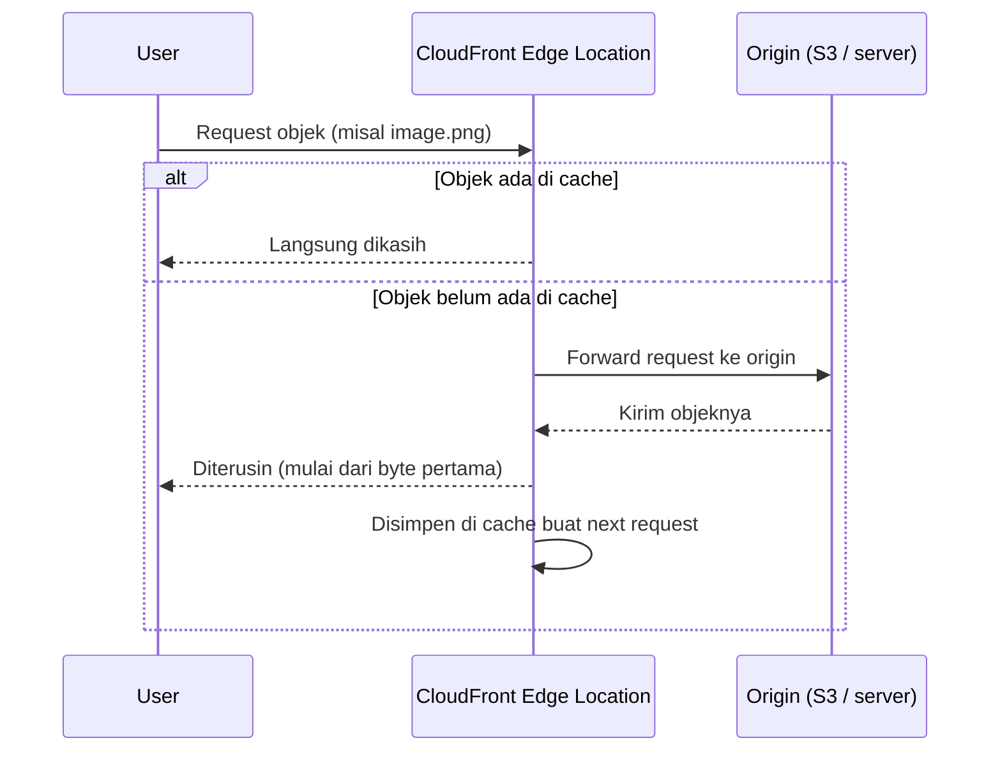

Ini salah satu materi yang menurutku paling gampang "kebayang" cara kerjanya, CloudFront.

## Apa Itu CloudFront

CloudFront itu CDN (content delivery network) punya AWS, fungsinya nyepetin distribusi konten (html, css, js, gambar) ke user. Caranya lewat jaringan **edge location**, lebih dari 450 titik di 90-an kota seluruh dunia. Kalau user request konten, request-nya diarahin ke edge location yang paling deket/paling rendah latency-nya.

Kalau kontennya udah ada di edge location itu, langsung dikasih. Kalau belum ada, CloudFront ambil dulu dari **origin** (bisa S3 bucket, server HTTP, atau media channel) baru dikirim ke user, sambil disimpen juga di edge buat request berikutnya.

Selain edge location, ada juga **regional edge cache** (13 titik), fungsinya nyimpen konten yang kurang populer tapi masih sering diakses, biar nggak ilang dari cache begitu aja.

Kalau data nggak ketemu di edge location terdekat, dia eskalasi naik ke regional edge cache dulu, baru kalau masih nggak ketemu juga baru nembak ke origin. Begitu ketemu di origin, datanya di-cache berlapis balik ke regional edge cache dan edge location, jadi request berikutnya buat konten yang sama nggak perlu naik sampe origin lagi.

## TTL dan Cache Invalidation

Berapa lama sebuah objek disimpen di cache diatur pake **TTL (time to live)**, defaultnya satu hari. Begitu TTL habis (istilah instrukturnya "housekeeping"), objek itu otomatis kehapus dari cache, request berikutnya buat objek yang sama bakal dianggap cache miss dan CloudFront nembak ulang ke origin, nyimpen ulang dengan TTL baru dari awal (nggak ada mekanisme recycle atau extend otomatis).

Ini jadi trade-off: TTL pendek cocok buat konten yang sering berubah (dinamik), soalnya cache-nya cepet di-refresh. TTL panjang cocok kalau ngejar performa maksimal (naikin cache hit ratio), tapi cuma masuk akal kalau website-nya emang jarang update, karena makin lama TTL, makin numpuk storage yang dipake buat nyimpen cache di edge, dan itu ngaruh ke biaya juga.

KPI yang dipantau di sini namanya **cache hit ratio**, rasio antara request yang kena cache (hit) vs yang harus naik ke origin (miss). Makin tinggi rasionya, makin efektif CloudFront-nya ngurangin beban origin, ini juga alesan kenapa nggak sekadar pasang CloudFront terus TTL-nya dibiarin sembarangan.

## Kenapa Ini Kepake

Bayangin serving foto langsung dari server biasa, request-nya harus lewat jaringan internet yang berlapis-lapis sampe ketemu server itu. CloudFront motong jalur itu, request diarahin lewat backbone network AWS sendiri (fiber 100 GbE, redundant) ke edge terdekat, jadi latency lebih rendah dan transfer rate lebih tinggi.

Fitur lain yang worth dicatet:
- **Security**: HTTPS pake TLS 1.3, proteksi serangan layer network & application, compliant PCI-DSS/HIPAA/ISO.
- **Availability**: ada origin failover otomatis kalau origin utama down.
- **Edge computing**: bisa jalanin logic custom di edge lewat CloudFront Functions atau Lambda@Edge.
- **Blue/green deployment**: bisa deploy 2 environment identik tanpa perlu ubah DNS.

## Biaya

CloudFront nggak ada biaya di muka, bayar sesuai pemakaian. Faktor yang nentuin biaya: region tempat trafik didistribusikan, jumlah & tipe request (HTTP/HTTPS), sama jumlah data yang keluar dari edge location. Kalau origin-nya S3 atau ELB, transfer antar servicenya sendiri gratis, yang dibayar cuma transfer keluar ke internet.

Satu hal yang agak "nyebelin" soal harga: kita nggak bisa milih sendiri mau pake edge location di region mana aja, semuanya dijual dalam bentuk paket harga (price class). Misal price class yang murah cuma nyakup Amerika Utara, yang menengah nambah sebagian Eropa & Asia, yang paling mahal nyakup semua region AWS. Jadi kalau target usernya cuma di satu region tapi kena paket yang nyakup semua dunia, otomatis bayar lebih mahal dari yang sebetulnya dibutuhin. Selain itu, makin lama TTL (makin banyak yang di-cache), storage yang dipake di tiap edge makin numpuk, dan itu juga nambah komponen biaya.

## Yang Perlu Diinget

- Popular content disajikan dari edge location, kalau miss baru eskalasi ke regional edge cache, baru ke origin.
- CloudFront kerja bareng origin (S3, server HTTP, dll), bukan gantiin origin.
- TTL itu trade-off: pendek buat konten dinamik, panjang buat naikin cache hit ratio (tapi cuma worth it kalau konten emang jarang berubah).
- Biayanya ditentuin dari price class (paket region), jumlah/tipe request, dan data transfer out, nggak bisa milih region satuan.

## Referensi Resmi

- [Amazon CloudFront Developer Guide](https://docs.aws.amazon.com/AmazonCloudFront/latest/DeveloperGuide/Introduction.html)
