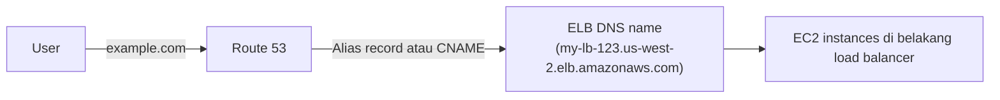
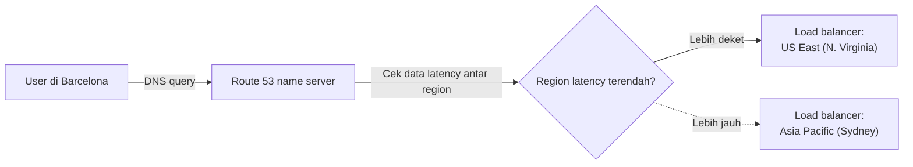
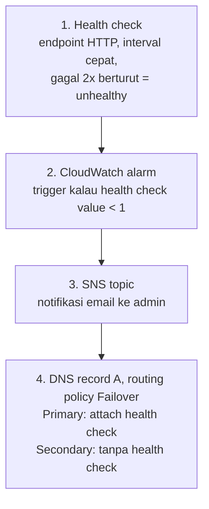

## Apa Itu Route 53

Route 53 itu layanan DNS-nya AWS, scalable dan highly available. Fungsinya translate domain (`www.example.com`) jadi IP address (`192.0.2.1`), sekaligus bisa dipake buat register/transfer domain, connect ke infrastruktur, sampe distribusi trafik antar region.

Kenapa butuh distribusi trafik antar region? Dua alasan utama: disaster recovery kalau ada outage yang gede, sama nurunin latency dengan serve user dari lokasi yang lebih deket.

Soal harga, register domain lewat Route 53 itu nggak gratis, umumnya sekitar $15/tahun buat TLD standar kayak `.com`. Tapi harganya bisa jauh lebih mahal tergantung TLD-nya, ada yang sampai ratusan dolar per tahun, jadi worth dicek dulu harga TLD yang diincer sebelum register.

## Route 53 + ELB

Defaultnya, load balancer di AWS dapet hostname otomatis yang resolve ke beberapa IP. Kita bisa pake DNS name default itu, atau assign hostname sendiri lewat **alias record** atau bikin **CNAME**.

Bedanya: CNAME bisa redirect ke DNS record mana aja. Alias record cuma bisa ke resource AWS tertentu (S3, CloudFront, record lain di hosted zone yang sama).

## Routing Policy

Route 53 punya 8 routing policy: simple (1 resource), weighted (proporsi custom), latency-based (region tercepat), failover (active-passive), geolocation (berdasar lokasi user), geoproximity (berdasar lokasi resource), multivalue answer (sampe 8 record random), dan IP-based (berdasar IP asal user).

Yang paling menarik menurutku itu **latency-based routing**: Route 53 ngecek data latency antar region, terus arahin user ke region yang response-nya paling cepet, biasanya (meski nggak selalu) yang paling deket secara geografis.

Ada juga pola **blue/green deployment**, pake weighted routing buat geser trafik pelan-pelan dari environment lama (blue) ke yang baru (green), sambil dimonitor pake CloudWatch. Kalau ada masalah di green, weighted routing bisa digeser balik ke blue. Kebalikannya, kalau langsung switch 100% ke green begitu selesai testing tanpa perlu jaga-jaga rollback, itu masuk pola **canary/rolling** biasa, bedanya blue/green tetep nyimpen environment lama nyala sebagai jaring pengaman sampe yakin baru di-terminate.

## Lab: Failover Routing

Skenarionya: website sempet down beberapa hari dan customer nggak bisa order online pas lagi rame-ramenya, jadi kehilangan revenue. Solusinya, Route 53 dikonfigurasi buat health check + failover routing ke instance cadangan.

Setup awal: 2 EC2 instance yang sama-sama jalanin web app, ditaruh di 2 Availability Zone berbeda (misal `2a` dan `2b`), berperan sebagai primary dan secondary.

### Kenapa Bikin Health Check Cuma di Primary

Health check di Route 53 itu **bayar per check**, jadi cukup dibikin di instance primary aja. Secondary nggak usah dicek karena dia emang cuma standby, nggak nerima trafik sama sekali kecuali primary lagi down, jadi health check-nya nggak nambah value yang sepadan sama biayanya.

### Alur Setup

1. **Health check**: nembak endpoint HTTP di instance primary, interval paling cepat yang tersedia (harganya lebih mahal makin cepat), dianggap unhealthy kalau gagal 2 kali berturut-turut.
2. **CloudWatch alarm**: dibikin berdasarkan metric health check tadi, trigger kalau nilainya kurang dari 1 (1 = sehat/nyala, 0 = nggak sehat/mati).
3. **SNS notification**: alarm ini nge-trigger topic SNS baru yang subscribe-nya lewat email, jadi begitu primary unhealthy, admin langsung dapet email notifikasi.
4. **DNS record**: dua record A dengan routing policy **Failover**, satu ditandain `Primary` (pake health check di atas), satu ditandain `Secondary` (tanpa health check). Selama primary sehat, semua trafik ke domain itu selalu diarahin ke primary, secondary nggak pernah kebagian.

### Hasil Simulasi

Instance primary sengaja di-stop buat simulasi down. Begitu health check mendeteksi unhealthy, CloudWatch alarm nyala, email notifikasi masuk, dan refresh ke domain-nya langsung ngarah ke instance secondary. Pas instance primary dinyalain lagi dan health check balik sehat, refresh berikutnya otomatis balik ke primary lagi, murni aktif-pasif.

### Route 53 Failover vs Load Balancer

Ini yang paling penting dibedain: **Route 53 failover cuma DNS-level redirect, bukan self-healing**. Instance yang down nggak bakal otomatis dinyalain lagi atau diganti sama Route 53, itu bukan kerjaannya. Route 53 juga nggak bisa langsung integrasi ke Auto Scaling Group, kalau butuh scaling otomatis, itu kerjaan load balancer (ELB terhubung ke ASG, baru ASG yang nambah/kurangin instance). Kelebihan Route 53 dibanding load balancer justru di jangkauan, dia bisa failover ke resource apa aja termasuk yang nggak bisa ditembak load balancer langsung (misal Lambda), tapi kompatibilitasnya nggak seluas ELB dan biaya health check-nya sendiri lebih mahal dibanding health check ELB.

## Yang Perlu Diinget

- Route 53 support banyak routing policy: simple, weighted, latency, failover, geolocation, geoproximity, multivalue answer, IP-based.
- Buat route trafik ke IP address, dipake DNS record tipe A.
- Health check cukup dipasang di primary, karena berbayar dan secondary emang nggak nerima trafik kecuali lagi failover.
- Route 53 failover itu DNS-level switch aktif-pasif doang, bukan self-healing, dan nggak terintegrasi langsung ke Auto Scaling, itu tugasnya load balancer.

## Referensi Resmi

- [Amazon Route 53 Developer Guide](https://docs.aws.amazon.com/Route53/latest/DeveloperGuide/Welcome.html)
- [Choosing a Routing Policy](https://docs.aws.amazon.com/Route53/latest/DeveloperGuide/routing-policy.html)
- [Routing Traffic to an Amazon EC2 Instance](https://docs.aws.amazon.com/Route53/latest/DeveloperGuide/routing-to-ec2-instance.html)
