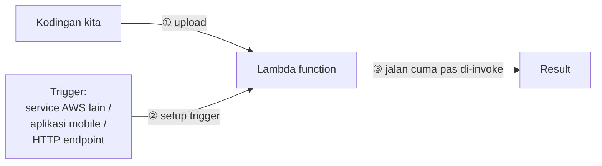

Di ujung sesi hari ini, mulai masuk unit baru "Serverless and Containers", dibuka dengan materi serverless computing dan AWS Lambda.

## Apa Itu Serverless Computing

"Serverless" itu cuma terminologi doang, sebenarnya server-nya tetep ada, cuma kita nggak perlu ngurusinnya. Bandingin sama deployment tradisional:

| Deployment Tradisional | Serverless |
|---|---|
| Provisioning instance | Deploy aplikasi |
| Update OS | Monitor aplikasi |
| Install platform aplikasi (PHP, dll) | |
| Build & deploy aplikasi | |
| Konfigurasi auto scaling & load balancing | |
| Patch, secure, monitor server berkala | |
| Monitor & maintain aplikasi | |

Kelihatan bedanya, banyak pekerjaan yang "hilang" di kolom serverless, karena semua itu di-handle di balik layar sama AWS.

## AWS Lambda

Lambda itu service serverless compute-nya AWS. Kita tinggal upload kodingan, Lambda yang urus sisanya: cara jalanin, scaling, sampe high availability.

Karakteristiknya:
- **Event-driven**: dijalanin kalau ada trigger/event, bukan nyala terus-terusan.
- **Sub-second billing**: bayarnya granular banget, per pecahan detik.
- **Limit eksekusi 15 menit** per function. Kalau kodingannya butuh proses berat/lama (misal ETL gede), Lambda bukan pilihan yang tepat.
- Support banyak bahasa: Java, Node.js, C#, Python, Ruby, Go, PowerShell.

## Contoh Kasus Pakai

**Upload foto listing properti**: user upload foto lewat aplikasi mobile ke S3 → event upload ke S3 nge-trigger Lambda → Lambda manggil Amazon Rekognition (computer vision) → Rekognition analisa foto (deteksi balkon, jendela, dll) → hasil label dipakai buat estimasi harga properti.

**Nyalain/matiin EC2 terjadwal**: daripada instance nyala 24 jam padahal cuma dipake jam kerja, EventBridge bisa dijadwalin nge-trigger Lambda buat matiin instance jam 8 malam, terus nyalain lagi paginya. Efisiensi biaya, karena instance yang nyala tapi nggak dipake tetep kena biaya percuma.

Kasus lain: automated backup, processing file yang di-upload ke S3, analisa log event-driven, transformasi data event-driven, IoT, sampe jalanin website serverless penuh (S3 buat static hosting, Cognito buat auth, API Gateway buat routing, Lambda buat logic, DynamoDB buat data).

## Langkah Develop dan Deploy Lambda Function

1. Definisiin **handler class**, titik mulai eksekusi kode.
2. Bikin function-nya (console atau CLI).
3. Bikin dan attach **IAM role** dengan permission yang dibutuhin function buat akses service lain.
4. Upload kode function.
5. Test invoke, cek hasil dan log-nya.
6. Monitor di production pake CloudWatch (jumlah request, latency, error rate).

## Lambda Layers

**Layer** itu file `.zip` isinya library/dependency yang bisa dipake bareng-bareng sama beberapa Lambda function, tanpa perlu di-bundle ulang di tiap deployment package. Manfaatnya:

- Deployment package jadi kecil.
- Ngurangin error gara-gara dependency conflict.
- Library-nya bisa di-share ke developer lain.

Satu function bisa pake sampe 5 layer sekaligus, dan total ukuran unzipped function + semua layer-nya nggak boleh lebih dari 250 MB.

## Batasan (Quota) Lambda

- Memory maksimum per function: 10 GB.
- Ukuran deployment package maksimum: 250 MB.
- Default concurrency: sampe 1.000 invocation bersamaan per region.

Kalau kelewat batas ini, function-nya bakal gagal dengan exceeded limits exception.

## Yang Perlu Diinget

- Serverless bukan berarti nggak ada server, cuma kita nggak perlu ngurusnya, AWS yang handle.
- Lambda itu event-driven, bayarnya sub-second, dan ada limit eksekusi 15 menit per function.
- Lambda layer berguna buat share dependency antar function dan bikin deployment package tetep kecil.
- Lambda cocok buat proses ringan-cepat yang di-trigger event, bukan buat proses berat/lama.

## Referensi Resmi

- [What Is AWS Lambda?](https://docs.aws.amazon.com/lambda/latest/dg/welcome.html)
- [AWS Lambda Layers](https://docs.aws.amazon.com/lambda/latest/dg/configuration-layers.html)
- [AWS Lambda Quotas](https://docs.aws.amazon.com/lambda/latest/dg/gettingstarted-limits.html)
