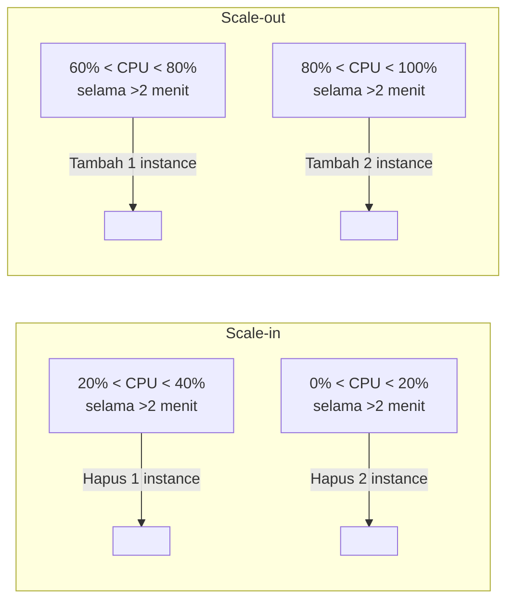

Ini latihan lanjutan dari materi [Auto Scaling](/blog/ec2-auto-scaling), tapi bukan hands-on lab, lebih ke latihan mikir/prediksi. Skenarionya: Auto Scaling group dengan kapasitas min 5, desired 10, max 20, pake step scaling policy berbasis CPU utilization.

## Aturan Scaling-nya

Instance warmup period-nya 5 menit, berlaku terus di semua kondisi.

## Jalan Ceritanya

**Kondisi 1**: CPU 63-70% selama 2+ menit. **Hasilnya**: tambah 1 instance, tapi instance itu belum kehitung di kapasitas sampe warmup 5 menitnya kelar.

**Kondisi 2**: 2 menit kemudian, CPU masih 60-80%. Alarm scale-out trigger lagi, tapi **nggak ada instance baru ditambah**, karena warmup period dari kondisi 1 belum kelar.

**Kondisi 3**: belum 5 menit dari kondisi 1, CPU naik ke 85%. Alarm scale-out (nambah 2) trigger, tapi karena 1 instance masih warming up, cuma **1 instance tambahan** yang beneran dilaunch.

**Kondisi 4**: instance pertama dari kondisi 3 udah kelar warmup dan mulai nanggung beban, instance kedua masih warming up. CPU turun ke 53% selama 3 menit. **Nggak ada alarm yang trigger** (53% ada di antara 40-60%, zona aman).

**Kondisi 5**: demand turun terus, CPU stabil di 32%. Setelah 2 menit di bawah 40%, alarm scale-in trigger, **1 instance dihapus**.

**Kondisi 6**: CPU turun lagi ke 17%. Karena udah di bawah 20%, **2 instance dihapus sekaligus**. Group sekarang cuma sisa 9 instance.

## Yang Aku Pelajarin dari Latihan Ini

Yang paling nempel itu soal warmup period-nya, dia bukan cuma soal "nunggu instance siap", tapi juga jadi pengaman biar Auto Scaling nggak over-provisioning gara-gara beberapa alarm nyala berturut-turut sebelum instance sebelumnya sempet keitung. Tanpa warmup period, kondisi 2 dan 3 di atas bisa aja malah nambah instance berlebihan padahal yang lagi warming up udah cukup buat nanganin bebannya.

Instruktur juga nekenin bahwa besaran threshold dan jumlah nambah/kurangnya itu bukan angka baku, semua tergantung SOP dan budget masing-masing perusahaan. Ada yang parameternya CPU, ada yang berdasarkan request rate, ada yang network throughput, tergantung apa yang paling relevan buat aplikasinya. Strategi yang disaranin: mulai dari kapasitas kecil dulu (cost optimization), baru dinaikin bertahap sampe ketemu baseline yang pas, biar nggak under-provision (lemot) atau over-provision (billing bengkak).

## Yang Perlu Diinget

- Instance yang masih warming up nggak dihitung ke kapasitas group.
- Beberapa alarm scale-out bisa trigger berturut-turut, tapi kalau masih dalam warmup period instance sebelumnya, nggak otomatis nambah instance baru lagi.
- Scale-in dan scale-out sama-sama punya threshold sendiri, dan efeknya bisa beda (misal langsung hapus 2 instance sekaligus kalau CPU turun drastis).

## Referensi Resmi

- [Amazon EC2 Auto Scaling User Guide](https://docs.aws.amazon.com/autoscaling/ec2/userguide/what-is-amazon-ec2-auto-scaling.html)
- [Scaling Based on Amazon EC2 Auto Scaling Metrics](https://docs.aws.amazon.com/autoscaling/ec2/userguide/enable-as-instance-metrics.html)
- [Best Practices for AWS Auto Scaling Plans](https://docs.aws.amazon.com/autoscaling/plans/userguide/best-practices-for-scaling-plans.html)
