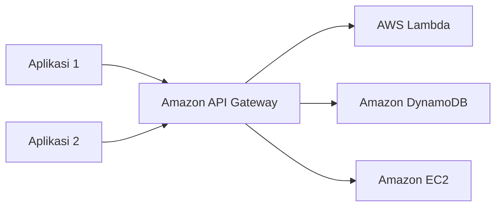
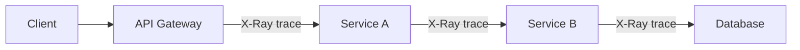

Lanjutan dari [materi REST API](/blog/restful-api-fundamentals), sekarang masuk ke service-nya: Amazon API Gateway.

## Apa Itu API Gateway

API Gateway itu service buat bikin dan maintain API, biasanya berupa REST API buat aplikasi yang jalan di AWS. Fully managed, jadi urusan scaling, access control, dan monitoring udah dihandle AWS. Kita bayar cuma dari jumlah API call yang diterima plus data yang keluar.

## Throttling: Ngerem Request yang Kebanyakan

Throttling itu batas limit, analoginya kayak motor yang top speed-nya dibatasin di angka tertentu, mentok di situ nggak bisa naik lagi walaupun gas terus ditarik. Kalau request-nya kebanjiran, API Gateway bisa nge-throttle biar nggak masuk antrean yang numpuk sampe penuh. Bahasa gaulnya "dicekek" biar nggak "kebablasan".

Kenapa nggak dibiarin masuk antrean aja? Karena kalau antreannya penuh, itu lebih bahaya, mending langsung dikasih error kalau memang overload daripada numpuk request yang ujung-ujungnya bikin sistem down semua.

## Staging: Misahin Traffic Premium vs Biasa

Contoh kasus kayak Spotify: user premium (nggak ada iklan) sama user biasa (banyak iklan) itu beda alur aksesnya. Lewat API Gateway, request divalidasi dulu, dicek statusnya user premium atau biasa, baru diarahin ke staging yang sesuai. Ini juga bisa dipake buat transformasi request/response, misal format data-nya perlu disesuaikan dulu sebelum atau sesudah kena backend.

## Cache Hit Ratio

API Gateway punya cache sendiri, tujuannya sama kayak cache di CDN, biar request yang sama nggak perlu manggil ulang ke backend. Size cache-nya bisa diatur, dan makin tinggi cache hit ratio-nya, makin efektif ngurangin beban backend.

## Security: Token dan Validasi

Request yang masuk biasanya dienkripsi (misal pake JWT), dan di sisi backend perlu validasi lagi, kalau secret/token-nya nggak cocok, request-nya di-reject. Ini bagian dari security yang emang tanggung jawab arsitektur backend, bukan API Gateway doang.

## Audit dan Tracing

Buat audit siapa yang manggil API kapan dan ngapain, bisa dicek lewat **CloudWatch**. Tapi kalau butuh tau di titik mana request-nya lemot (di API-nya, di backend-nya, atau di service lain), itu pake **AWS X-Ray**, jadi request bisa di-trace hop-by-hop dari mulai masuk API Gateway sampe ke backend paling dalam.

Kalau kelihatan lemotnya di segmen tertentu (misal antara Service A ke Service B), langsung ketauan titik masalahnya di situ, nggak perlu raba-raba dari awal.

## Yang Perlu Diinget

- Throttling itu ngerem request yang berlebihan, biar nggak numpuk di antrean sampe sistem down.
- Staging bisa dipake buat misahin traffic (misal premium vs biasa), atau buat transformasi request/response.
- API Gateway punya cache sendiri, size-nya bisa diatur buat naikin cache hit ratio.
- CloudWatch buat audit "siapa manggil apa", X-Ray buat trace "di mana lemotnya".

## Referensi Resmi

- [What Is Amazon API Gateway?](https://docs.aws.amazon.com/apigateway/latest/developerguide/welcome.html)
- [Throttle API Requests for Better Throughput](https://docs.aws.amazon.com/apigateway/latest/developerguide/api-gateway-request-throttling.html)
- [AWS X-Ray Developer Guide](https://docs.aws.amazon.com/xray/latest/devguide/aws-xray.html)
