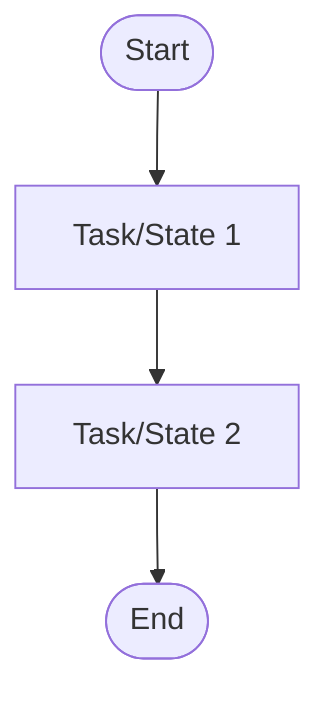
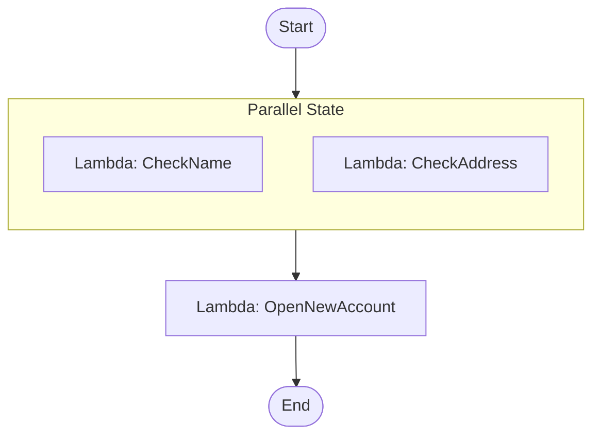

## Apa Itu Step Functions

Step Functions itu service orkestrasi buat aplikasi modern. Fungsinya mempusatkan workflow dengan cara mecah jadi beberapa step (langkah), tambahin flow logic (kalau gini, lakuin ini, kalau gagal, lakuin itu), terus track input-output di antara step-nya.

Analoginya kayak resep masak, atau pipeline distribusi aplikasi e-commerce (contohnya Tokopedia): user checkout, request-nya dilempar ke aplikasi pembayaran (BCA/BRI/Gopay/dll), abis itu dicek lagi ke aplikasi ekspedisi (JNE/SiCepat/dll) buat ngecek ketersediaan kurir. Semua proses ini sebenernya bisa dipetain jadi step-step yang jelas, itu yang difasilitasi Step Functions.

## Konsepnya: State Machine dan Task

Workflow di Step Functions disebut **state machine**, tiap langkahnya disebut **state**. **Task** itu yang ngerjain kerjaan, entah manggil service AWS lain atau aplikasi yang di-host di mana aja.

## Rapper Gratis, Bayarnya di Underlying Service

Yang menarik: Step Functions sendiri **gratis**, dia cuma "rapper" alias pembungkus. Kalau kita drag-drop bikin flow yang manggil Lambda, Lambda-nya yang bayar. Kalau manggil S3, S3-nya yang bayar. Kalau manggil AI, AI-nya yang bayar. Step Functions cuma nyediain cara gampang buat nyusun urutan dan logic-nya (drag-and-drop, mirip tools automation kayak n8n, bedanya n8n lebih ke arah AI workflow).

Hati-hati: karena drag-drop-nya gampang, makin kompleks flow-nya, makin banyak juga service di baliknya yang kena biaya. Jangan sampe kebablasan bikin flow rumit tanpa sadar semua underlying service-nya nambah cost.

## Contoh: Pembukaan Rekening Bank

Instruktur kasih contoh sederhana pake Step Functions: dua fungsi Lambda (`CheckName` dan `CheckAddress`) jalan **paralel**, ngecek nama dan alamat user secara bersamaan. Setelah dua-duanya beres, hasilnya jadi input buat Lambda ketiga (`OpenNewAccount`) yang bikin akun baru.

Kalau ada yang gagal, bisa di-declare handling-nya (fail state), lanjut ke branch lain. Jadi logic percabangan "kalau berhasil ke sini, kalau gagal ke situ" itu didefinisiin visual di state machine-nya, bukan campur aduk sama kode business logic di Lambda.

## Kenapa Ini Berguna

- Bisa nyambungin dan koordinasiin komponen/microservice yang beda-beda tanpa nge-hardcode urutannya di kode.
- Logic aplikasi terpisah dari implementasinya, jadi kalau mau nambah/ubah urutan step, nggak perlu ubah kode business logic-nya.
- Ada history tiap run, jadi gampang di-debug kalau ada masalah, tinggal liat step mana yang stuck/gagal.
- Auto scaling built-in, nggak perlu ngatur infrastruktur di baliknya.

## Yang Perlu Diinget

- Step Functions itu orkestrasi, workflow-nya disebut state machine, tiap langkah disebut state.
- Servicenya sendiri gratis, bayarnya di underlying service yang dipanggil (Lambda, S3, dll), jadi tetep hati-hati sama kompleksitas flow.
- Cocok buat workflow yang butuh banyak step dengan percabangan logic (data processing, IT automation, e-commerce, web app dengan approval step).

## Referensi Resmi

- [What Is AWS Step Functions?](https://docs.aws.amazon.com/step-functions/latest/dg/welcome.html)
- [AWS Step Functions Use Cases](https://aws.amazon.com/step-functions/use-cases/)
