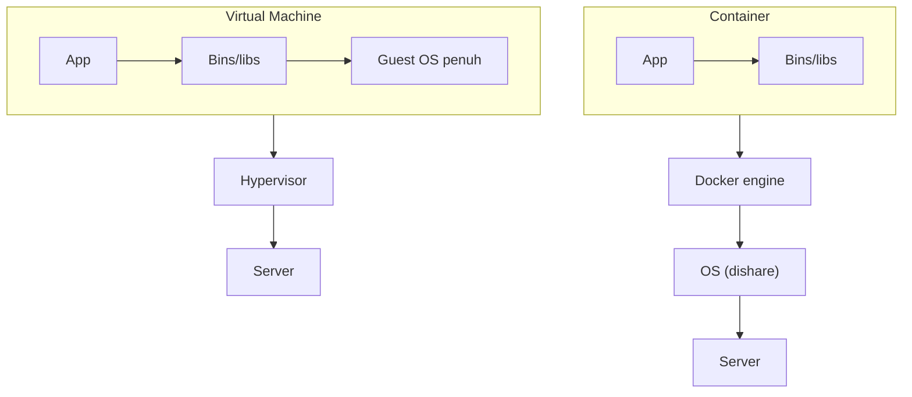
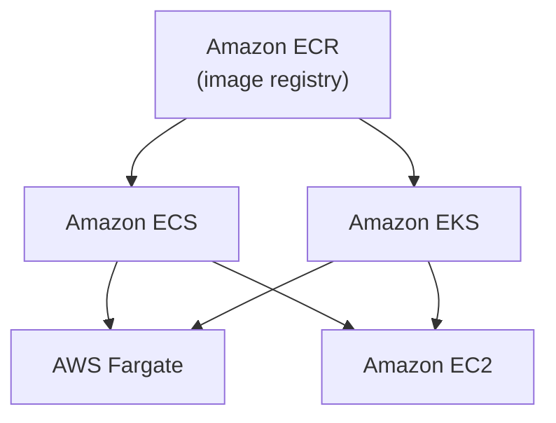

## Masalah yang Diselesaikan Container

VM itu boros. Tiap aplikasi butuh satu OS penuh sendiri-sendiri, padahal RAM dan storage sekarang mahal (laptop 10 juta aja RAM-nya cuma 8 giga). Belum lagi kalau ada dependency conflict, misal Laravel butuh versi PHP tertentu, MySQL versi tertentu, begitu salah satu di-update tapi yang lain enggak, aplikasinya rusak.

Container nyelesain ini: aplikasi + library-nya dibungkus bareng, tapi **share OS dan Docker engine yang sama** di level host, jadi nggak perlu install OS penuh per aplikasi. Lebih murah, lebih cepat, lebih ringan.

## Tapi Container Punya "Penyakit Bawaan"

Container itu **stateless**, data yang disimpen di dalam container ilang kalau container-nya mati/di-restart (makanya butuh Docker volume kalau mau data-nya persisten). Container juga suka "hilang sendiri" atau jadi unhealthy tanpa jelas kenapa, itu emang sifat dari lahir, belum ada obatnya. Makanya butuh satu layer kontrol di atasnya buat mantau dan bikin ulang otomatis kalau ada yang hilang, itu namanya **orchestrator**.

### Kapan Sebaiknya Tetap Pake VM

Nggak semua kasus wajib pindah ke container. Pertimbangannya:

- Aplikasinya udah microservice-oriented atau masih monolith? Kalau masih monolith, migrasi ke container itu ribet banget (nyaris bikin dari nol), belum tentu worth it.
- Troubleshooting container beda banget sama VM, butuh skill DevOps yang lebih spesifik, referensi/dokumentasinya juga nggak sebanyak VM di forum-forum.
- Kesiapan SDM tim dan budget training, jangan sampe migrasi paksa padahal tim belum siap.

## Komponen Docker

- **Dockerfile**: template/instruksi buat bikin image.
- **Image**: cetakan container (mirip AMI di EC2).
- **Registry**: tempat nyimpen image.
- **Container**: instance yang jalan dari image.
- **Host**: mesin tempat container jalan.

Docker sendiri itu **merek**, bukan satu-satunya opsi. Ada alternatif open-source seperti Podman. Docker "open source" tapi tetep ada tier berbayar kalau butuh fitur lebih atau dipake buat production/perusahaan (makin gede makin mahal lisensinya). Podman beneran gratis tanpa tier berbayar.

## Container Service di AWS

| Area | Fungsi | Service |
|---|---|---|
| Image registry | Nyimpen image | Amazon ECR |
| Management (orkestrasi) | Deploy, schedule, scale | Amazon ECS, Amazon EKS |
| Hosting | Tempat container jalan | EC2 (kita kelola), AWS Fargate (serverless) |

### ECS vs EKS

**ECS** itu proprietary AWS, jualan kemudahan, jadi lebih gampang dipake dibanding EKS. Cocok kalau nggak mau ribet ngurusin klaster.

**EKS** itu managed Kubernetes, dan Kubernetes-nya sendiri open source (asalnya dikembangin Google terus di-donate jadi open standard). Karena open source, migrasi antar cloud (misal dari AWS EKS ke Google GKE) jauh lebih gampang dibanding migrasi dari ECS, soalnya "masih satu bahasa" (Kubernetes). Tapi EKS lebih ribet dari sisi manajemen klaster dibanding ECS.

### EC2 vs Fargate (Launch Type)

**EC2 launch type**: kita yang kontrol instance-nya, klaster, strategi auto scaling, dll. Lebih murah dari sisi biaya per unit, tapi kita yang nanggung manajemen overhead-nya.

**Fargate**: serverless, kita nggak ngurusin klaster/instance sama sekali, tinggal fokus deploy container-nya. Bayarnya per container (bukan per instance), jadi biasanya lebih mahal per unit tapi lebih murah dari sisi effort/manajemen.

## Tips Ujian CCP

Kalau ketemu soal:
- "Saya mau manage container tapi nggak mau ribet manajemen overhead" → jawabannya **Fargate**.
- "Saya punya legacy dan masih mau kontrol infrastruktur sendiri" → jawabannya **EC2 launch type**.
- "Saya udah punya ekosistem Kubernetes pihak ketiga" → jawabannya **EKS**.

## Yang Perlu Diinget

- Container lebih hemat resource dibanding VM karena share OS/Docker engine, tapi stateless dan bisa "hilang sendiri", makanya butuh orchestrator.
- Nggak semua aplikasi wajib pindah ke container, tergantung arsitektur (microservice vs monolith), kesiapan tim, dan budget.
- ECS = gampang tapi proprietary AWS. EKS = lebih portable (Kubernetes standar) tapi lebih ribet dikelola.
- EC2 launch type = kontrol penuh, lebih murah per unit. Fargate = serverless, bayar per container, minim manajemen.

## Referensi Resmi

- [What Is Amazon Elastic Container Service?](https://docs.aws.amazon.com/AmazonECS/latest/developerguide/Welcome.html)
- [What Is Amazon EKS?](https://docs.aws.amazon.com/eks/latest/userguide/what-is-eks.html)
- [AWS Fargate](https://docs.aws.amazon.com/AmazonECS/latest/userguide/what-is-fargate.html)
- [Amazon Elastic Container Registry](https://docs.aws.amazon.com/AmazonECR/latest/userguide/what-is-ecr.html)
